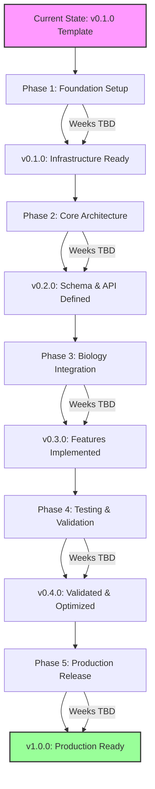

# USD-Bio v0.1.0 – Implementation Roadmap (v0 - Foundation Setup)

**Project**: USD-Bio – OpenUSD Extensions for Biology Data in Scientific Metaverses
**Roadmap Date**: 2025-11-13
**Phase**: Planning
**Source**: Repository Reorganization Planning Report v0 + Stakeholder Approval
**Current Version**: v0.1.0 (template with minimal functionality)
**Target Version**: v1.0.0 (production-ready biology extension)
**Timeline**: TBD (foundation setup first, detailed timeline in v1 roadmap)

---

## Executive Summary

This initial roadmap establishes the foundation for transforming usd-bio from a minimal OpenUSD template into a production-ready C++ extension for handling biology data in scientific metaverses. Following the success of OpenUSD's physics extensions (UsdPhysics), this project aims to enable biology-specific data representation, manipulation, and visualization within the OpenUSD ecosystem.

**This is a v0 roadmap**: High-level phase structure only. Detailed milestones, tasks, and timelines will be defined in v1.0 after:
- Biology data requirements analysis
- Schema extension architecture design
- Integration point identification
- Performance benchmark definition

**Stakeholder Decisions**:
- ✅ **Documentation Stack**: Doxygen + Sphinx + Breathe (C++ industry standard, ReadTheDocs-compatible)
- ✅ **Testing Framework**: Google Test (OpenUSD-aligned, industry standard)
- ✅ **Code Organization**: New `src/` directory for production code, preserve `OpenUSD-setup-vcpkg/` as template reference
- ✅ **Roadmap Approach**: Foundation setup first (Phase 1), detailed planning deferred until foundation complete

**Architectural Decision**:
Establish clean separation between template artifacts and production extension code from the beginning. This avoids technical debt from mixing proof-of-concept code with production implementation and enables clear CI/CD targets, team onboarding, and future template archival.

---

## Versioning Strategy

**Semantic Versioning (SemVer)**: `Major.Minor.Patch`

**Version Progression**:
- **Major Version**: 0 (development) → 1 (production-ready)
  - Major=0 enforced until v1.0.0 release
  - Breaking changes allowed during Major=0 phase (API not yet stable)
  - Major=1 signals production-ready, stable API, adoption-ready

- **Minor Version**: Increments per Phase completion
  - Phase 1 complete → v0.1.0 (Foundation Setup)
  - Phase 2 complete → v0.2.0 (Core Architecture & Schema Definition)
  - Phase 3 complete → v0.3.0 (Biology Data Integration)
  - Phase 4 complete → v0.4.0 (Testing & Validation)
  - Phase 5 complete → v1.0.0 (Production Release)

- **Patch Version**: Increments per Milestone completion within a Phase
  - Milestone 1.1 complete → v0.1.0 (first milestone of Phase 1)
  - Milestone 1.2 complete → v0.1.1 (second milestone of Phase 1)
  - Milestone 1.3 complete → v0.1.2 (third milestone of Phase 1)
  - Milestone 2.1 complete → v0.2.0 (first milestone of Phase 2)

- **Tasks**: Do NOT increment version (tasks are sub-units of milestones)

**Version Management**:
- Configured in `CMakeLists.txt` with project version
- Git tags created on milestone completion
- GitHub Releases created for phase completions
- v1.0.0 triggers public announcement and adoption campaign

---

## Git Workflow

**USD-Bio Branching Strategy** (Milestone-Based Development)

**Branch Hierarchy**:
```
main (production, v1.0.0 release only)
  └── dev (development integration branch)
      ├── milestone/1.1-directory-structure
      │   ├── task/1.1.1-core-directories
      │   ├── task/1.1.2-config-files
      │   └── task/1.1.3-documentation-structure
      ├── milestone/1.2-documentation-system
      │   ├── task/1.2.1-doxygen-setup
      │   ├── task/1.2.2-sphinx-breathe-integration
      │   └── task/1.2.3-readthedocs-config
      ├── milestone/1.3-testing-framework
      │   ├── task/1.3.1-gtest-integration
      │   ├── task/1.3.2-test-structure
      │   └── task/1.3.3-ci-workflow
      ├── milestone/2.1-architecture-analysis
      └── ...
```

**Workflow Rules**:

1. **All work from `dev` branch** (not `main`)
   - `main` is production-only, receives merges only at v1.0.0 release
   - `dev` is the integration branch for all development work

2. **Milestone branches from `dev`**
   - Branch naming: `milestone/<milestone-id>-<short-description>`
   - Example: `milestone/1.2-documentation-system`
   - Created when milestone work begins
   - Deleted after merge back to `dev`

3. **Task branches from milestone branches**
   - Branch naming: `task/<task-id>-<short-description>`
   - Example: `task/1.2.1-doxygen-setup`
   - Created when task work begins
   - Deleted after merge back to milestone branch

4. **Merge Hierarchy**:
   - Task branches → Milestone branch (when task complete)
   - Milestone branch → `dev` (when ALL milestone tasks complete)
   - `dev` → `main` (only at v1.0.0 release, when ALL phases complete)

5. **Merge Criteria**:
   - **Task → Milestone**: Task success gates met, code compiles, task-specific tests pass
   - **Milestone → dev**: All milestone tasks complete, all tests pass, no regressions, documentation updated
   - **dev → main**: v1.0.0 complete, ALL tests pass (unit, integration, performance), documentation complete, stakeholder approval

6. **Conventional Commits**:
   - Follow organization's git-workflow.md standards
   - Types: `feat`, `fix`, `docs`, `test`, `refactor`, `chore`, `ci`, `perf`, `style`
   - Examples:
     ```
     feat(core): add USD stage processor for biology data
     test(processor): add unit tests for biology metadata handling
     docs(api): document UsdBioProcessor class with Doxygen comments
     chore(build): add Google Test dependency to vcpkg.json
     ```

**Note**: This is a USD-Bio-specific variation of the organization's standard git workflow, optimized for milestone-based development with strict quality gates.

---

## Phase 1: Foundation Setup (Weeks TBD)

**Version Target**: v0.1.0 (after all Phase 1 milestones complete)

**Objective**: Establish project infrastructure, build system, documentation framework, and testing foundation to enable efficient development of biology extension features.

**High-Level Milestones** (detailed breakdown in v1 roadmap):

### Milestone 1.1: Directory Structure & Configuration
- Create production source directory (`src/`)
- Establish documentation structure (`docs/`)
- Set up testing infrastructure (`tests/`)
- Configure project management directories (`__design__/`, `__reports__/`)
- Preserve template reference (`OpenUSD-setup-vcpkg/`)

### Milestone 1.2: Documentation System
- Configure Doxygen for C++ API parsing
- Set up Sphinx with Breathe extension
- Create ReadTheDocs-compatible configuration
- Establish documentation build workflow (local)
- Create initial documentation structure (user guide, developer guide, API reference)

### Milestone 1.3: Testing Framework
- Integrate Google Test with CMake build system
- Add GTest dependency to vcpkg
- Create test directory structure with fixtures
- Establish CI/CD workflow for automated testing
- Write initial smoke tests to validate framework

### Milestone 1.4: Project Documentation
- Rewrite README.md with project identity, installation, quick start
- Document architecture decisions and rationale
- Create contribution guidelines for C++ development
- Establish code style guide (aligned with OpenUSD conventions)

**Phase 1 Success Gates**:
- ✅ All directories created and documented
- ✅ CMake builds successfully with GTest integration
- ✅ Doxygen generates XML from sample C++ headers
- ✅ Sphinx + Breathe renders API documentation locally
- ✅ Google Test suite runs (even if minimal tests)
- ✅ CI/CD workflow validates builds and tests
- ✅ README.md provides clear project overview and getting-started guide
- ✅ Template reference (`OpenUSD-setup-vcpkg/`) still compiles

---

## Phase 2: Core Architecture & Schema Definition (Weeks TBD)

**Version Target**: v0.2.0 (after all Phase 2 milestones complete)

**Objective**: Design and implement core architecture for biology data representation, define USD schema extensions, and establish API patterns for biology-specific operations.

**High-Level Focus Areas** (detailed milestones in v1 roadmap):
- Biology data requirements analysis (molecular, cellular, tissue, organism scales)
- USD schema extension design (following UsdPhysics patterns)
- Core API architecture (processors, validators, converters)
- Integration points with existing USD features
- Performance benchmarking framework

**Note**: This phase requires deep technical analysis before milestone definition. v1 roadmap will include:
- Detailed schema specification
- API design patterns
- Integration architecture
- Performance targets

---

## Phase 3: Biology Data Integration (Weeks TBD)

**Version Target**: v0.3.0 (after all Phase 3 milestones complete)

**Objective**: Implement biology-specific data types, converters, and USD stage manipulation tools to enable practical use of the extension.

**High-Level Focus Areas** (detailed milestones in v1 roadmap):
- Schema implementation (C++ classes)
- Data import/export pipelines
- USD stage integration
- Biology-specific geometric primitives
- Metadata and attribute handling

**Note**: Specific milestones depend on Phase 2 architecture decisions.

---

## Phase 4: Testing & Validation (Weeks TBD)

**Version Target**: v0.4.0 (after all Phase 4 milestones complete)

**Objective**: Comprehensive testing of all features, performance validation, cross-platform verification, and edge case handling.

**High-Level Focus Areas** (detailed milestones in v1 roadmap):
- Unit test suite completion (>90% coverage)
- Integration test suite (end-to-end workflows)
- Performance benchmarking and optimization
- Cross-platform testing (Windows, Linux, macOS)
- USD ecosystem compatibility validation

**Note**: Testing strategy will be refined based on implemented features.

---

## Phase 5: Production Release (Weeks TBD)

**Version Target**: v1.0.0 (production-ready release)

**Objective**: Finalize documentation, complete examples, establish release process, and prepare for public adoption.

**High-Level Focus Areas** (detailed milestones in v1 roadmap):
- Documentation completion (all APIs documented)
- Tutorial and example creation
- Release notes and migration guides
- Community engagement preparation
- Public announcement and adoption campaign

---

## Deferred to v1 Roadmap

The following critical elements will be defined in the v1 roadmap after Phase 1 completion:

**Detailed Milestones & Tasks**:
- Specific task breakdown for each milestone
- Success gates for each task
- Pre-conditions and dependencies
- Time estimates

**Technical Specifications**:
- Biology data schema details
- API design patterns
- Performance benchmarks
- Integration architecture

**Timeline & Resources**:
- Specific week/duration estimates
- Resource allocation
- Parallel development opportunities
- Critical path analysis

**Rationale for Deferral**:
- Foundation must be established before detailed technical planning
- Biology data requirements need stakeholder input and domain analysis
- Architecture decisions require experimental validation
- Time estimates require baseline performance measurements

---

## Success Criteria for v1.0.0

**Functional Requirements** (high-level, details in v1 roadmap):
- ✅ Biology-specific USD schemas defined and implemented
- ✅ Data import/export pipelines for common biology formats
- ✅ Integration with USD stage manipulation APIs
- ✅ Example workflows demonstrating practical use cases
- ✅ Cross-platform support (Windows, Linux, macOS)

**Quality Requirements**:
- ✅ Test coverage >90% (unit + integration tests)
- ✅ Performance overhead <10% vs. standard USD operations
- ✅ Full API documentation with Doxygen + Sphinx
- ✅ Comprehensive user and developer guides
- ✅ CI/CD automation for builds, tests, documentation
- ✅ Zero critical bugs, minimal known issues

**Adoption Requirements**:
- ✅ Public GitHub repository with open-source license
- ✅ Published documentation on ReadTheDocs
- ✅ Example projects and tutorials available
- ✅ Community contribution guidelines established
- ✅ Integration with OpenUSD ecosystem validated

---

## Topological Ordering for Parallel Development

**Critical Path** (must complete in order):
1. Phase 1: Foundation Setup (all milestones sequential)
2. Phase 2: Core Architecture & Schema Definition (architecture first, then schema)
3. Phase 3: Biology Data Integration (depends on Phase 2 completion)
4. Phase 4: Testing & Validation (depends on Phase 3 features)
5. Phase 5: Production Release (depends on Phase 4 validation)

**Parallel Opportunities** (to be defined in v1 roadmap):
- Documentation system and testing framework (Phase 1) can develop in parallel after directory structure complete
- Schema design and API architecture (Phase 2) can explore alternatives in parallel
- Multiple biology data types (Phase 3) can be implemented in parallel after core architecture established
- Unit tests and integration tests (Phase 4) can run in parallel

**Note**: Detailed topological ordering will be provided in v1 roadmap once milestones and tasks are fully defined.

---

## Visual Roadmap Overview



---

## Development Philosophy

Following the cracking-shells playbook work ethics:

**Root Cause Analysis**: Every issue investigated systematically until fundamental cause identified (no shortcuts)

**Systematic Debugging**: Iterative debugging with evidence-based validation at each step

**Research-First Approach**: Comprehensive research before implementation, decisions based on industry standards

**High Iteration Standards**: Budget time for thorough refinement, preventing technical debt accumulation

**Evidence Documentation**: Maintain debugging and research documentation in `__reports__/` structure

**Commit Discipline**: Single logical change per commit with clear rationale (conventional commits)

---

## Next Steps

**Immediate** (current work session):
1. ✅ Repository reorganization planning report complete
2. ✅ Initial roadmap (v0) drafted
3. ⏳ User review and approval

**Next Iteration** (after approval):
1. Implement Phase 1, Milestone 1.1: Directory Structure
2. Implement Phase 1, Milestone 1.2: Documentation System
3. Implement Phase 1, Milestone 1.3: Testing Framework
4. Implement Phase 1, Milestone 1.4: Project Documentation
5. Validate Phase 1 success gates
6. **Begin v1 roadmap development** with detailed milestones, tasks, and timelines

**Future Planning**:
- v1 roadmap: Detailed Phase 2-5 breakdown (after Phase 1 complete)
- v2 roadmap: Adjustments based on Phase 2 discoveries
- vN roadmap: Iterative refinement as project progresses

---

**Report Version**: v0 (High-Level Foundation)
**Status**: Draft for Review
**Next Steps**: User approval → Phase 1 implementation → v1 roadmap development with detailed milestones
