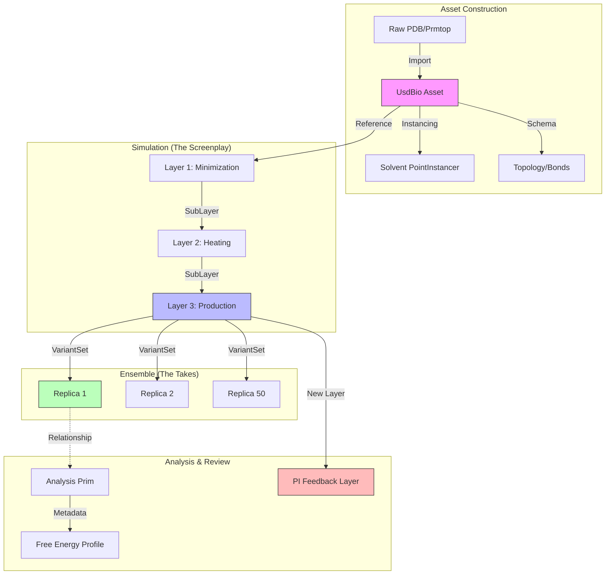

# Report: USD-Bio Workflow Brainstorming (v0)

**Topic**: Mapping Research Workflows to OpenUSD Concepts
**Source**: ShinobuLab Data Analysis
**Date**: 2026-01-10
**Status**: Draft

---

## Executive Summary

This report explores the architectural potential of `usd-bio` by mapping a standard Molecular Dynamics (MD) research workflow (based on `ShinobuLab` data) to the OpenUSD "Movie Production" pipeline. By treating biological entities as "Assets" and experimental protocols as "Screenplays," we identify significant opportunities for using USD not just for visualization, but as a robust **Knowledge Management System** for scientific data.

---

## The Metaphor: Research as Movie Production

The core insight is that managing a complex biological research project shares architectural patterns with producing an animated film. Both involve heterogeneous data, collaborative iteration, massive instancing, and distinct "stages" of production.

| Movie Production Concept | Research Workflow Concept | USD Mechanism |
| :--- | :--- | :--- |
| **The Star / Character Rig** | **The Biological System** (e.g., ABL Kinase + ATP) | `UsdBio` Schema + `PointInstancer` |
| **The Screenplay** | **Simulation Protocol** (Minimization → Equil → Prod) | `SubLayers` (Opinion Strength) |
| **Takes / Alternate Cuts** | **Replicas & Ensembles** (REUS runs) | `VariantSets` |
| **Post-Production / VFX** | **Analysis & Data Processing** (PMF, COM Dist) | `UsdRelationship` + Custom Metadata |
| **Dailies / Director Review** | **PI / Peer Review** | `Composition Arcs` (Feedback Layers) |
| **Cinematography** | **Publication visuals** | Hydra Rendering (Storm/RTX) |

---

## Architectural Opportunities

### 1. The "Asset": Standardized Biological Rigs
Current research relies on scattered file formats (`.pdb`, `.prmtop`, `.inpcrd`) that separate geometry, topology, and parameters.
*   **USD Approach**: Encapsulate the "ATP-Complex" as a single **Asset** (Prim).
    *   **Geometry**: `UsdGeomMesh` for surfaces, `UsdGeomPoints` for atoms.
    *   **Topology**: Custom `BioSchema` properties (mass, charge, bonds) embedded directly on the Prim.
    *   **Efficiency**: Use **PointInstancer** for the solvent (water/ions). Instead of listing 50,000 water molecules explicitly (as in PDB), USD defines one prototype and instances it 50,000 times, dramatically reducing memory footprint and enabling real-time interaction.

### 2. The "Screenplay": Workflow via Layering
Scientific protocols are sequential modifications of a base state. File-based workflows require duplicating the entire system state for each step (`1-min`, `3-heat`, etc.).
*   **USD Approach**: Use **SubLayers** to build the simulation history non-destructively.
    *   `Root.usd`: Composes the session.
    *   `Layer 3 (Production)`: *Overlays* the trajectory animation.
    *   `Layer 2 (Heating)`: *Overlays* thermal velocities.
    *   `Layer 1 (Minimization)`: *Overlays* minimized positions.
    *   `Layer 0 (Base)`: The raw topological construct.
    *   **Benefit**: Users can toggle layers to instantly compare "Before Minimization" vs. "After" without loading different files.

### 3. The "Takes": Managing Ensembles with Variants
`ShinobuLab/pull/` contains 50+ replicas for Umbrella Sampling. Traditional tools struggle to load these simultaneously.
*   **USD Approach**: Use **VariantSets**.
    *   Define a VariantSet named `ReplicaID`.
    *   Each variant (`rep01`, `rep02`...) points to a different trajectory payload.
    *   **Visualization**: Enable "Grid View" to instantiate all 50 variants in a single scene, visualizing the entire statistical ensemble at once.

### 4. "Post-Production": Embedded Analysis
Analysis currently happens "offline" in Python, generating detached plots (`.npy` files).
*   **USD Approach**: Embed analysis definitions into the scene graph.
    *   **Semantic Targeting**: Instead of Python indices (`residue 278`), use **UsdRelationships** (`rel calculatesDistanceTo = </Protein/Residue_278>`). This survives topology changes.
    *   **In-Context Viz**: Store analysis results (PMF values) as time-sampled attributes on a `AnalysisScope` prim. A custom Hydra delegate or UI can render these as 3D graphs *inside* the molecular view.

### 5. "Dailies": Collaborative Review
Feedback is currently decoupled (emails, screenshots).
*   **USD Approach**: Non-destructive **Feedback Layers**.
    *   A Principal Investigator (PI) adds a new layer on top of the simulation.
    *   They place 3D annotations ("Check this loop conformation") or Camera markers.
    *   The underlying data remains untouched, but the feedback is spatially and temporally context-aware.

---

## Visual Architecture

---

## Implications for USD-Bio Development

1.  **Schema Priority**: We need `BioSchema` definitions not just for atoms, but for **Analysis Concepts** (Restraints, Distances, Angles).
2.  **Tooling**: The "Loader" needs to be smart. It shouldn't just "import a file"; it should allow constructing a **Stage** from a directory of simulation steps.
3.  **Visualization**: We need to leverage Hydra to render non-geometric data (PMF curves, distance vectors) effectively.

## Next Steps
*   Prototype a simple `UsdBio` asset from `atp-complex-solv35.pdb`.
*   Experiment with `UsdGeomPointInstancer` for the solvent box.
*   Draft a schema for a "Molecular System" that includes topology.
