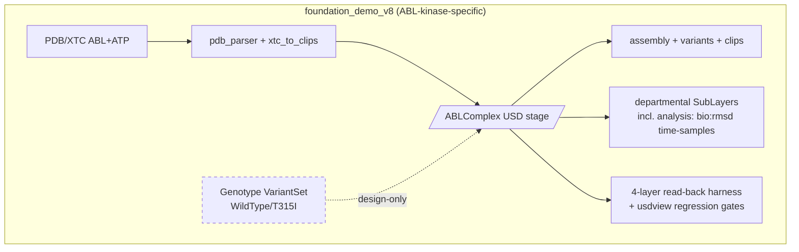
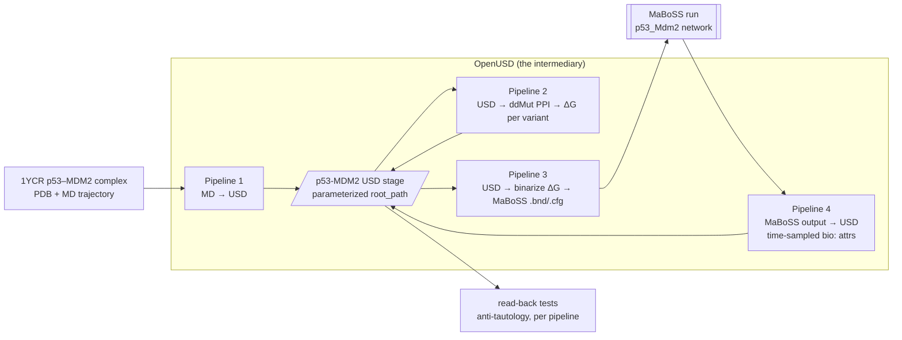
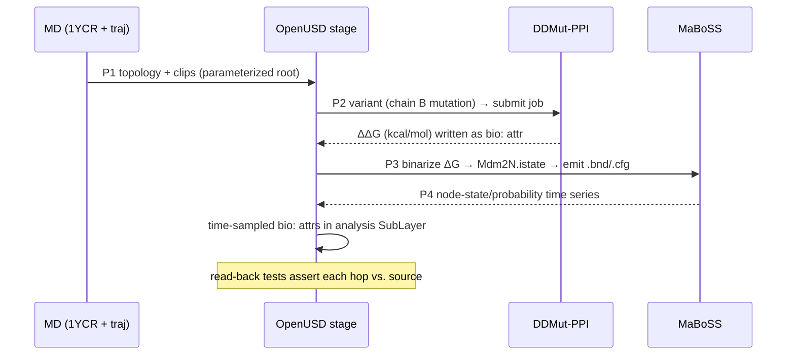

# p53-mdm2 — Architecture Analysis (v0)

Date: 2026-07-08
Cycle: cycle-000 (first cycle)
Author: Claude Opus 4.8 (async agent)

## Executive Summary

- **Problem:** Build a runnable, multi-scale p53–MDM2 demonstration in which OpenUSD is the shared representation tying molecular dynamics (MD) to systems-biology (MaBoSS Boolean-network) modelling, across four pipelines. New work lands under a fresh `examples/p53_mdm2/`; `foundation_demo_v8/` is inspiration, **not** a copy source `[source: __threads__/p53-mdm2/INTENT.md:9]`.
- **Proposed change (this cycle):** Produce the **reuse map** that classifies every v8 asset (reuse-as-is / generalize / greenfield / leave-behind) and pins the three external-input decisions (starting PDB, MaBoSS model shape, ΔG API), so the map — not v8 — drives extraction. Scaffold `examples/p53_mdm2/` as the extraction target.
- **Non-goals:** C++/schema authoring, CMake/CI/vcpkg revival, rewriting arch-doc decisions `[source: __threads__/p53-mdm2/INTENT.md:34]`. No pipeline code is written this cycle (avoiding premature chimera copy).
- **Biggest risks:** (1) the `/ABLComplex` root-path literal + `4676` atom-count baked across ≥6 v8 files is the chief chimera hazard if copied; (2) p53–MDM2 input-data format/availability is unconfirmed; (3) the ΔG→node binarization threshold is an unmade modeling decision.
- **Validation approach:** carry forward v8's falsification-resistant read-back testing — assert artifacts against expectations independently re-derived from source data, never against generator in-memory state — as the unit of "done" for every extracted pipeline.

## Current State (v8)

Pipelines 3 (USD→MaBoSS) and 4 (MaBoSS→USD) have **no** v8 presence; pipeline 2 (USD→MD ΔG) exists only as the design-stage Genotype/Perturbation VariantSet.

## Proposed State (p53_mdm2)

## The Reuse Map (core deliverable)

Classification of every significant v8 asset. Dominant coupling pattern: a hard-coded root prim path `/ABLComplex` and expected atom count `4676` threaded through generators **and** their verification code `[source: examples/foundation_demo_v8/converters/xtc_to_clips.py:88; examples/foundation_demo_v8/converters/pdb_parser.py:294]`.

### Pipeline 1 — MD → OpenUSD (v8 has it, ABL-coupled)

| Asset | Class | Rationale (ABL-specifics quoted) |
|---|---|---|
| `converters/pdb_parser.py` | **generalize** | Parsing core is general (`_parse_atom_line`, `infer_element`, `parse_solvent`) `[source: converters/pdb_parser.py:105,92,148]`. Coupled: `EXCLUDED_RESIDUES`/`LIGAND_RESIDUES={"atp","ATP"}` module constants `[source: converters/pdb_parser.py:20,26]`; `verify_pdb_parse()` asserts `total_atoms==4676`, `ligand_atoms==43` `[source: converters/pdb_parser.py:294-346]`. Target: `parse_pdb(path, exclude_residues=…, ligand_residues=frozenset())`; dataclasses reusable as-is. |
| `converters/xtc_to_clips.py` | **generalize** (highest value, most coupled) | Reusable: `compute_bond_xform`, `write_clip_file`, clip-template-manifest writer (carries the `clip.###.usdc` dot-separator rule) `[source: converters/xtc_to_clips.py:164,234,454-459]`. Coupled: `/ABLComplex` literal in every path builder `[source: converters/xtc_to_clips.py:88,110,298]`; mdtraj `select("resname atp or resname ATP")` `[source: converters/xtc_to_clips.py:211]`; `EXTRA_BONDS` ATP/cap table **duplicated** in `04_create_assembly.py:73-92`. Keep Å convention `metersPerUnit=1e-10`, nm→Å `*10`. |
| `converters/usda_to_usdc.py` | **reuse-as-is** (lib) | `convert_layer`/`batch_convert` fully generic `[source: converters/usda_to_usdc.py:30,75]`; only `__main__` names ABL files. |
| `converters/__init__.py` | **leave-behind** | Eager `import xtc_to_clips` pulls `mdtraj`, breaking pxr-only interpreters `[source: converters/__init__.py:6]`. Rebuild with lazy imports. |
| `templates/01_create_element_templates.py` + `data/**` | **reuse-as-is** | `/_class_/<symbol>` builder + authoritative biochemistry data (Bondi/Cordero radii, Shannon ionic radii, 20-AA definitions, ideal coords), no ABL coupling `[source: examples/foundation_demo_v8/data/element_properties.py:14; data/residue_definitions.py:10]`. |
| `templates/04_create_assembly.py` | **generalize** (reference architecture) | The LIVERPS-applied assembly builder (element-class `inherits`, LOCAL positions, `representation` cascade) is the pattern to carry `[source: templates/04_create_assembly.py:262,195-393]`. Strip `/ABLComplex`, duplicated `EXTRA_BONDS`, `verify_assembly` 4676/chain asserts, and the fragile `sys.path` reach into `composition_advanced`. |
| `templates/02,03,05,06,07` | **generalize / reuse-as-is** | Water template (02), residue templates (03), element library (07) general; solvent PointInstancer (05) and BasisCurves bonds (06) are valuable perf patterns but `/ABLComplex`-coupled. |
| `templates/08_create_assembly_refstyle.py` | **leave-behind** | Reference-arc twin of 04; keep ONE assembly builder to avoid duplicate-builder chimera. |
| `usdbio_env.py` | **reuse-as-is** | Env-driven data-dir helper, fails loudly, zero USD imports `[source: examples/foundation_demo_v8/usdbio_env.py:10-30]`. Model for the p53 data-root convention. |
| `tools/patch_stage_metadata.py` | **reuse-as-is (fn) / question the need** | `patch_stage()` general; its raison d'être (mdtraj absent under pxr-only) is **moot** — forOUSD venv carries both `pxr` and `mdtraj` `[source: __threads__/p53-mdm2/INTENT.md:27]`. |

### Pipeline 2 — OpenUSD → MD (ΔG): design-only skeleton

| Asset | Class | Rationale |
|---|---|---|
| `composition_advanced/perturbation_variantset/build_genotype.py` | **generalize** (pipeline-2 seed) | Authors a `Genotype` VariantSet with per-variant `Reference` geometry swap — exactly arch-doc §4.2 `[source: examples/composition_advanced/perturbation_variantset/build_genotype.py:37-96; __design__/openusd_for_research_architecture.md:89-92]`. Generalize off `T315I`/ABL drug-resistance specifics; the geometry-swap-by-Reference mechanism transfers directly. |
| `composition_advanced/provenance_metadata/provenance_schema.py` | **reuse-as-is / extend** | Six-field `bio:` provenance API `apply_provenance_metadata(prim, record)` `[source: examples/composition_advanced/provenance_metadata/provenance_schema.py:39-96]`. |
| `composition_advanced/provenance_metadata/provenance_source.py` | **generalize** | Data-driven "parse real run artifacts, mark unknowns `unknown`, never fabricate" philosophy is a keeper; every path is GENESIS/ShinobuLab-specific. |
| ddMut PPI API client + Variant→query→ΔG-write-back | **greenfield** | No v8 code touches the API `[source: __threads__/p53-mdm2/INTENT.md:16]`. |

### Pipeline 3 — OpenUSD → MaBoSS: **greenfield**

No v8 asset emits `.bnd`/`.cfg` or binarizes ΔG→node state. Only transferable scaffolding: the generic read-a-`bio:`-attribute pattern and the read-back testing discipline.

### Pipeline 4 — MaBoSS → OpenUSD: **greenfield**, one strong pattern to mine

| Asset | Class | Rationale |
|---|---|---|
| `templates/09_create_departmental_layers.py` (`_create_analysis_layer`) | **generalize** (the pipeline-4 template) | Writes time-sampled `bio:rmsd` (`Usd.TimeCode(frame)`) on an `OverridePrim` in a separate analysis SubLayer `[source: examples/foundation_demo_v8/templates/09_create_departmental_layers.py:156-195]`. MaBoSS node-state/probability time series map onto exactly this shape. Strip synthetic ABL values + `/ABLComplex`. |
| `composition_advanced/analysis_attributes/build_analysis_layer.py` | **generalize** | Second instance of the time-sampled-derived-attribute-in-analysis-layer pattern. |

### Testing — the crown jewel to carry forward

| Asset | Class | Rationale |
|---|---|---|
| `tests/run_tests.py` + 4-layer ladder | **generalize (keep architecture, rebuild specifics)** | Layer1 compliance (real `usdchecker --skipVariants`), Layer2 domain invariants (imports source-of-truth from `data.*`, **not** generator state) `[source: examples/foundation_demo_v8/tests/layer2_domain.py:46-51]`, Layer3 read-back (opens stage FRESH, asserts against independently-stated `_KNOWN_T0` positions "SOURCE values from the committed clip file") `[source: examples/foundation_demo_v8/tests/layer3_readback.py:404-423]`, Layer4 golden (targeted key-attribute diff vs. small fixtures, not fragile full-file diff). |
| `tests/usdview_regression_check.py` | **generalize (very high value)** | Headless 6-gate render-bug catcher; "every stage opened FRESH… expectations independently stated in the MANIFEST… assert the composed result, not any one layer" `[source: examples/foundation_demo_v8/tests/usdview_regression_check.py:17-24]`. |
| `tests/test_provenance_lineage.py` | **generalize (exemplary anti-tautology)** | Re-parses raw run artifacts with separate logic AND negatively asserts no field equals a shipped sentinel. |
| `tests/test_*.py` (per-artifact), `demos/*.py`, `assets/**`, `output/**`, `ROADMAP/**` | **leave-behind** | v8-artifact-specific; mine for technique, do not port. p53 regenerates its own artifacts and roadmap. |

## External Input Decisions

### Starting structure: **1YCR** (primary), **4HFZ** (fallback)

1YCR — "MDM2 bound to the transactivation domain of p53", X-ray 2.6 Å; chain A = human MDM2 N-terminal domain (res 17–125), chain B = native p53 peptide `SQETFSDLWKLLPEN` (res 15–29) `[source: https://data.rcsb.org/rest/v1/core/polymer_entity/1YCR/1; https://data.rcsb.org/rest/v1/core/polymer_entity/1YCR/2]`. Hydrophobic triad **Phe19 / Trp23 / Leu26** fully modeled; **no bound small molecule** — a clean wild-type baseline so variants are introduced by us `[source: https://data.rcsb.org/rest/v1/core/entry/1YCR]`. Rejected: 1T4E/4HG7/3LBK (inhibitor complexes, no peptide); 1T4F (1.9 Å but engineered non-native peptide) `[source: https://data.rcsb.org/rest/v1/core/entry/1T4E; …/4HG7; …/1T4F]`. Fallback 4HFZ is a native-peptide complex but messier (4 chains, 51 unmodeled residues, SER-mutant MDM2) `[source: https://data.rcsb.org/rest/v1/core/entry/4HFZ]`.

### MaBoSS model: 5-node `p53_Mdm2` DNA-damage oscillator

Nodes `p53`, `p53_h`, `Mdm2C` (cytoplasmic), `Mdm2N` (nuclear — the direct p53 antagonist), `Dam` (DNA-damage input) `[source: https://maboss.curie.fr/files/p53Dam/p53_Mdm2.bnd]`. The p53–MDM2 inhibition is encoded as `p53.logic = NOT Mdm2N`. WT `.cfg` istate: `Dam=TRUE, Mdm2N=TRUE, p53=FALSE`; `max_time=50`, `time_tick=0.1`, continuous-time, `sample_count=50000` `[source: https://maboss.curie.fr/files/p53Dam/p53_Mdm2_runcfg.cfg]`. **Hook:** a binarized p53–MDM2 ΔG maps most defensibly onto **`Mdm2N.istate`** — strong binding → `Mdm2N=TRUE` (baseline); destabilizing variant past threshold → `Mdm2N=FALSE`, releasing p53 via `NOT Mdm2N`.

### ΔG source: DDMut-PPI API

POST-to-submit → GET-by-`job_id` async API; single-mutation endpoint takes `pdb_accession` or `pdb_file`, required `chain`, required `mutation` (aaFrom+pos+aaTo, e.g. `L45G`); returns `prediction` = ΔΔG kcal/mol (negative = destabilizing) `[source: https://biosig.lab.uq.edu.au/ddmut_ppi/api]`. No documented rate limit / no API key → be a good citizen: sequential submits ≥1/s, backed-off polling, batch via `/list` (≤500). For p53–MDM2, mutate the **p53 peptide chain** (chain B in 1YCR) bearing the triad.

## Contracts & Invariants (for the generalized extraction)

- **Root-path parameterization (the anti-chimera invariant).** No module hard-codes a system root; `root_path: str` (default from config) is threaded through parser→assembly→clips→tests. `/ABLComplex` must never appear in `examples/p53_mdm2/`.
- **No dataset counts in library code.** Atom counts (`4676`, `43`) live only in per-run read-back fixtures, never in generators/parsers.
- `parse_pdb(path, *, exclude_residues=DEFAULT_SOLVENT_IONS, ligand_residues=frozenset()) -> PDBStructure` — solvent/ion/ligand sets are caller-supplied.
- **Anti-tautology testing invariant.** Every assertion compares an artifact opened FRESH against a value independently re-derived from source data or a stated MANIFEST — never against generator in-memory state.
- **Project conventions preserved:** `bio:` namespace, Å (`metersPerUnit=1e-10`), CPK colors, `/_class_/` templates, `representation` VariantSet.
- **ΔG→node binarization contract (pipeline 3):** `f(ΔΔG) -> {Mdm2N.istate ∈ {TRUE, FALSE}}` with a PI-set threshold; emitted `.cfg` differs from baseline only in `Mdm2N.istate` (optionally a forced-node override). **Error model:** ddMut job failure/timeout surfaces as an explicit `unknown`-tagged provenance value, never a fabricated ΔG.

## Key Flow (end-to-end target)

## Alternatives Considered

- **Copy v8 and retrofit p53** vs. **reuse-map-driven extraction.** Chosen: extraction. Copying reproduces the `/ABLComplex`+`4676` coupling the PI explicitly forbids as "chimera code" `[source: __threads__/p53-mdm2/INTENT.md:22]`.
- **MaBoSS source access: clone read-only `ro/` vs. GitHub MCP repo-search.** Chosen (this cycle): the PI-provided `.bnd`/`.cfg` files are the actual pipeline I/O contract and were fully characterized without cloning; GitHub MCP repo-search of `sysbio-curie/pyMaBoSS` is sufficient for API questions. Defer any `ro/` clone until a concrete pyMaBoSS-invocation need arises.
- **ΔG binarization onto `Mdm2N.istate` vs. onto a p53 node or a rate parameter.** Chosen: `Mdm2N.istate`, because the ΔG is a property of the binding interaction encoded as `NOT Mdm2N`. Tradeoff: threshold is a modeling choice deferred to the PI (see risk register + steering question).
- **Build the formal roadmap now vs. milestone sketch + defer.** Chosen: milestone sketch this cycle; build the `__roadmap__/p53_mdm2/` tree in cycle-001 once the PI confirms pipeline ordering. Rationale: bounded first cycle; the reuse map is the prerequisite the roadmap consumes.

## Risks & Mitigations

| Risk | Severity | Mitigation |
|---|---|---|
| `/ABLComplex` + `4676` coupling copied into p53 → chimera | High | Root-path invariant above; grep-gate `examples/p53_mdm2/` for `ABLComplex`/`4676` in tests. |
| p53–MDM2 input data format/availability unconfirmed (`USDBIO_DATA_DIR` unset in agent shell) | High | Steering question to PI (below); parser generalization assumes PDB+XTC shape v8 handles. |
| ΔG binarization threshold is an unmade modeling decision | Medium | Soft steering question; pipeline 3 built to take threshold as a parameter regardless. |
| 1YCR has 26 unmodeled residues; MDM2 species annotation ambiguity | Low | MD equilibration handles peripheral loops; interface fully resolved; trust RCSB's human annotation. |
| ddMut `/list` arg name ambiguous (`mutation_list` vs `mutations_list`); no published rate limit | Low | One lightweight probe before batch use; conservative client-side throttle. |

## Roadmap Recommendation

Multi-phase (four pipelines, multi-cycle) → build a formal `__roadmap__/p53_mdm2/` tree via `managing-roadmaps` in the next cycle. Milestone sketch:

- **M0 — scaffold & Pipeline 1 extraction:** `examples/p53_mdm2/` package; generalize `pdb_parser` + assembly builder off ABL (root-path param); drive with 1YCR; read-back tests. Committed `.usda`.
- **M1 — Pipeline 2 (ΔG):** generalize Genotype VariantSet; ddMut-PPI client with rate-limiting; write ΔΔG back as `bio:` attrs per p53-peptide variant.
- **M2 — Pipeline 3 (USD→MaBoSS):** binarize ΔG→`Mdm2N.istate`; emit `.bnd`/`.cfg` matching the `p53_Mdm2` shape; round-trip vs. the PI-provided files.
- **M3 — Pipeline 4 (MaBoSS→USD):** run MaBoSS; read node-state/probability time series back as time-sampled `bio:` attrs in an analysis SubLayer.
- **M4 — integrated demonstration:** the full chain end-to-end with committed artifacts + passing read-back tests.

## What I am uncertain about

- **p53–MDM2 input data.** `USDBIO_DATA_DIR` was unset in the analysis shell; the actual topology/trajectory files for p53–MDM2 (whether they exist yet, PDB vs mmCIF, GROMACS XTC vs other engine) are unconfirmed `[source: sub-agent shell: USDBIO_DATA_DIR unset]`. If p53 ships mmCIF or a non-mdtraj trajectory, `pdb_parser`/`xtc_to_clips` need more than parameterization. **Filed as a soft steering question.**
- **Whether the complex has non-standard residues/ligands** needing `EXTRA_BONDS`-style hand-authored connectivity. 1YCR is plain protein+peptide with no small molecule, so the ATP/cap bond machinery is likely dead weight to leave behind — but the *MD-prepared* system (caps, protonation states) may reintroduce non-standard residues.
- **ΔG binarization threshold** and whether variants flip only `Mdm2N.istate` or force the node — a genuine modeling decision not fixed by any file; the PI must set it.
- **MaBoSS `$case_a` / `p53` vs `p53_h` semantics** were inferred from the rules, not the source publication; the node-to-biology mapping and the `Mdm2N` hook stand regardless.
- **Coverage gaps:** the reuse map's classifications for `templates/02,03,06,08`, the `composition_advanced/{ensemble,parameter,analysis}` bodies, and `usdview_regression_check.py` past line ~120 rest on docstrings + README rather than full line-level reads — judged sufficient for a reuse map, not for exhaustive ABL-coupling quotes.
