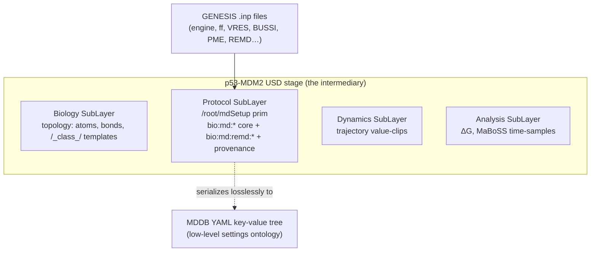

# p53-mdm2 — MD Setup-Parameter Reproducibility Survey & USDBio Representation (v0)

Date: 2026-07-10
Cycle: cycle-001
Author: Claude Opus 4.8 (async sub-agent)
Report type: architecture (model-first; leads with the recommended attribute schema)

## Executive Summary

- **Why this exists.** The PI reframed the topic: rather than consuming an existing p53–MDM2 trajectory, the project may run its **own** MD on dgx1/banyan. If so, the **MD setup parameters must become part of the USDBio intermediate representation** — a greenfield concern USDBio has never handled `[source: __threads__/p53-mdm2/QUESTIONS.md:6]`.
- **The EU database the PI referenced is MDDB** (Molecular Dynamics Data Bank), EU HORIZON-INFRA-2022 project #101094651, coordinated by IRB Barcelona, running 2023-03 to 2026-02 `[source: https://mddbr.eu/wp-content/uploads/2024/07/D1.1-Specification-of-file-format-metadata-and-provenance-record-requirements.pdf p.1]`. Its metadata design (Deliverable D1.1) is the recommended alignment target.
- **MDDB's design is not a frozen field list** — it is a **two-tier key-value tree** (high-level biological content + low-level algorithmic settings), serialized to **YAML/JSON**, with **units mandatory on every value** and **program name + version mandatory** `[source: D1.1 §4.1, §4.2, §5]`. This is the shape to mirror, not a table to copy.
- **Recommended USDBio core:** ~14 flat `bio:md:` attributes on one dedicated `MDSetup` prim in the **Protocol departmental SubLayer**, plus an optional nested `bio:md:remd:` block for replica-exchange. The core is exactly MDDB's "conceptual-reproducibility" descriptor list `[source: D1.1 §1]` intersected with the community reporting checklist `[source: https://pmc.ncbi.nlm.nih.gov/articles/PMC10014944/ §4a-4c]`, and every field is populated by the ShinobuLab GENESIS `.inp` files, so the design is grounded in a real workflow.
- **Footprint:** one prim, ~14 core attributes, no new file format, no C++ this cycle. Serializes losslessly to an MDDB YAML key-value tree, so future MDDB interop is mechanical.

## Recommended `bio:md:` Attribute Schema (the deliverable)

Author these on a single dedicated prim — proposed path `/<root>/mdSetup`, typeName `Scope` (a later C++ `MDSetupAPI` applied schema can formalize it). It belongs in the **Protocol SubLayer** (CLAUDE.md departmental layering: "Protocol/setup") so setup metadata is versioned and loadable independently of topology/trajectory `[source: /Users/hacker/Documents/src/LittleCoinCoin/usd-bio/CLAUDE.md "Departmental layering"]`.

### Core set (mandatory — the minimum defensible set)

| `bio:md:` attribute | USD type | Unit (customData `unit`) | Example (ShinobuLab) | MDDB / checklist basis |
|---|---|---|---|---|
| `engine` | `string` | — | `GENESIS` | program name, mandatory `[source: D1.1 §5]` |
| `engineVersion` | `string` | — | `spdyn 2.x` (record actual) | program version, mandatory `[source: D1.1 §5]` |
| `forceField` | `string` | — | `AMBER (ff19SB)` | force field name `[source: D1.1 §1]` |
| `waterModel` | `string` | — | `TIP3P` | solvent composition `[source: D1.1 §1]`; checklist water `[source: PMC10014944 §4a]` |
| `ensemble` | `token` {NVE,NVT,NPT} | — | `NVT` (prod) / `NPT` (equil) | ensemble / conditions `[source: D1.1 §1]` |
| `integrator` | `string` | — | `VRES` (RESPA MTS) | algorithm, units-bearing node `[source: D1.1 §5]` |
| `timestep` | `double` | `ps` | `0.0035` | timestep `[source: D1.1 §1]` |
| `nSteps` | `int64` | `steps` | `600000` per run | total length `[source: D1.1 §1]` |
| `temperature` | `double` | `K` | `310.0` | thermostat reference T `[source: D1.1 §4.2]` |
| `thermostat` | `string` | — | `Bussi` | T-coupling algorithm `[source: D1.1 §1]`; checklist `[source: PMC10014944 §4b]` |
| `barostat` | `string` | — | `Bussi` (NPT only) | P-coupling algorithm `[source: D1.1 §1]`; checklist `[source: PMC10014944 §4b]` |
| `pressure` | `double` | `atm` | `1.0` (NPT only) | conditions `[source: D1.1 §1]` |
| `electrostatics` | `token` {PME,CUTOFF,…} | — | `PME` | electrostatics algorithm `[source: D1.1 §1]` |
| `cutoff` | `double` | `Å` | `8.0` | nonbonded cutoff `[source: D1.1 §1]`; checklist `[source: PMC10014944 §4b]` |
| `constraintAlgorithm` | `string` | — | `SHAKE` (rigid_bond=YES) | constraint algorithm `[source: D1.1 §1]` |

### Provenance (reuse, do not re-invent)

Starting structure + run lineage go through the **existing v8 provenance API** (`apply_provenance_metadata`, six `bio:` fields) already classed **reuse-as-is/extend** in the cycle-000 reuse map `[source: __reports__/p53-mdm2/00-architecture_v0.md:73]`. Add `bio:md:startingStructure` (e.g. `1YCR`) as the anchor. This directly satisfies MDDB's provenance-record intent: command/operation, input-file names + **hash sums**, and an optional carry-over chain back to the source PDB `[source: D1.1 §3]`.

### Optional extension — replica exchange (`bio:md:remd:`)

Only authored when the run is a REMD/enhanced-sampling run (ShinobuLab is 2D gREST/REUS). Nested namespace on the same prim:

| `bio:md:remd:` attribute | Type | Example (ShinobuLab) |
|---|---|---|
| `method` | `string` | `gREST/REUS (2D)` |
| `dimensions` | `int` | `2` |
| `nReplicas` | `int` | `288` (8 gREST × 36 REUS) |
| `exchangePeriod` | `int` (steps) | `600` |
| `dim1:type` / `dim1:parameters` | `token` / `double[]` | `REST` / `[310,328,349,371,396,422,450,481]` K |
| `dim2:type` / `dim2:centers` / `dim2:forceConstants` | `token` / `double[]` / `double[]` | `RESTRAINT` / `[6.5…31.46]` Å / `[2.0×36]` |

**Architectural tie-in:** replica-exchange replicas map cleanly onto the project's existing **Ensemble scientific-variant pattern (`ReplicaID`)** `[source: CLAUDE.md "VariantSets … Ensemble (replicas via ReplicaID)"]`. The `bio:md:remd:` block describes the *protocol that generated the ensemble*; the per-replica states are the `ReplicaID` VariantSet — the two are complementary, not redundant.

### Where it sits

## The SOTA Landscape (survey)

### The EU database: MDDB (the PI's reference — confirmed)

MDDB is the EU-funded ("Funded by the European Union", HORIZON-INFRA-2022-DEV-01) MD-trajectory repository, coordinated by IRB Barcelona with KTH, BSC, and Oxford (UOXF) partners `[source: D1.1 p.1-2]`. Shinobu-san's "database of MD trajectories funded by European research" `[source: __threads__/p53-mdm2/QUESTIONS.md:6]` is MDDB (its predecessor demo is the COVID-19 BioExcel-CV19 bank `[source: https://bioexcel.eu/molecular-dynamics-databases-at-the-cusp-of-an-upward-trajectory/]`). Its metadata design, from Deliverable D1.1 (public, final v1.0, 2024-02):

- **Two-tier ontology** `[source: D1.1 §4]`: **§4.1 high-level qualitative** metadata (what the system *is* — molecule types, configuration, trajectory purpose e.g. folding / transition / free-energy), extending the **BIGNASim / MDposit** ontology from MMB Barcelona `[source: D1.1 §4.1 & fn.9-10]`; and **§4.2 low-level specific settings** — a *strictly hierarchical* key-value tree where each algorithm owns its own parameters (e.g. each thermostat carries its own reference temperature) `[source: D1.1 §4.2]`.
- **Units mandatory on all values**; the tree carries **program name + version** and **simulation phase** (e.g. "energy minimization") `[source: D1.1 §5]`.
- **The conceptual-reproducibility descriptor list** (D1.1 §1, verbatim intent): "algorithms used for pressure/temperature coupling, the force field name, program and version …, algorithms for electrostatics and van der Waals interactions and their cutoffs, the timestep, constraint algorithms, and total length of the simulation" — *"sufficient to reproduce the results when using the same input files, program, and program version"* `[source: D1.1 §1]`. **This list is the source of the core-set table above.**
- **Serialization:** key-value tree as **YAML** (preferred, comments), or JSON/XML; deliberately **no prescribed rigid schema file yet** — auto-extraction is planned first for GROMACS `[source: D1.1 §5, §6.1]`.
- **Provenance records** (§3): command/operation + input-file names + **hash sums**, optional carry-over history back to the PDB, optional digital signatures `[source: D1.1 §3]`.
- **Trajectory storage** is a separate concern: an **HDF5-based container building on H5MD**, with SZ3/MDZ lossy compression, storing names/connectivity/partial-charges/occupancy inline `[source: D1.1 §2.1, §6.1]`. USDBio does **not** need to adopt this — USD value-clips already handle trajectory streaming (cycle-000 reuse map, `xtc_to_clips`).

### Adjacent efforts (context, not alignment targets)

- **MDverse** — indexes ~250k files / ~2k datasets scraped from Zenodo/Figshare/OSF, GROMACS-centric; it *infers* metadata (temperature, length, resolution) post-hoc and explicitly calls for "a clear and uniformly used ontology and dedicated metadata reference file" for future deposits `[source: https://elifesciences.org/articles/90061; https://pubmed.ncbi.nlm.nih.gov/39212001/]`. Confirms the gap MDDB fills; not a schema to copy.
- **MoDEL / MDposit / BIGNASim (MMB Barcelona)** — the ontology MDDB §4.1 explicitly extends `[source: D1.1 §4.1 fn.9-10]`. Aligning with MDDB transitively aligns with these.
- **H5MD** — HDF5-based MD file format (2014); root groups `h5md` (metadata: version, author, creator), `particles`, `observables`, `connectivity`, `parameters`; MDDB's container builds on it `[source: https://h5md.nongnu.org/; https://arxiv.org/abs/1308.6382; D1.1 §6.1]`. Relevant only if USDBio ever needs a trajectory sidecar; USD clips make it unnecessary here.
- **GROMACS `.mdp` / OpenMM XML** — engine-native setup files; the ShinobuLab lab uses **GENESIS `.inp`** instead. All three are *inputs* to the `bio:md:` extraction, not USDBio's representation. USDBio's job is the engine-neutral superset MDDB defines.
- **Community reporting checklists** — the LiveCoMS "Reliability and reproducibility checklist for MD" mandates box dimensions, atom/water counts, salt concentration, protonation state, nonbonded cutoff, thermostat, barostat, software+version `[source: https://pmc.ncbi.nlm.nih.gov/articles/PMC10014944/ §4a-4c]`; JCIM's reporting guidelines are the journal-enforced equivalent `[source: https://pubs.acs.org/doi/10.1021/acs.jcim.3c00599]`. These validate the core set from the *reader/reviewer* side and add three composition fields (see uncertainties).

## What the ShinobuLab lab actually records (grounding)

The lab's own procedure is a GENESIS-based **2D gREST/REUS** workflow for ABL-kinase + ATP peptide `[source: $USDBIO_DATA_DIR/251112-grest-reus-md-procedure-shinobu-lab.docx; .../README.md]`. Concrete parameters extracted from the GENESIS `.inp` files (these populate every core attribute above):

- **Engine/FF:** GENESIS `spdyn`/`spdyn-mix`; `forcefield = AMBER`; Amber `.prmtop`/`.inpcrd`/`.pdb` inputs; `water_model = WAT` (TIP3P) `[source: .../README.md; .../equilibration/5-eq2/*.inp]`.
- **Electrostatics/nonbonded:** `electrostatic = PME`; `switchdist = 8.0`, `cutoffdist = 8.0`, `pairlistdist = 10.0` Å; `dispersion_corr = EPRESS` `[source: .../equilibration/5-eq2/*.inp]`.
- **Integrator/timestep:** `integrator = VRES` (RESPA multiple-timestep); `timestep = 0.0035` ps (3.5 fs), enabled by **hydrogen mass repartitioning** (`hydrogen_mr = YES`, `hmr_ratio = 3.0`, `hmr_target = solute`) `[source: .../md-simulations/production/run001/run001-prod-atpcomplex-288rep.inp]`.
- **Constraints/ensemble:** `rigid_bond = YES` (SHAKE, all bonds); `ensemble = NPT` (equilibration) / `NVT` (production & REUS); `tpcontrol = BUSSI`; `temperature = 310.0` K; `pressure = 1.0` atm; `gamma_t = 1.0` ps⁻¹; `type = PBC` `[source: .../equilibration/5-eq2/*.inp; .../pull/reus-tune-50rep-20.3.inp]`.
- **Replica exchange:** `[REMD] dimension = 2`; **type1 = REST** (gREST solute tempering), 8 replicas, ladder `310 328 349 371 396 422 450 481` K; **type2 = RESTRAINT** (REUS), 36 replicas, `DISTMASS` harmonic, force constant `2.0` (×36), reference COM distances `6.50 … 31.46` Å; `exchange_period = 600`; total **288 replicas** `[source: .../md-simulations/production/run001/run001-prod-atpcomplex-288rep.inp]`.
- **Protocol shape:** min → min → heat(→310K) → eq1(NPT) → eq2 → pull(umbrella, 6.8-31.3 Å every 0.5 Å) → gREST tune (7 rounds, accept >0.20) → 2D gREST/REUS tune (34 rounds, gREST accept >0.20, REUS >0.17) → production (run001…run350, continuation-chained) `[source: 251112-grest-reus-md-procedure-shinobu-lab.docx]`.

Note this is a **REUS/PMF (ΔG-along-a-coordinate) workflow**, which is directly the kind of free-energy calculation Pipeline 2 needs — the lab already produces binding-related free energies via PyMBAR PMF `[source: .../analysis/3_mbar/reus_pymbar.py; .../README.md]`. If the project runs its own p53–MDM2 MD, this procedure is the template to adapt.

## Design Rationale (useful, reusable, low-footprint)

- **Why a flat core + optional REMD block, not the full MDDB tree.** MDDB's low-level tree aims to *exhaustively* describe a simulation for a public repository; USDBio's job in this topic is to carry *enough to reproduce and to drive downstream pipelines*, not to be a deposition endpoint. The ~14-field core is the intersection of MDDB §1 and the community checklist — the defensible minimum. The REMD block is optional because most demonstrations (and 1YCR conventional MD) will not use it.
- **Why align vocabulary with MDDB.** MDDB is the EU standard-in-formation, extends the established BIGNASim/MDposit ontology, and serializes to YAML key-value trees — a flat `bio:md:` namespace maps 1:1 onto that tree, so a future `usd → MDDB.yaml` exporter is a dict walk, not a translation `[source: D1.1 §4.2, §6.1]`.
- **Why the Protocol SubLayer.** Matches the project's existing departmental-layering concept and keeps setup metadata independently versionable `[source: CLAUDE.md]`.
- **Units.** MDDB mandates units on every value `[source: D1.1 §5]`. USD has no first-class unit-per-attribute mechanism except length (`metersPerUnit=1e-10`, already the project's Å convention). Recommend attaching a `customData = {"unit": "ps"}` dict per non-length attribute — cheap, lossless to YAML, and does not fight USD conventions.

## Alternatives Considered

- **Adopt H5MD/HDF5 as a trajectory sidecar** vs. **stay on USD value-clips.** Chosen: USD clips. Cycle-000 already has a working `xtc_to_clips` path `[source: __reports__/p53-mdm2/00-architecture_v0.md:58]`; adding HDF5 would be a second trajectory backend for no benefit in this topic.
- **Encode setup params as name-mangled attributes** (`bio:md:thermostat_Bussi_T310`) vs. **typed attributes + `unit` customData.** Chosen: typed attributes — queryable, type-safe, and MDDB-serializable.
- **Model each simulation *phase* (min/heat/eq/prod) as its own prim** vs. **one `mdSetup` prim for the production run.** Chosen (this cycle): one prim for the production run, because the demonstration reproduces the production trajectory; MDDB's per-phase `simulation phase` node `[source: D1.1 §5]` is the growth path if multi-phase provenance is later needed (flagged in roadmap, not built now).
- **Wait for MDDB's frozen schema file** vs. **align on its published principles now.** Chosen: align now — D1.1 deliberately publishes principles not a frozen field list `[source: D1.1 §5]`, and the §1 descriptor list is stable enough to build against.

## What I am uncertain about

- **MDDB has no published frozen field-name list.** D1.1 defines an *approach* (two-tier YAML key-value tree, units mandatory, extends BIGNASim), not a machine-readable schema with canonical keys `[source: D1.1 §4-5]`. The exact MDDB key strings (e.g. is it `force_field`, `forcefield`, or `ff`?) are **not** fixed in the public deliverable; my `bio:md:` names follow USD camelCase convention and MDDB's *semantics*, and would need reconciliation against MDDB's eventual released schema or its live API (`mdposit`/`mmb.irbbarcelona.org`) — which I did not query this cycle.
- **Composition fields the checklist mandates but MDDB §1 omits from its minimal list:** box dimensions, total atom count, water count, salt/ion concentration, protonation states `[source: PMC10014944 §4a-4b]`. I left these out of the *core* to keep footprint low and because several are derivable from the topology the Biology SubLayer already carries (atom count, box) — but ion concentration and protonation state are *not* recoverable from geometry alone and may deserve promotion to core. This is a judgement call the PI may want to overturn.
- **GENESIS engine version** is not recorded in the `.inp` files themselves `[source: .../*.inp — no version field]`; it lives in the batch scripts / module loads on Fugaku. `engineVersion` will need to be captured from the job environment, not the input deck, if the project runs its own MD.
- **Whether USDBio should carry setup params at all vs. reference an external MDDB record.** The PI framed this as "these parameters must become part of the USDBio IR" `[source: __threads__/p53-mdm2/QUESTIONS.md:6]`, so I designed for in-USD authoring; an alternative (USD holds only a `bio:md:mddbRecordRef` URI pointing at an external MDDB deposition) would be even lower-footprint but defers the greenfield capability the PI asked for. Not pursued, but noted.
- **Water model precision.** GENESIS `water_model = WAT` names the residue, not the parameter set; TIP3P is the Amber default and near-certain here `[assumption: Amber `.prmtop` + `WAT` residue ⇒ TIP3P is the standard Amber pairing]`, but the `.prmtop` would need parsing to confirm the exact water parameters.
- **Scope of "own MD" decision is still open.** Whether the project actually runs MD on dgx1/banyan (vs. using ΔG-only from the ddMut server) is a PI decision not yet made `[source: __threads__/p53-mdm2/QUESTIONS.md:6 "it is worth considering"]`. This schema is the *contingency* design for the "yes" branch; if the answer is "no, ΔG-only", most of `bio:md:` is unneeded and only provenance of the ΔG source matters.
