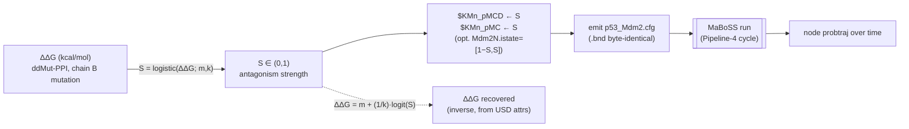

# p53-mdm2 — ΔG↔MaBoSS Correlation (Pipeline 3) — Architecture Analysis (v0)

Date: 2026-07-10
Cycle: cycle-001
Author: Claude Opus 4.8 (async research sub-agent)

## Executive Summary

- **Problem:** Pipeline 3 (OpenUSD → MaBoSS) must turn a p53-peptide variant's binding free-energy change (ΔΔG, from ddMut-PPI) into a concrete edit of the tutorial `p53_Mdm2` Boolean model. The PI **rejected picking a fixed ΔG binarization threshold** (Q-002): instead, the model's ad-hoc "hill-function" activation parameters are to be **correlated with ΔG**, and **ΔG is recovered as the inverse of that correlation** `[source: __threads__/p53-mdm2/QUESTIONS.md:12]`.
- **Proposed change:** Replace the arch-doc's binarize-to-`Mdm2N.istate`-TRUE/FALSE contract with a **continuous monotonic correlation** from ΔΔG onto the Mdm2N activation "hill" parameter **`$KMn_pMCD`** (co-driven companion `$KMn_pMC`). A logistic sigmoid maps ΔΔG→S∈[0,1]; its logit inverse recovers ΔΔG from any parameter value. The full correlation (form + midpoint + steepness) is carried on the variant prim as `bio:maboss:*` attributes so the inverse is reconstructable from USD alone.
- **Non-goals:** No MaBoSS/pyMaBoSS install and no live simulation run this cycle (deferred to the Pipeline-4 cycle); no litigation of model validity — it is a tutorial model, the goal is to push the MD+MaBoSS link through the USDBio IR `[source: __threads__/p53-mdm2/QUESTIONS.md:12]`.
- **Biggest risks:** (1) which knob most moves the attractor is unverified without a run; (2) default midpoint/steepness are undefensible-by-data placeholders (by design, per PI); (3) supersedes an arch-doc contract, so the reuse-map wording must be updated downstream.
- **Validation approach:** anti-tautology round-trip — emit `.cfg` (topology `.bnd` byte-identical to reference), re-parse with an independent reader, assert `$KMn_pMCD` equals S recomputed from the committed ΔΔG; assert the logit inverse recovers the original ΔΔG; and (when MaBoSS lands) assert an independently-derived directional expectation — a destabilizing variant yields strictly more time-averaged P(p53 active) than WT.

## The governing parameter (what ΔG hooks onto)

The physical observable is **ΔΔG of the p53-peptide : MDM2-N-terminal-domain interaction** upon mutating the p53 peptide (chain B of 1YCR). Negative ΔΔG = destabilizing = weaker binding `[source: https://biosig.lab.uq.edu.au/ddmut_ppi/api]`. Biologically: weaker p53:MDM2 binding → MDM2 sequesters/inhibits p53 less → p53 is released.

In the model the p53↔MDM2 antagonism is a **hard Boolean** — `p53.logic = NOT Mdm2N` and `p53_h.logic = NOT Mdm2N` `[source: https://maboss.curie.fr/files/p53Dam/p53_Mdm2.bnd]`. There is no continuous knob on that inhibition edge itself. The only continuous "hill-function" knobs live on **Mdm2N's own activation** — the `$KMn_*` family that weights the eight Boolean contexts of `Mdm2N.rate_up`/`rate_down`, all ∈ [0,1] and, per the PI, "completely ad-hoc, tuned only to fit observation" `[source: https://maboss.curie.fr/files/p53Dam/p53_Mdm2.bnd; __threads__/p53-mdm2/QUESTIONS.md:12]`.

Under the WT config `$case_a = TRUE`, so `@logic_p53 = p53` inside Mdm2N `[source: https://maboss.curie.fr/files/p53Dam/p53_Mdm2_runcfg.cfg; …/p53_Mdm2.bnd]`. The four **p53-present** contexts (`$KMn_p, $KMn_pD, $KMn_pMC, $KMn_pMCD`) are exactly the coupling "can nuclear MDM2 still turn on *while p53 is present*" — i.e. the binding-affinity-dependent quantity. WT values: `$KMn_pMCD=1, $KMn_pMC=1, $KMn_p=0, $KMn_pD=0` `[source: …/p53_Mdm2_runcfg.cfg]`.

**Primary knob: `$KMn_pMCD`** (WT=1). The model's own comment names it the case_a toggle: "if p53 and MDM2C are present when DNA damage and Kmn_pMCD=1 => despite the presence of p53 and DNA damage, MDM2N can activate" `[source: …/p53_Mdm2.bnd]`. Reducing it from 1→0 removes MDM2N's ability to hold under the maximal-p53+stress context → p53 escapes under DNA damage — the direct model image of "weaker binding releases p53." **Companion `$KMn_pMC`** (WT=1) carries the no-damage context and is co-driven. `$KMn_p`/`$KMn_pD` stay at WT 0 (they encode "no spontaneous MDM2N under p53 without the MDM2C/Dam context" and are not the binding signal). Non-p53 contexts (`$KMn_MC, $KMn_MCD, $KMn_D, $KMn`) are unchanged — they do not involve the p53:MDM2 interface.

> **Supersession note.** This replaces the arch-doc §"Contracts & Invariants" ΔG→`Mdm2N.istate ∈ {TRUE,FALSE}` binarization contract `[source: __reports__/p53-mdm2/00-architecture_v0.md:118]`, per the newer Q-002 answer (2026-07-09) that rejects the threshold premise `[source: __threads__/p53-mdm2/QUESTIONS.md:9,12]`. `Mdm2N.istate` is retained only as an *optional secondary, continuous* signal (P(Mdm2N=1)=S), never a hard TRUE/FALSE flip.

## The correlation function (and its inverse)

Antagonism strength `S ∈ (0,1)` (the value written into the `$KMn_*` knobs, WT=1):

```
                      1
  S(ΔΔG) = ───────────────────────           (logistic; ΔΔG in kcal/mol)
            1 + exp(−k·(ΔΔG − m))

  Inverse (PI's "ΔG is the inverse of the correlation"):

  ΔΔG(S) = m + (1/k)·ln( S / (1 − S) )        (logit)
```

| Symbol | Meaning | Default | Rationale |
|---|---|---|---|
| `m` | midpoint ΔΔG₅₀ (S=0.5) | **−3 kcal/mol** | `[assumption: ~3 kcal/mol destabilization ≈ ~150× affinity loss at 300 K (RT≈0.6), a defensible "half-released" point; placeholder to be refined against MD+ddMut data, not a validated cutoff]` |
| `k` | steepness (1/(kcal/mol)) | **1.5** | `[assumption: 10–90% transition spans ΔΔG∈[m−1.46, m+1.46]≈[−4.5,−1.5], a ~3 kcal/mol soft window — avoids the hard cliff the PI objected to]` |

Behaviour (with defaults): WT `ΔΔG=0` → `S≈0.989≈1` = WT `$KMn_pMCD` ✔; `ΔΔG=−3` → `S=0.5`; `ΔΔG=−6` → `S≈0.011≈0` (MDM2N cannot hold, p53 released). Monotone increasing in ΔΔG, so the logit inverse is single-valued on (0,1). Sign check: aromatic-triad mutants (p53 F19/W23/L26 → Ala), strongly destabilizing, give large-negative ΔΔG → S→0 → p53 released; WT → S≈1 → p53 suppressed at baseline. Correct direction `[assumption: triad hydrophobicity drives the interface per 1YCR annotation — __reports__/p53-mdm2/00-architecture_v0.md:101]`.



## MaBoSS model characterization (source of truth)

**Nodes & logic** `[source: https://maboss.curie.fr/files/p53Dam/p53_Mdm2.bnd]`:

| Node | logic | rate_up | rate_down |
|---|---|---|---|
| `p53` | `NOT Mdm2N` | `(@logic?1:0)/$tp53u` | `((NOT @logic AND NOT p53_h)?1:0)/$tp53d` |
| `p53_h` | `NOT Mdm2N` | `((@logic AND p53)?1:0)/$tp53hu` | `((@logic?0:1))/$tp53hd` |
| `Mdm2C` | `$case_a ? p53_h : p53` | `(@logic?1:0)/$tMCu` | `(@logic?0:1)/$tMCd` |
| `Mdm2N` | `logic_p53 = $case_a ? p53 : p53_h` | Σ of 8 mutually-exclusive `(context ? $KMn_x : 0)` / `$tMNu` | Σ of 8 `(context ? (1−$KMn_x) : 0)` / `$tMNd` |
| `Dam` | `$case_a ? p53_h : p53` | `@logic?0:0` (always 0; stress = initial condition) | `(@logic?1:0)/$tDd` |

Mdm2N's 8 contexts are all combinations of `{@logic_p53, Mdm2C, Dam}` weighted by `$KMn`, `$KMn_p`, `$KMn_MC`, `$KMn_pMC`, `$KMn_D`, `$KMn_pD`, `$KMn_MCD`, `$KMn_pMCD` (rate_down uses `1−$KMn_x`, "everything that inactivates Mdm2N is the opposite of what activates it") `[source: …/p53_Mdm2.bnd]`.

**Every tunable parameter** `[source: https://maboss.curie.fr/files/p53Dam/p53_Mdm2_runcfg.cfg]`:

- **Structure switches:** `$case_a = TRUE` (selects p53 vs p53_h coupling; held fixed = Figure 5a Kauffmann). `$fast = 100` (not referenced by any rate expression in the `.bnd` provided — effectively unused/leftover).
- **Hill parameters (the ΔG-correlated family):** `$KMn=1, $KMn_p=0, $KMn_MC=1, $KMn_pMC=1, $KMn_D=0, $KMn_pD=0, $KMn_MCD=1, $KMn_pMCD=1`.
- **Transition time constants (rate denominators):** `$tp53u=2, $tp53d=2, $tp53hu=1, $tp53hd=1, $tMCu=0.6, $tMCd=1, $tMNu=0.3, $tMNd=1, $tDd=5`.
- **istate:** `Dam=TRUE, Mdm2N=TRUE, p53=FALSE, p53_h=FALSE`.
- **refstate:** `p53.refstate=0, p53_h.refstate=0`.
- **Sim params:** `sample_count=50000, max_time=50, time_tick=0.1, discrete_time=0` (continuous-time), `use_physrandgen=FALSE, seed_pseudorandom=100, thread_count=1, statdist_traj_count=100, statdist_cluster_threshold=0.9`.

## pyMaBoSS call shape (Pipeline-3 emit target / Pipeline-4 read source)

Confirmed against the module source `[source: github.com/thenlevy/pyMaBoSS maboss/simulation.py; maboss/result.py; maboss/gsparser.py]` (origin of the `maboss` package; the maintained fork preserves these Python-level entry points):

```python
import maboss
sim = maboss.load("p53_Mdm2.bnd", "p53_Mdm2_runcfg.cfg")   # -> Simulation

# override a $-hill-parameter (keys starting with '$' live in sim.param):
sim.param['$KMn_pMCD'] = S          # cannot pass '$'-name via **kwargs; index sim.param
sim.param['$KMn_pMC']  = S
sim.update_parameters(max_time=50)  # kwargs path for non-$ sim params

# optional continuous istate (secondary signal): P(Mdm2N=0)=1-S, P(=1)=S
sim.network.set_istate("Mdm2N", [1 - S, S])
# hard force (NOT used here): sim.mutate("Mdm2N", "ON"|"OFF"|"WT")

res = sim.run()                     # -> Result (invokes MaBoSS on temp .bnd/.cfg)
nodes = res.get_nodes_probtraj()    # DataFrame: index=Time, cols=node names, vals=P(node up)
states = res.get_states_probtraj()  # per-state probabilities over time
```

`sim.print_bnd()` / `sim.print_cfg()` serialize the model, but **Pipeline 3 emits `.bnd`/`.cfg` as text directly** (reference-template + parameter substitution) so the emit step needs no MaBoSS install; pyMaBoSS `load`/`run` is used only at the Pipeline-4 boundary `[source: maboss/simulation.py print_bnd/print_cfg; maboss/result.py Result.__init__ subprocess.call("MaBoSS", ...)]`.

## Contracts & Invariants

**`bio:` attributes** (Å/units conventions unchanged; `bio:` namespace per CLAUDE.md `[source: CLAUDE.md]`). On the p53-variant prim (Genotype variant / complex root):

| Attribute | Type | Written by | Meaning |
|---|---|---|---|
| `bio:mutation:code` | string | P2 | e.g. `W23A` |
| `bio:mutation:chain` | string | P2 | `B` (p53 peptide) |
| `bio:mutation:ddgKcalPerMol` | float | P2 | ddMut-PPI ΔΔG; negative=destabilizing |
| `bio:ddg:source` / `bio:ddg:status` | string | P2 | `ddmut_ppi` / `ok`\|`unknown` (never fabricate) |
| `bio:maboss:targetNode` | token | P3 | `Mdm2N` |
| `bio:maboss:paramNames` | token[] | P3 | `["KMn_pMCD","KMn_pMC"]` |
| `bio:maboss:paramValue` | float | P3 | `S` written into those `$KMn_*` |
| `bio:maboss:correlationForm` | token | P3 | `logistic` |
| `bio:maboss:correlationMidpointKcalPerMol` | float | P3 | `m` (−3) |
| `bio:maboss:correlationSteepnessPerKcal` | float | P3 | `k` (1.5) |
| `bio:maboss:prob:<node>` | float (time-sampled) | P4 | P(node up) at `Usd.TimeCode(frame)`, analysis SubLayer, `_create_analysis_layer` pattern `[source: examples/foundation_demo_v8/templates/09_create_departmental_layers.py:156-195]` |

**Invariants:**
- **Inverse-reconstructable-from-USD:** `{paramValue, correlationMidpoint, correlationSteepness}` on the prim are sufficient to recover `ΔΔG = m + (1/k)·logit(S)` with no external state — the PI's "ΔG is the inverse of the correlation" made a USD-local property.
- **Monotonic + single-valued:** logistic strictly increasing on ℝ → inverse single-valued on (0,1); reject `S∈{0,1}` exactly (logit diverges) — clamp to `[ε, 1−ε]`.
- **Topology-invariant emit:** emitted `.bnd` is byte-identical to the reference `p53_Mdm2.bnd`; only `.cfg` `$KMn_pMCD`/`$KMn_pMC` (and optional `Mdm2N.istate`) differ from baseline.
- **No hard threshold:** no code path binarizes ΔΔG to a Boolean node flip (the rejected Q-002 premise).

**Error model:** ddMut failure/timeout → `bio:ddg:status="unknown"`, no ΔΔG, Pipeline 3 skips the variant (never emits a fabricated `S`). `S` clamped to `[ε,1−ε]`.

## Round-trip validation (falsification-resistant, anti-tautology)

1. **Emit test (no MaBoSS needed):** re-parse the emitted `.cfg` with an **independent** reader; assert `$KMn_pMCD == S_expected`, where `S_expected` is recomputed from the committed `bio:mutation:ddgKcalPerMol` by a **second, independent** logistic implementation (or a hand-computed fixture table), never read from the Pipeline-3 object that wrote the file. Assert `.bnd` byte-identical to reference.
2. **Inverse test (no MaBoSS needed):** assert `m + (1/k)·logit(paramValue)` equals the original `bio:mutation:ddgKcalPerMol` within tolerance — closes the PI's inverse loop independently.
3. **Read-back / directional test (needs MaBoSS, Pipeline-4 cycle):** open the analysis-layer stage FRESH; assert `bio:maboss:prob:<node>` at `t=0` equals the emitted `.cfg` istate (independently stated); assert an **independently-derived biological expectation** — for a strongly destabilizing variant (`S≈0`) the time-averaged `P(p53 up)` over the trajectory is **strictly greater** than WT (`S≈1`). Compares against a re-derived expectation, not the generator's own numbers.

## Alternatives Considered

- **Continuous `$KMn_pMCD` hill-parameter vs. hard `Mdm2N.istate` binarization (arch-doc).** Chosen: continuous KMn — directly implements the PI's Q-002 steering; istate-flip is the rejected fixed-threshold premise. Tradeoff: supersedes a prior arch-doc contract (flagged above).
- **Single knob `$KMn_pMCD` vs. whole p53-present KMn family.** Chosen: `$KMn_pMCD` primary + `$KMn_pMC` companion (both WT=1); leave `$KMn_p`/`$KMn_pD` at WT 0 (driving them from 0 is meaningless) and non-p53 contexts untouched (not the interface). Tradeoff: a two-parameter co-drive, not a one-liner.
- **`Mdm2N.istate` as continuous secondary vs. dropped entirely.** Chosen: retained as optional `[1−S, S]` signal for continuity with the arch-doc hook, flagged as initial-condition-only (washes toward the attractor) so KMn is load-bearing.
- **Logistic vs. Hill (`Sⁿ/(Kⁿ+Sⁿ)`) vs. linear-clamped.** Chosen: logistic — closed-form logit inverse, symmetric soft window, natural [0,1] range matching KMn; Hill needs a positive-argument transform of ΔΔG, linear-clamped reintroduces hard corners.
- **Emit `.cfg` as text template vs. via `sim.print_cfg()`.** Chosen: text template — Pipeline-3 emit runs with no MaBoSS install; pyMaBoSS reserved for the run boundary.

## Risks & Mitigations

| Risk | Severity | Mitigation |
|---|---|---|
| Which knob most moves the attractor is unverified without a run | Med | Pipeline-4 directional test (#3); if `$KMn_pMCD` proves weak, `$tMNu` (Mdm2N up-rate) is the documented fallback continuous knob. |
| Default `m`, `k` are data-undefensible placeholders | Med (by design) | PI explicitly wants ad-hoc, to be refined vs. MD+ddMut; both carried as `bio:` attrs so any re-fit is a data edit, not a code change. |
| Supersedes arch-doc binarization contract | Low | Supersession note above; reuse-map §Pipeline-3 wording to be updated next cycle. |
| pyMaBoSS maintained fork API drift from the 2017 source read | Low | Core entry points (`load`, `param`, `set_istate`, `mutate`, `run`, `get_nodes_probtraj`) are stable; confirm at Pipeline-4 install time. |
| `S→{0,1}` diverges logit inverse | Low | Clamp `S∈[ε,1−ε]`. |

## Roadmap Recommendation

Folds into the existing M2 (Pipeline 3) / M3 (Pipeline 4) milestones `[source: __reports__/p53-mdm2/00-architecture_v0.md:160-161]`. Milestone sketch for this design:

- **M2a:** reference-template `.bnd`/`.cfg` emit with `$KMn_pMCD`/`$KMn_pMC` substitution; `bio:maboss:*` attrs on variant prims; emit + inverse tests (#1,#2) — runnable with no MaBoSS.
- **M2b:** logistic/logit helper + fixture table (independent of the emitter).
- **M3:** pyMaBoSS `load`→`run`→`get_nodes_probtraj`; time-sampled `bio:maboss:prob:*` in analysis SubLayer; directional read-back test (#3).

## What I am uncertain about

- **Attractor sensitivity to `$KMn_pMCD` is unverified.** I have not run MaBoSS (out of scope this cycle), so the claim that reducing `$KMn_pMCD` releases p53 is a logic-level inference from the rate expressions, not an observed trajectory. `$tMNu` is the fallback knob if a run shows KMn is too weak an effector. `[assumption]`
- **Default `m=−3`, `k=1.5` are placeholders.** They are biologically plausible but not fitted; the PI's framing makes them explicitly ad-hoc pending MD+ddMut correlation data.
- **`$fast=100` role.** It appears in the `.cfg` but is not referenced by any rate expression in the `.bnd` I fetched — I read it as leftover/unused, but the upstream publication may use it elsewhere.
- **`$case_a` and p53 vs p53_h semantics** were inferred from the rule structure and the inline comments, not the source paper (Stoll/Kauffmann p53-Mdm2 DNA-damage oscillator). The `Mdm2N`/`$KMn` hook stands regardless of that mapping.
- **pyMaBoSS version.** API confirmed from the 2017 origin repo (`thenlevy/pyMaBoSS`); the `sysbio-curie/pyMaBoSS` path in the brief 404s. The maintained `maboss` PyPI package keeps these entry points, but exact signatures should be re-confirmed when it is installed for Pipeline 4.
- **Whether to also correlate a second observable** (e.g. an MD-derived residence time onto `$tMNu`) — the PI hinted at "linking MD simulations with the dG results"; this design uses ΔΔG only. Left as a future extension.
