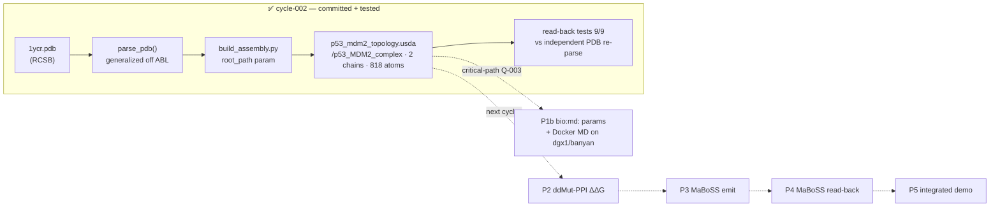

# p53-mdm2 — Findings (v0)

Date: 2026-07-13

---
type: findings
topic: p53-mdm2
date: 2026-07-13
version: v0
prior-version: none
key-metric: pipelines-with-committed-artifact: 1 of 4 (prior: 0, delta: +1)
decision-required: confirm
---

## Headline Result

metric: Pipeline 1 (MD→USD topology) landed — first committed `.usda` + passing read-back tests
value: 1 of 4 pipelines with a committed artifact; 9 of 9 checks pass (compliance + domain + read-back + anti-chimera layers); 2 anti-chimera gates clean
unit: pipelines / checks / gates
prior: 0 pipelines, 0 checks (two prior cycles were planning/design only)
direction: new

Cycle-002 converted the topic from all-planning to first-code: it generalized v8's PDB→USD path off ABL, emitted a committed 1YCR topology `.usda`, and proved it with falsification-resistant read-back tests. It also folded the PI's Q-003/Q-004 answers into the roadmap (p1b unblocked + promoted to critical-path; all four pipelines led in this one topic).

## Results Tables

### Pipeline 1 topology artifact — `examples/p53_mdm2/output/p53_mdm2_topology.usda`

| Property | Value | Source |
|----------|-------|--------|
| Root prim | `/p53_MDM2_complex` (parameterized `root_path`, NOT `/ABLComplex`) | commit `50d00f1` |
| Chains | 2 — A = MDM2 N-term (705 atoms), B = p53 peptide (113 atoms) | read-back test `counts_match_independent_pdb` |
| Total atoms | 818 | read-back test |
| Element classes | `/_class_/{C,N,O,S}` inline, CPK colors, atoms inherit | commit `50d00f1` |
| Stage metadata | `metersPerUnit=1e-10` (Ångström) | commit `50d00f1` |
| `representation` VariantSet | points / balls / vdw / ballstick, cascading complex→chain→residue→atom | commit `50d00f1` |
| p53 activation triad | Phe19 / Trp23 / Leu26 present on chain B | read-back test `triad_present` |
| usdchecker | exit 0 (`--skipVariants`) | agent run log |

### Commits this cycle (branch `topic/p53-mdm2`)

| Hash | Change |
|------|--------|
| `3f25ad6` | scaffold package + parameterized config (`p53_env.py`, lazy `__init__`) |
| `402ab6e` | port biochemistry data + `/_class_/<symbol>` element-template builder |
| `953b572` | generalized `pdb_parser` off ABL (`parse_pdb(path, *, exclude_residues, ligand_residues)`) |
| `01ea78b` | un-ignore biology `.pdb` inputs (repo `*.pdb` rule was the VS program-database pattern) |
| `50d00f1` | fetch 1YCR + emit topology `.usda` via generalized assembly builder |
| `240570a` | read-back + anti-chimera tests |
| `9814c06` | roadmap: integrate PI Q-003/Q-004 (orchestrator) |

## Observations

| Signal | Baseline / Expected | Observed [source] | Interpretation |
|--------|--------------------|--------------------|----------------|
| Atom/chain counts | 1YCR = MDM2 + p53 peptide, 2 chains | 2 chains / 818 atoms, A=705 B=113 [source: examples/p53_mdm2/tests/run_tests.py `counts_match_independent_pdb`] | Topology faithfully represents the complex; counts asserted against an independent re-parse of `1ycr.pdb`, not generator state (anti-tautology guard holds) |
| ABL coupling in new tree | Zero (anti-chimera invariant) | GATE1 `ABLComplex` = 0 matches; GATE2 `4676`/`43` in lib `.py` = 0 matches [source: independent re-run, both exit 1] | Clean spine — no chimera copy of ABL specifics |
| Interpreter compatibility | forOUSD venv imports pxr + mdtraj | Import + emit + usdchecker succeeded, no segfault [source: agent run log] | The cycle-000 "interpreter split" false premise stays retired; forOUSD is the canonical interpreter |
| p1b (self-run MD) gate | Was Blocked on Q-003 | Q-003 = yes → p1b promoted to critical-path in roadmap [source: __roadmap__/p53_mdm2/README.md amendment A1] | New substantial workstream opened: containerized MD on dgx1/banyan |

## Charts & Visualizations

<!-- Caption: cycle-002 delivered the leftmost (done) subgraph; dotted edges are the still-planned pipelines. -->

## Contradictions & Surprises

- The repo's `.gitignore` `*.pdb` rule is the **Visual Studio program-database** pattern, not Protein Data Bank — it was silently swallowing the crystal-structure input. Fixed with a scoped negation (`01ea78b`); worth remembering for any future structure-file input.
- Satisfying the `ABLComplex` grep-gate literally (it scans docstrings + README + the test itself, not just code) forced the worker to reword one pre-existing doc (`examples/p53_mdm2/README.md`) and to assemble the forbidden tokens from string fragments inside `test_anti_chimera.py` so the gate does not trip on itself. Intent (no ABL coupling in code) and the literal command are both satisfied, but the gate's whole-tree scope is broader than "library code" — a future refinement could scope it to code only.

## Steering Questions

- **[next run]** Two children of P1 are now both in-scope: `p2_ddg_pipeline` (ddMut-PPI ΔΔG, self-contained, low external risk) and `p1b` containerized MD on dgx1/banyan (large, beta cluster, shared resource). Recommend **P2 next** (keeps the USD↔external-data loop moving with low risk) and treating p1b's Docker/cluster track as a parallel multi-cycle workstream seeded shortly after. Confirm or reprioritize.
- **[later]** p1b will need a real MD-engine choice (GENESIS per ShinobuLab decks vs. a more container-friendly engine) before the Dockerfile is meaningful — flag for when p1b is picked up.
- **[later]** Should the anti-chimera grep-gate be scoped to code only (vs. whole-tree incl. docs), to avoid the doc-rewording contortion noted above?

## Pointers

- Artifact: [p53_mdm2_topology.usda](../../examples/p53_mdm2/output/p53_mdm2_topology.usda)
- Tests: [examples/p53_mdm2/tests/](../../examples/p53_mdm2/tests/)
- Roadmap: [__roadmap__/p53_mdm2/README.md](../../__roadmap__/p53_mdm2/README.md), [p1b leaf](../../__roadmap__/p53_mdm2/p1b_md_parameter_representation.md)
- Prior planning cycle: [03-cycle001_findings_v0.md](03-cycle001_findings_v0.md)
- PI answers: [__threads__/p53-mdm2/QUESTIONS.md](../../__threads__/p53-mdm2/QUESTIONS.md) Q-003, Q-004
