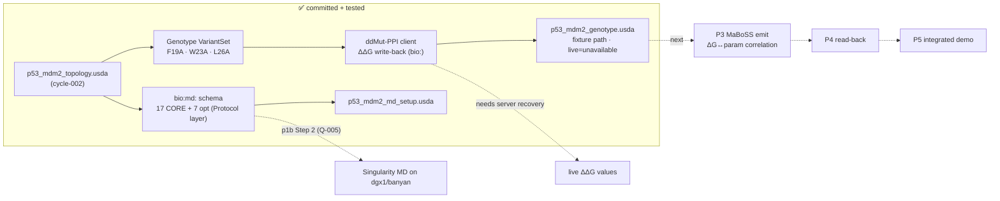

# p53-mdm2 — Findings (v0)

Date: 2026-07-14

---
type: findings
topic: p53-mdm2
date: 2026-07-14
version: v0
prior-version: 04-cycle002_findings_v0.md
key-metric: pipelines-with-committed-artifact: 2 of 4 (prior: 1, delta: +1)
decision-required: confirm
---

## Headline Result

metric: Pipeline 2 (OpenUSD→MD ΔG) landed + p1b Step 1 (`bio:md:` MD-parameter representation) seeded
value: 2 of 4 pipelines with a committed artifact; 17 of 17 read-back/domain/anti-chimera checks pass; ddMut-PPI honest error-model exercised live (submit worked, retrieval 500'd → `unavailable`, zero fabricated ΔG)
unit: pipelines / checks
prior: 1 pipeline, 9 checks (cycle-002)
direction: up

Cycle-003 executed the PI-confirmed order (INBOX 2026-07-13; Q-004 lead-all-here): **P2 first, then seed p1b**. Pipeline 2 now authors a p53-peptide `Genotype` VariantSet (generalized off v8's ABL T315I) and writes ddMut-PPI ΔΔG back onto USD as provenance-tagged `bio:` attributes with a strict "never fabricate" error model. p1b Step 1 landed the `bio:md:` MD-setup-parameter schema (17 CORE incl. the PI-promoted ion-concentration + protonation-state, 7 optional, a REMD growth path) on a `Protocol`-layer prim, grounded in R01's ShinobuLab GENESIS reference. A read-only cluster recon (report 05) surfaced one **execution-model correction** the PI must rule on (Q-005): the clusters support **Singularity, not unprivileged Docker**.

## Results Tables

### Pipeline 2 artifacts — `examples/p53_mdm2/composition/p53_mdm2_genotype.usda`

| Property | Value | Source |
|----------|-------|--------|
| Genotype VariantSet | 4 variants, geometry-swap-by-Reference, generalized off v8 T315I/ABL | commit `4e96727` |
| Variants queried | p53 hotspot alanine scan on chain B: **F19A, W23A, L26A** (residues confirmed vs `1ycr.pdb`) | agent A return; `test_ddg_readback.py` |
| ddMut-PPI **submit** | Live — real job_ids returned (e.g. `17839863991546`) | agent A live run [source: https://biosig.lab.uq.edu.au/ddmut_ppi/api] |
| ddMut-PPI **retrieval** | Server-side `Internal Server Error` (500) throughout → all live queries resolved `status=unavailable`, **ΔΔG not written** | agent A live run |
| Committed ΔΔG values | Fixture path, explicitly tagged `bio:ddgStatus="fixture"`/`bio:ddgSource="fixture"`: F19A −2.8, W23A −3.9, L26A −1.9 kcal/mol (synthetic, literature-informed placeholders — NOT server output) | `composition/fixtures/ddmut_ppi_fixture.json` |
| Provenance | six-field `bio:` schema reused from v8; `unknown`/`unavailable` on failure, never fabricated | commit `0db982c` |
| Client | stdlib `urllib` only (venv has no `requests`); multipart submit; ≥1 s spacing + backed-off polling | `converters/ddmut_client.py` |
| usdchecker | `Success` (`--skipVariants`) on genotype assembly + 6 geometry stubs | agent A run log |

### p1b Step 1 artifact — `examples/p53_mdm2/output/p53_mdm2_md_setup.usda`

| Property | Value | Source |
|----------|-------|--------|
| Carrying prim | `<root>/mdSetup` `Scope`, authored in a **Protocol departmental layer** that `subLayers` the Biology topology | commit `a1ae572` |
| CORE fields | 17: engine, engineVersion, forceField, waterModel, ensemble, integrator, timestep, nSteps, temperature, thermostat, barostat, pressure, electrostatics, cutoff, constraintAlgorithm + **ionConcentration** + **protonationState** (PI-promoted, Q-003) | `templates/md_parameters.py` |
| Optional fields | 7: ionSpecies, boxType, pairlistDist, dispersionCorrection, hydrogenMassRepartitioning, hmrRatio, gammaT | `templates/README.md` |
| REMD | field list defined + documented, **deliberately NOT authored** (copying ABL's 288-replica ladder onto p53-MDM2 would be fabrication) | agent B return |
| Values from R01 | GENESIS · AMBER ff19SB · TIP3P · NVT · VRES · 0.0035 ps · 600000 steps · 310 K · Bussi · 1.0 atm · PME · 8.0 Å · SHAKE | [source: R01 §recommended schema] |
| Assumption values | ionConcentration 0.15 M NaCl, protonation pH 7.0, ionSpecies NaCl (system-composition; R01 does not fix) — tagged `[assumption:]` | `templates/fixtures/md_setup_reference.json` |
| usdchecker | `Success` (`--skipVariants`) | agent B run log |

### Commits this cycle (branch `topic/p53-mdm2`)

| Hash | Change |
|------|--------|
| `4e96727` | feat: p53-peptide Genotype VariantSet (off ABL T315I) |
| `0db982c` | feat: rate-limited ddMut-PPI client + ΔΔG write-back as `bio:` attrs |
| `6b1cde6` | feat: USDBio MD-setup-parameter representation (`bio:md:`) |
| `a1ae572` | test: committed `bio:md:` artifact + falsification-resistant read-back |

(Plus the cycle chores: `inbox-ack`, `ask` Q-005; report commit + finish-cycle land at close.)

## Observations

| Signal | Baseline / Expected | Observed [source] | Interpretation |
|--------|--------------------|--------------------|----------------|
| ddMut-PPI live integration | POST-submit → GET-by-job_id | submit OK (real job_ids); GET returns 500 server-side [source: agent A live run] | The client is a real tool, not a stub; the server's retrieval half is currently broken — the error model correctly refused to invent values |
| Fabrication guard | never write a ΔG without a source | 3/3 live queries → `status=unavailable`, no numeric written; fixture values self-declare `bio:ddgSource="fixture"` [source: test_ddg_readback.py `fixture_honestly_tagged`] | Honesty contract's "claim-without-source ≡ hallucination" enforced in code |
| PI-promoted core fields | ion-conc + protonation in CORE (Q-003) | both present in the 17-field CORE block + a dedicated read-back check `md_pi_promoted_core` [source: examples/p53_mdm2/tests/test_md_setup_readback.py] | Q-003 directive satisfied and test-guarded |
| Departmental layering | SubLayers separate concerns (CLAUDE.md) | `mdSetup` authored in a Protocol layer over the Biology topology, verified by `md_departmental_layering` check | First cycle to exercise the Local/SubLayer arc the cycle-002 topology deferred |
| Cluster execution model | PI assumed Docker + bind-mount (Q-003) | docs on both clusters name **Singularity** as supported; Docker not the batch path [source: report 05, dgx1/banyan docs "Containers"] | Assumption likely wrong → Q-005 filed; pivot recommended (build Docker locally, run Singularity on-cluster) |
| Cluster reachability | recon commands | **zero** live commands ran — rsync 2.6.9<3.0.0 blocker on dgx1, banyan config missing [source: report 05 Pain Points] | Recon is doc-sourced only; next cycle must unblock tooling then live-verify |

## Charts & Visualizations

<!-- Caption: cycle-003 added the Genotype→ddMut-PPI chain and the bio:md: schema (both committed+tested); dotted edges are pending (server recovery, the p1b Step 2 pivot decision, and pipelines 3–5). -->

## Contradictions & Surprises

- **The ddMut-PPI retrieval endpoint is down.** Submit accepts jobs and returns job_ids, but the documented GET-by-job_id retrieval returns HTTP 500 throughout the cycle. This is undocumented behavior. It is exactly the case the error model was built for — the pipeline recorded `unavailable` and used a clearly-tagged fixture for the reviewable artifact rather than inventing predictions. The live path is real and will produce `bio:ddgStatus="success"` values unchanged once the server recovers; we have **not** observed a live success end-to-end.
- **The PI's Docker assumption is contradicted by the cluster docs** (Singularity is the supported path). Filed as Q-005 rather than silently pivoting. Recon was doc-sourced only because both clusters were unreachable (local rsync blocker on dgx1, missing banyan config) — the single most important question (unprivileged Docker daemon access) remains unverified by observation.
- **Fixture-independence limit (carried over).** Both new read-back suites (ddG, md-setup) cross-check USD against a separately-maintained fixture + an independent re-derivation, so a generator typo is caught — but a systematic misreading of a source (R01, the API) by the author would appear in all oracles. Same accepted limitation flagged in cycle-002.

## Steering Questions

- **[Q-005, filed — decision-required]** p1b Step 2 execution-model pivot: confirm **build Docker locally → run Singularity (`.sif`) on-cluster with bind-mounts**, or insist on Docker. See report 05 §C and QUESTIONS.md Q-005.
- **[next run]** Recommended next-cycle order: (a) **P3 MaBoSS emit** — the ΔG↔MaBoSS-parameter correlation (R02) now has a committed ΔΔG-bearing stage to consume, and it is self-contained; (b) in parallel, **unblock cluster tooling + run the report-05 §B read-only live-verification pass** (no cluster mutation) so p1b Step 2 can start under supervision once Q-005 is answered. Confirm or reprioritize.
- **[later]** ddMut-PPI live re-run: schedule a retry of the 3 hotspot variants once the retrieval endpoint recovers, to replace fixture ΔΔG with `success`-tagged server values.
- **[later, carried]** MD-engine choice for the container (GENESIS per R01 vs. a more container-friendly GROMACS/OpenMM for the *demo*) — needed before the container recipe is meaningful.

## Pointers

- Artifacts: [p53_mdm2_genotype.usda](../../examples/p53_mdm2/composition/p53_mdm2_genotype.usda), [p53_mdm2_md_setup.usda](../../examples/p53_mdm2/output/p53_mdm2_md_setup.usda)
- Code: [composition/](../../examples/p53_mdm2/composition/), [converters/ddmut_client.py](../../examples/p53_mdm2/converters/ddmut_client.py), [templates/](../../examples/p53_mdm2/templates/)
- Tests: [examples/p53_mdm2/tests/](../../examples/p53_mdm2/tests/) (17/17)
- Cluster recon: [05-cluster_md_recon_v0.md](05-cluster_md_recon_v0.md)
- Roadmap: [__roadmap__/p53_mdm2/README.md](../../__roadmap__/p53_mdm2/README.md), [p2 leaf](../../__roadmap__/p53_mdm2/p2_ddg_pipeline.md), [p1b leaf](../../__roadmap__/p53_mdm2/p1b_md_parameter_representation.md)
- Prior findings: [04-cycle002_findings_v0.md](04-cycle002_findings_v0.md)
- PI channel: [QUESTIONS.md](../../__threads__/p53-mdm2/QUESTIONS.md) Q-003/Q-004/Q-005

## What I Am Uncertain About

- **No live ddMut-PPI prediction observed.** The integration is proven only through submit + the error path; the committed ΔΔG numbers are fixtures, self-tagged as such. Whether the server's retrieval endpoint recovers on its normal cadence or is durably broken is unknown.
- **All cluster capability claims (report 05) are doc-sourced, not observation-sourced** — both clusters were unreachable this cycle. Treat the recon capability table as "asserted by docs, pending live confirmation," and the Docker-unavailable conclusion as an inference from doc wording + the standard Docker security model, not a failed `docker info`.
- **The `bio:md:` assumption values** (0.15 M NaCl, pH 7.0) are physiological defaults standing in until the project's actual p53-MDM2 solvation/protonation protocol is decided (Step 2 territory); they are tagged so they cannot masquerade as sourced.
- **MDDB has no frozen field-name list** (R01's own caveat), so `bio:md:` names follow USD camelCase + MDDB semantics and will need reconciliation against MDDB's released schema.
