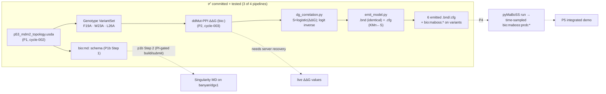

# p53-mdm2 — Findings (v0)

Date: 2026-07-21

---
type: findings
topic: p53-mdm2
date: 2026-07-21
version: v0
prior-version: 06-cycle003_findings_v0.md
key-metric: pipelines-with-committed-artifact: 3 of 4 (prior: 2, delta: +1)
decision-required: confirm
---

## Headline Result

metric: Pipeline 3 (OpenUSD→MaBoSS emit) landed + p1b Step 2 cluster tooling unblocked and live-verified
value: 3 of 4 pipelines with a committed artifact; 28 of 28 correlation/emit/read-back/domain/anti-chimera checks pass; both clusters now reachable and the decisive Docker question answered by live observation
unit: pipelines / checks
prior: 2 pipelines, 17 checks (cycle-003)
direction: up

Cycle-004 ran the cycle-003 `next_decision` order on two independent tracks. **Track 1 (P3)** implemented the R02 ΔG↔MaBoSS-parameter correlation as a pure tested function + its logit inverse, and a text-templating emitter that reads each variant's committed ΔΔG from the genotype stage, computes the antagonism strength `S`, and emits a MaBoSS `.bnd` (byte-identical to the reference) + `.cfg` (only `$KMn_pMCD`/`$KMn_pMC` reset to `S`) per mutant, writing the full correlation back onto the variant prims as `bio:maboss:*` attributes so the inverse is reconstructable from USD alone. **Track 2 (p1b Step 2 prep)** — now that the PI answered Q-005 (config fixes + deferral to technical findings) — unblocked the cluster tooling and ran the report-05 §B read-only live-verification pass. Headline correction: **banyan's unprivileged Docker actually works** (live-confirmed, reversing report 05's doc-sourced inference), while **dgx1's does not**; the Docker→Singularity pivot is **confirmed** on portability + scheduler-integration grounds regardless. No cluster state was mutated — build/convert/stage/submit remain PI-gated.

## Results Tables

### Pipeline 3 artifacts — `examples/p53_mdm2/maboss/`

| Property | Value | Source |
|----------|-------|--------|
| Correlation function | logistic `S(ΔΔG)=1/(1+exp(−k·(ΔΔG−m)))`, defaults m=−3, k=1.5; logit inverse `ΔΔG(S)=m+(1/k)·ln(S/(1−S))`; stdlib `math` only | commit `1f53e38`; [source: R02 §correlation function] |
| Correlation anchors (unit test) | ΔΔG 0→S≈0.989, −3→0.5, −6→0.011; round-trip, strict monotonicity, clamp at S→{0,1}, k>0 guard | `tests/test_dg_correlation.py` (9 checks) |
| Emitter | reads `bio:ddgKcalPerMol` per variant → `S`; emits `.bnd` (verbatim copy of reference) + `.cfg` (exactly 2 param lines differ) | commit `6cf3cb3`; `maboss/emit_model.py` |
| Reference model | `p53_Mdm2.bnd` + `p53_Mdm2_runcfg.cfg` fetched verbatim from maboss.curie.fr; WT `$KMn_pMCD=1`, `$KMn_pMC=1` — **matches R02 exactly**, no discrepancy | `maboss/reference/`; agent A return |
| Emitted artifacts | 6 files: `p53_Mdm2_{F19A,W23A,L26A}.{bnd,cfg}`; S values F19A −2.8→0.5744, L26A −1.9→0.8389, W23A −3.9→0.2059 | `maboss/output/` |
| Provenance | `bio:maboss:*` on the 3 mutant variants (WT untouched); `S` self-tagged `paramValueStatus/Source="fixture"` — inherits the fixture lineage of the committed ΔΔG, never promoted to real | `composition/p53_mdm2_genotype.usda` |
| usdchecker | `Success` (exit 0) on the modified genotype stage + every variant selection (F19A/W23A/L26A/WildType) | agent A run log |
| MaBoSS install | **none** — emit is pure text templating per R02; pyMaBoSS reserved for the P4 run boundary | [source: R02 §pyMaBoSS call shape] |

### p1b Step 2 — cluster live verification (READ-ONLY; report 07)

| Concern | dgx1 | banyan | Source |
|---|---|---|---|
| Unprivileged Docker | **NO** — user not in `docker` group; `docker info` → socket permission denied | **YES** — user in `docker` group; daemon responds (Server 29.4.3) | `[live: id; getent group docker; docker info]` |
| Singularity | 3.5.2 | singularity-ce 4.2.2 (module, loaded) | `[live: singularity --version]` |
| GPUs | 8× Tesla V100-SXM2-16GB (drv 580.159.03) | 2× H100 NVL ≈94 GB (drv 595.71.05) | `[live: nvidia-smi]` |
| MD engine present | none | none | `[live: command -v; module avail]` |
| Scheduler | Slurm 23.11.4, idle | Slurm 22.05.2, idle | `[live: get_facility/get_resources]` |
| Home | `ts2:/export/home` 29T (13T free) — SAME shared NFS on both | same | `[live: df -h /home; identical fs_ls]` |

### Commits this cycle (branch `topic/p53-mdm2`)

| Hash | Change |
|------|--------|
| `f28d938` | chore: consume pi-reviewed (begin-cycle) |
| `1f53e38` | feat: ΔG↔MaBoSS-parameter correlation function + inverse |
| `6cf3cb3` | feat: emit MaBoSS .bnd/.cfg from USD via ΔG correlation |

(Plus the cycle report commit + finish-cycle, which land at close.)

## Observations

| Signal | Baseline / Expected | Observed [source] | Interpretation |
|--------|--------------------|--------------------|----------------|
| P3 emit correctness | `.bnd` byte-identical, `.cfg` differs only in correlated params | SHA-256-identical `.bnd`; exactly-2-lines-differ guard passes; `$KMn_pMCD==S` from a second independent logistic [source: tests/test_maboss_emit.py] | Anti-tautology round-trip holds — the emit is verified against an independent recomputation, not its own state |
| PI inverse loop | `m+(1/k)·logit(S)` recovers ΔΔG | inverse test recovers committed ΔΔG within tolerance, reading `S` back from the emitted `.cfg` [source: tests/test_maboss_emit.py] | The PI's "ΔG is the inverse of the correlation" is a USD-local, test-guarded property |
| Fabrication guard (carried) | never promote fixture to real | emitted `S` self-tags `paramValueStatus="fixture"` end-to-end [source: composition/p53_mdm2_genotype.usda] | Honesty lineage preserved across the P2→P3 boundary |
| Cluster reachability | recon commands | **all 8 live calls succeeded on both clusters** — rsync resolved ≥3.0, banyan config present [source: report 07] | Report 05's total-blockage is resolved; facts are now live, not doc-sourced |
| Docker availability (decisive) | report 05 inferred "likely gated everywhere" | banyan Docker WORKS (in group, daemon responds); dgx1 does NOT (not in group) [source: report 07 §Executive Summary] | Report 05's inference is **reversed for banyan, confirmed for dgx1** — a per-host admin fact |
| Cross-cluster portability | one runtime path for both | Singularity present on both; Docker only on banyan; home is one shared NFS [source: report 07] | Singularity is the only portable, scheduler-integrated, non-root path → pivot confirmed |

## Charts & Visualizations

<!-- Caption: cycle-004 completed the P2→P3 chain (correlation + emit, committed+tested) and live-verified the cluster substrate for p1b Step 2. Dotted edges pending: the MaBoSS run (P4), the PI-gated container build/submit, and live ddMut-PPI recovery. -->

## Contradictions & Surprises

- **banyan Docker works — report 05 was wrong for that host.** Report 05 inferred (from doc silence + the standard Docker security model) that unprivileged Docker was likely gated on both clusters. Live: `eliott` IS in banyan's `docker` group and the daemon answers fully — matching the PI's Q-005 recollection. dgx1 remains gated (not in group). The Singularity pivot survives this correction because it rests on *cross-cluster portability + Slurm integration*, not on Docker being universally broken.
- **The rsync/banyan blocker simply did not recur.** Report 05's tooling was fully blocked; this cycle all cluster calls worked with zero rsync errors and no manual PATH export was needed (homebrew rsync 3.4.4 already resolved; PI added the banyan config). The sub-agent flagged honestly that it did not inspect the MCP server's env, so a different-PATH session could regress.
- **Attribute-name reality vs. R02 spelling.** The R02 contract table wrote `bio:mutation:ddgKcalPerMol` / `bio:ddg:status`, but Pipeline 2's committed stage actually uses `bio:ddgKcalPerMol` / `bio:ddgStatus` / `bio:ddgSource`. The emitter follows the real stage (documented in its module docstring), not the design-doc spelling.
- **Fixture-grounded S (by design).** The emitted `S` values are computed from the committed *fixture* ΔΔG (ddMut-PPI retrieval was 500'd in cycle-003), so they are literature-informed placeholders, tagged fixture end-to-end. A live ddMut-PPI re-run (server recovery) would flow real values through the same, unchanged code.

## Steering Questions

- **[Q-005 — effectively resolved; confirm the close]** The PI deferred the Docker-vs-Singularity choice to technical findings (2026-07-20). Live findings (report 07) confirm **build with Docker locally → run on-cluster via Singularity** as the portable path (Docker works only on banyan; Singularity works on both; `submit_job` wraps `singularity exec --nv`). Unless the PI objects, Q-005 is answered and can be acked/closed. No further blocking question is open.
- **[decision-required — first cluster mutation]** p1b Step 2 now needs the **first PI-gated mutating step** to proceed: (1) build the MD-engine image locally / convert to `.sif` on banyan, (2) `fs_mkdir`/`fs_upload` decks + `.sif` into shared home, (3) a short 1-GPU smoke `submit_job`. Per the beta/shared-resource caution (Q-003), each needs an explicit PI "yes". **Which MD engine** should the container carry — GENESIS gREST/REUS (R01) vs. a more container-friendly GROMACS/OpenMM for the *demo*? This blocks a meaningful container recipe.
- **[next run]** Recommended next-cycle order: (a) **P4 MaBoSS read-back** — install pyMaBoSS at that boundary, run the emitted `.cfg`, write time-sampled `bio:maboss:prob:*` onto an analysis SubLayer, and run the deferred directional test (destabilizing variant → higher time-averaged P(p53 up) than WT); (b) in parallel, once the PI approves the engine + first mutation, execute the supervised container build + smoke submit for p1b Step 2. Confirm or reprioritize.
- **[later]** ddMut-PPI live re-run of the 3 hotspot variants once the retrieval endpoint recovers, to replace fixture ΔΔG with `success`-tagged server values (flows unchanged through P3).

## Pointers

- Artifacts: [genotype.usda (+bio:maboss:*)](../../examples/p53_mdm2/composition/p53_mdm2_genotype.usda), [emitted .bnd/.cfg](../../examples/p53_mdm2/maboss/output/)
- Code: [maboss/dg_correlation.py](../../examples/p53_mdm2/maboss/dg_correlation.py), [maboss/emit_model.py](../../examples/p53_mdm2/maboss/emit_model.py)
- Tests: [examples/p53_mdm2/tests/](../../examples/p53_mdm2/tests/) (28/28)
- Cluster live verification: [07-cluster_liveverify_v1.md](07-cluster_liveverify_v1.md) (supersedes [05](05-cluster_md_recon_v0.md))
- Design: [R02 correlation](02-dg_maboss_correlation_v0.md), [P3 leaf](../../__roadmap__/p53_mdm2/p3_maboss_emit.md), [p1b leaf](../../__roadmap__/p53_mdm2/p1b_md_parameter_representation.md)
- Prior findings: [06-cycle003_findings_v0.md](06-cycle003_findings_v0.md)
- PI channel: [QUESTIONS.md](../../__threads__/p53-mdm2/QUESTIONS.md) Q-005

## What I Am Uncertain About

- **No MaBoSS run this cycle.** P3 emit is verified only by text-level round-trip + inverse; the biological directional expectation (destabilizing → more free p53) is unverified until pyMaBoSS runs in P4. The `Mdm2N.istate` continuous-override text is implemented but off by default and untested against a real MaBoSS loader.
- **Emitted `S` values are fixture-grounded**, inheriting the cycle-003 fixture ΔΔG; they are tagged as such and are not server predictions.
- **Live cluster facts are point-in-time reads.** `docker`-group membership and node-idle state can change; the `submit_job`→`singularity exec --nv` wrapping is still doc-sourced (no job submitted); per-user home quota is unknown (`quota -s` empty); SIF 4.2.2→3.5.2 portability is unverified (verifying = running a container = a PI-gated mutation).
- **Shared-home inference.** The two clusters returned byte-identical `fs_ls ~` and the same NFS device, attributed to a genuinely shared mount, but no sentinel file was written to prove the inode namespace (writing forbidden this cycle).
