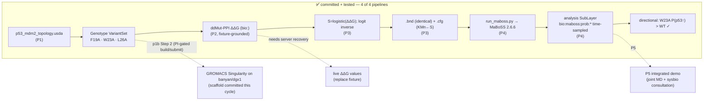

# p53-mdm2 — Findings (v0)

Date: 2026-07-24

---
type: findings
topic: p53-mdm2
date: 2026-07-24
version: v0
prior-version: 08-cycle004_findings_v0.md
key-metric: pipelines-with-committed-artifact: 4 of 4 (prior: 3, delta: +1)
decision-required: confirm
---

## Headline Result

metric: Pipeline 4 (MaBoSS → OpenUSD read-back) landed — **all four pipelines now have a committed, tested artifact** and the ΔG↔MaBoSS biological expectation is verified against a real simulation
value: 4 of 4 pipelines with a committed artifact; 31 of 31 checks pass; the directional biology holds (destabilizing variant releases more p53 than WT)
unit: pipelines / checks
prior: 3 pipelines, 28 checks (cycle-004)
direction: up

Cycle-005 consumed the PI's ack (reports 07 + 08) and MD-engine decision (**GROMACS**, INBOX 2026-07-23) and ran two tracks. **Track 1 (P4, primary)** implemented the MaBoSS → OpenUSD read-back: a `run_maboss.py` wrapper drives the Pipeline-3-emitted `.bnd`/`.cfg` through a **real MaBoSS 2.6.6 run**, and `build_analysis_layer.py` writes the node-probability trajectories back onto USD as **time-sampled `bio:maboss:prob:<node>` attributes in a separate analysis SubLayer** (base topology untouched). The deferred directional test is now real and **passes**: the most-destabilizing variant (W23A) shows a strictly greater time-averaged P(p53 up) than WT. **Track 2 (p1b Step 2 prep, non-mutating)** turned the PI's GROMACS choice into a reviewable Singularity container scaffold (`cluster/`) — **nothing was built, uploaded, or submitted**; every cluster mutation remains PI-gated and none ran in this unattended session.

## Results Tables

### Pipeline 4 artifacts — `examples/p53_mdm2/{maboss,templates,analysis}/`

| Property | Value | Source |
|----------|-------|--------|
| Run wrapper | `maboss/run_maboss.py` — backend discovery + run + pandas→plain-Python `ProbTraj` parser (`run_variant`/`run_cfg`/`run_all`) | commit `9dfadad` |
| MaBoSS backend | **external `MaBoSS 2.6.6` binary** (colomoto, `~/.local/share/colomoto/bin`), driven via `maboss.load(...).run()`; deterministic (`seed=100`, `thread_count=1`; two runs bit-identical) | agent run log |
| cmaboss note | in-process `cmaboss 1.0.0b32` backend was **flaky on this host** (empty node columns even in its own CSV dump) → deliberately **not trusted**; wrapper raises `MabossUnavailableError` (honest SKIP), never fabricates | `run_maboss.py` docstring |
| Analysis layer builder | `templates/build_analysis_layer.py` — generalizes the v8 `_create_analysis_layer` pattern (`OverridePrim` + `attr.Set(v, Usd.TimeCode(frame))`) | commit `e056ea3` |
| Analysis stage | `analysis/p53_mdm2_analysis.usda` (committed) — **SubLayers** the topology; `over "p53_MDM2_complex"` carrying **no** base attrs; `def Scope "maboss"` with per-variant child scopes (WildType/F19A/L26A/W23A), each 5 nodes × 500 frames of `bio:maboss:prob:<node>` | commit `e056ea3` |
| Time mapping | `frame = round(time/0.1)`, frames 0–499, `time = frame×0.1`; `startTimeCode=0`, `endTimeCode=499`, `timeCodesPerSecond=10`; carried as `bio:maboss:timeTick` | analysis `.usda` header |
| Provenance | scope attrs: `backend`, `engineVersion`, `sampleCount=50000`, `seedPseudorandom=100`, `bio:maboss:provenance="genuine MaBoSS simulation output (not fabricated)"` | analysis `.usda` |
| usdchecker | `Success` on the analysis stage | orchestrator + verifier runs |

### Directional result — time-averaged P(p53 up) (Pipeline-4 gate, R02 §Round-trip #3)

| Variant | S (antagonism strength) | time-avg P(p53 up) | vs WT | Source |
|---|---|---|---|---|
| WildType | ≈1.0 | **0.310018** | baseline | independent re-run **and** committed USD samples (identical) |
| L26A | 0.8389 | 0.313429 | ≳ | " |
| F19A | 0.5744 | 0.322447 | > | " |
| W23A | 0.2059 (most destabilizing) | **0.396226** | **strictly >** ✓ | " |

Ordering is destabilization-monotone (W23A > F19A > L26A ≳ WT); the biological expectation — weaker p53:MDM2 binding releases more free p53 — is confirmed against a real trajectory, not asserted.

### p1b Step 2 — GROMACS container scaffold (NON-MUTATING; `examples/p53_mdm2/cluster/`)

| File | Purpose | State |
|---|---|---|
| `gromacs.def` | GPU GROMACS 2025.3 on CUDA 12.9 base, `GMX_CUDA_TARGET_SM="70;90"` (V100 + H100) | **not built** |
| `smoke_submit.sbatch` | 1-GPU Slurm smoke-test template via `singularity exec --nv` | **not submitted** |
| `README.md` | PI runbook: ordered PI-gated steps (build→convert→stage→submit) + SIF version-skew risk | reviewable |

CUDA-12.9 rationale (verified): CUDA 13 drops offline compilation for Volta/V100; dgx1 sits on driver branch 580 exactly; CUDA 12.x also covers H100 (sm_90) → one toolkit spans both clusters.

### Commits this cycle (branch `topic/p53-mdm2`)

| Hash | Change |
|------|--------|
| `683e699` | chore: consume pi-reviewed (begin-cycle) |
| `9dfadad` | feat: pyMaBoSS run wrapper + node-probability parser |
| `e056ea3` | feat: MaBoSS node states as time-sampled bio: attrs (analysis layer) |
| `f084561` | chore: GROMACS Singularity scaffold for p1b Step 2 (non-mutating prep) |

(Plus the cycle report commit + finish-cycle, which land at close.)

## Observations

| Signal | Baseline / Expected | Observed [source] | Interpretation |
|--------|--------------------|--------------------|----------------|
| MaBoSS run reality | a genuine simulation, no fabrication | external `MaBoSS 2.6.6` ran; cmaboss backend distrusted for flakiness; wrapper SKIPs (not fakes) if absent [source: run_maboss.py; verifier] | The "MaBoSS runs" gate is met with real, deterministic output |
| Anti-tautology read-back | assert USD vs INDEPENDENT parse | read-back builds its oracle from a fresh `run_all()` re-run and compares committed USD time samples to it — never the builder's in-memory state [source: test_maboss_readback.py:108,114,226] | House-style falsification-resistance preserved across the P3→P4 boundary |
| Departmental layering | base topology untouched | analysis root is an `over` with zero attrs; `output/` git-clean; composed atoms resolve from the SubLayer [source: build_analysis_layer.py:148; verifier] | Concern separation holds; analysis is a removable layer |
| Directional biology | destabilizing → more free p53 | W23A time-avg P(p53 up) 0.3962 > WT 0.3100, correct sign, monotone ordering [source: test_maboss_readback.py] | The whole ΔG↔MaBoSS link is now verified end-to-end, not just designed |
| Fabrication guard (carried) | never promote fixture to real | P4 provenance scoped to the *run output* (genuine); upstream S/ΔΔG stay fixture-lineaged on the variant prims (cycle-003) [source: verifier; fixture_honestly_tagged check] | Fixture inputs are not laundered into "experimental" by the real run |
| Cluster mutation discipline | PI-gated, none unattended | `cluster/` scaffold committed; zero cluster calls; go/no-go surfaced to PI [source: cluster/README.md] | Outward-facing beta-resource actions correctly withheld pending PI presence |

## Charts & Visualizations

<!-- Caption: cycle-005 closed the P3→P4 chain with a REAL MaBoSS run and verified the directional biology; all four pipelines now carry a committed, tested artifact. Dotted edges pending: P5 integrated demo, live ddMut-PPI recovery, and the PI-gated GROMACS container build/submit (scaffold is now ready for the PI's go). -->

## Contradictions & Surprises

- **cmaboss (in-process) is unreliable on this host; the external binary is the trustworthy path.** The modern `maboss` wheel ships `cmaboss` to avoid needing an external `MaBoSS`, but here it returned flaky/empty node columns (a beta bug visible even in its own CSV dump). The implementer correctly distrusted it and drove the standalone `MaBoSS 2.6.6` binary instead. Anyone reproducing P4 needs that binary on `PATH` (the wrapper places colomoto's `bin`/`lib` itself).
- **WT P(p53 up) is 0.310, not ≈0.** An earlier (cmaboss-driven) reading suggested WT p53 stays near zero; the reliable external run shows p53 transiently activates even in WT under the DNA-damage initial condition. The directional gap (W23A − WT ≈ +0.086) is clean and correct-signed regardless — the earlier "≈0" was the buggy backend, not biology.
- **Encoding quirk in the reference `.bnd`.** Two `0xC9` bytes live in reference comments; `run_maboss` reads Latin-1 and runs off a transient UTF-8 temp copy, leaving the committed `.bnd`/`.cfg` byte-identical to the reference (P3 invariant preserved).

## Steering Questions

- **[decision-required — confirm P4 / all-pipelines-complete]** All four pipelines now have a committed, tested artifact (the topic's "done" unit), 31/31 checks pass, and the directional biology is verified against a real MaBoSS run (verifier verdict: **aligned**). Please review and `umbod ack p53-mdm2`. Recommended next cycle: **P5 — the integrated demonstration** (`__roadmap__/p53_mdm2/p5_integrated_demo.md`): compose topology + genotype + MaBoSS analysis onto one stage for joint MD + systems-biology consultation, with a read-back test over the composed result.
- **[decision-required — first cluster mutation, GROMACS]** The GROMACS container scaffold (`examples/p53_mdm2/cluster/`) is ready but **nothing has been built/uploaded/submitted**. To proceed with p1b Step 2 the PI must approve the ordered mutating steps (build `.sif` on banyan → stage into shared home → 1-GPU smoke `submit_job`), and settle the open sub-decisions in `cluster/README.md`: (a) exact GROMACS version (scaffolded 2025.3), (b) build-on-banyan vs local, (c) smoke-test banyan-first (recommended) then dgx1, (d) the real p53-MDM2 simulation decks are a downstream step. Each mutating step needs an explicit PI "yes" (Q-003).
- **[later]** ddMut-PPI live re-run of the 3 hotspot variants once the retrieval endpoint recovers, to replace fixture ΔΔG with `success`-tagged server values (flows unchanged through P3→P4).

## Pointers

- Artifacts: [analysis SubLayer](../../examples/p53_mdm2/analysis/p53_mdm2_analysis.usda), [run_maboss.py](../../examples/p53_mdm2/maboss/run_maboss.py), [build_analysis_layer.py](../../examples/p53_mdm2/templates/build_analysis_layer.py)
- Tests: [test_maboss_readback.py](../../examples/p53_mdm2/tests/test_maboss_readback.py); full suite [run_tests.py](../../examples/p53_mdm2/tests/run_tests.py) (31/31)
- Cluster prep (non-mutating): [cluster/README.md](../../examples/p53_mdm2/cluster/README.md), [gromacs.def](../../examples/p53_mdm2/cluster/gromacs.def), [smoke_submit.sbatch](../../examples/p53_mdm2/cluster/smoke_submit.sbatch)
- Design: [R02 correlation + pyMaBoSS](02-dg_maboss_correlation_v0.md), [P4 leaf](../../__roadmap__/p53_mdm2/p4_maboss_readback.md), [P5 leaf](../../__roadmap__/p53_mdm2/p5_integrated_demo.md)
- Prior findings: [08-cycle004_findings_v0.md](08-cycle004_findings_v0.md); cluster recon [07](07-cluster_liveverify_v1.md)

## What I Am Uncertain About

- **MaBoSS reproducibility off-host.** The run is deterministic here (fixed seed, single thread), but it depends on the colomoto `MaBoSS 2.6.6` binary; a different MaBoSS build/version could shift absolute probabilities. The directional *sign* (destabilizing > WT) is the robust claim; absolute values are backend-specific.
- **Emitted `S` values remain fixture-grounded.** P4 probabilities are a genuine simulation of models whose `$KMn` parameters derive from cycle-003 *fixture* ΔΔG (ddMut-PPI was 500'd). The simulation is real; its inputs are fixture-lineaged and tagged as such. A live ddMut-PPI re-run would flow real ΔΔG through the unchanged P3→P4 chain.
- **Correlation midpoint/steepness are still ad-hoc placeholders** (`m=−3`, `k=1.5`, by PI design), carried as `bio:maboss:*` so any refit is a data edit, not a code change.
- **No cluster mutation performed.** The GROMACS scaffold is doc/verified-fact-grounded but untested on hardware; the SIF version-skew risk (banyan 4.2.2 build vs dgx1 3.5.2 run) is unverified until the PI-gated smoke test runs.
