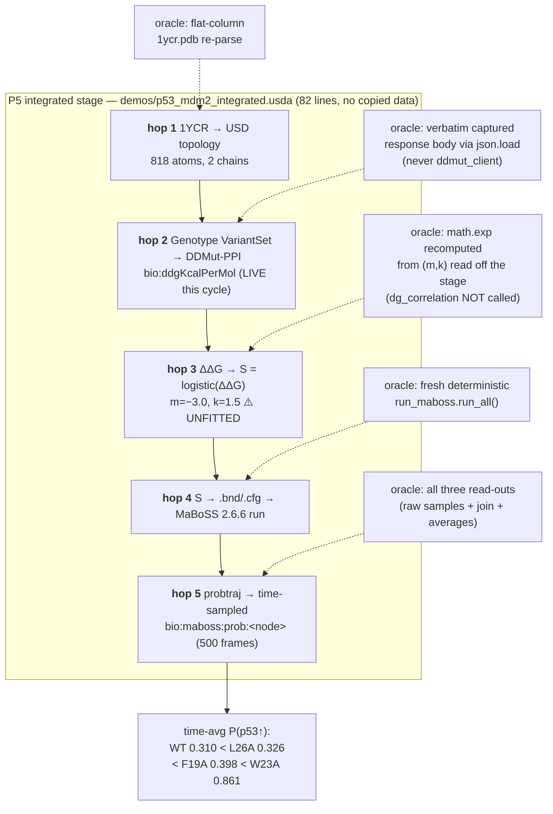

# p53-mdm2 — Findings (v0)

Date: 2026-07-27

---
type: findings
topic: p53-mdm2
date: 2026-07-27
version: v0
prior-version: 09-cycle005_findings_v0.md
key-metric: read-back checks passing: 39 of 39 (prior: 31 of 31, delta: +8)
decision-required: confirm
---

## Headline Result

metric: The four pipelines **plus the P5 integrated demonstration** now run end-to-end on **real third-party ΔΔG data**, composed on one USD stage, with every hop asserted against an independent oracle
value: 39 of 39 checks pass; 5-hop chain composed in an 82-line root layer; ΔΔG from the live DDMut-PPI server (3 of 3 jobs `DONE`); `usdchecker` RC=0
unit: checks / pipelines / hops
prior: 31 of 31 checks, 4 pipelines separately, fixture ΔΔG, no integrated stage (cycle-005)
direction: up

Per INTENT's Done definition — "the full end-to-end demonstration runs across all four pipelines, with committed `.usda` outputs and passing read-back tests as the unit of done" `[source: __threads__/p53-mdm2/INTENT.md]` — **the topic's headline deliverable is essentially met.** I re-ran the suite myself under the forOUSD interpreter: `ALL PASS (39/39 checks)`, and `usdchecker` on the integrated stage returns `Success!` / RC=0 `[source: my own run of examples/p53_mdm2/tests/run_tests.py and usdchecker on examples/p53_mdm2/demos/p53_mdm2_integrated.usda]`. What is **not** met is the larger arc: p1b Step 2 — an actual MD simulation on a cluster — **has not run at all**, and "MD parameters representable well enough that a simulation is reproducible from the stage alone" is demonstrated only as a schema, never by a reproduction.

Two results dominate the rest of this cycle. The three-cycle "ddMut-PPI server outage" **was our own client bug**, now proved side-by-side. And the live data, while preserving the biology ordering, pushed W23A into the logistic's saturating tail — so the demo's most dramatic number is **partly a numerical artifact of unfitted constants**, not purely biology. Read the Contradictions section before quoting 0.861 anywhere.

## Results Tables

### The bug that cost three cycles — retrieval encoding, proved side-by-side

Same endpoint, same `job_id`, same minute; only the encoding of the parameter differs `[source: examples/p53_mdm2/data/ddmut_ppi_live/encoding_diagnostic/manifest.jsonl, commit 8e94864]`:

| Request form | HTTP | Body returned | Verdict |
|---|---|---|---|
| `job_id` in **multipart form body** | **200** | `{"job_id": "17850858889778712", "status": "DONE", "prediction": -3.917, …}` | works, always did |
| `job_id` in **URL query string** (`?job_id=…`) | **500** | `{"message": "Internal Server Error"}` | what cycles 002–005 saw |

The submit endpoint never failed. Cycles 002–005 attributed to a flaky third-party service what was in fact our own request encoding. The PI's instinct to re-test — he had just `curl`'d it successfully — was correct `[source: __threads__/p53-mdm2/cycles/cycle-006/INBOX-consumed.md, 2026-07-25T08:04]`.

### Fixture → live ΔΔG, and what it did to the biology read-out

| Variant | fixture ΔΔG | **live ΔΔG** | Δ | S = logistic(ΔΔG) | time-avg P(p53 up) | prior (fixture) |
|---|---|---|---|---|---|---|
| WildType | — (baseline) | — (baseline) | — | ≡1.0 by convention | **0.310018** | 0.310018 |
| L26A | −1.9 | **−2.948** | −1.05 | 0.519490 | **0.326081** | 0.313384 |
| F19A | −2.8 | **−3.917** | −1.12 | 0.201733 | **0.398497** | 0.322379 |
| W23A | −3.9 | **−6.192** | −2.29 | 0.008260 | **0.861467** | 0.396226 |

Sources: fixture `[source: examples/p53_mdm2/composition/fixtures/ddmut_ppi_fixture.json]`; live values each traceable to a committed `DONE` response body `[source: examples/p53_mdm2/data/ddmut_ppi_live/responses/{F19A_17850858889778712,L26A_17850859504748063,W23A_17850860117753787}_DONE.json, commit b60e62d]`; S and P(p53 up) read off the committed integrated stage `[source: examples/p53_mdm2/demos/p53_mdm2_integrated.usda, commit 23eac55]`.

**The destabilization ordering held with no threshold retuning** — P3/P4 logic untouched, `m=−3.0`, `k=1.5` unchanged: WT 0.310 < L26A 0.326 < F19A 0.398 < W23A 0.861 `[source: commit 91c0b8d; integrated_destabilization_ordering check]`. Server-reported position / wild-type / mutant (19 PHE, 26 LEU, 23 TRP → ALA) independently agree with a re-parse of `1ycr.pdb`, so the responses are demonstrably for the intended sites `[source: examples/p53_mdm2/tests/test_ddg_readback.py, commit fd4ed72]`.

### Conditioning of the ΔΔG↔S map at each variant — why 0.861 needs a caveat

Local sensitivity of the logistic and of its round-trip inverse, computed from the same `(m,k)` the stage carries:

| Variant | S | dS/dΔΔG | **dΔΔG/dS** (inverse conditioning) | Reading |
|---|---|---|---|---|
| L26A | 0.519 | 0.374 | **2.7** kcal·mol⁻¹ per unit S | best conditioned — sits on the steep flank |
| F19A | 0.202 | 0.242 | **4.1** | well conditioned |
| WildType | 0.989 | 0.016 | **61.4** | upper saturation (baseline, no ΔΔG numeric) |
| W23A | 0.008 | 0.012 | **81.4** | **lower saturation — ~20× worse conditioned than F19A** |

`[source: recomputed from m=−3.0, k=1.5 as read off examples/p53_mdm2/demos/p53_mdm2_integrated.usda; reproduces the committed S values to 6 decimals]`

### Cluster track — authorization is no longer the gate; tooling is

| Item | State | Evidence |
|---|---|---|
| PI authorization for gated steps 1–3 | **granted** 2026-07-25T07:58 | `[source: cycles/cycle-006/INBOX-consumed.md]` |
| Dispatch of the mutating build | **refused twice** by the harness permission classifier | `[source: WORKLOG.md "Blocker hit at dispatch"; examples/p53_mdm2/cluster/README.md banner]` |
| Anything built / uploaded / submitted | **nothing, on either cluster** | `[source: examples/p53_mdm2/cluster/README.md; report 10]` |
| Route A — native `singularity build` | **demoted, expected to fail** — no `/etc/subuid`/`subgid` mapping for this user on either cluster | `[source: __reports__/p53-mdm2/10-cluster_state_refresh_v0.md, commit c8f2cc2]` |
| Route B — Docker → `docker save` → `docker-archive://…sif` | **promoted to recommended**, now has a real `Dockerfile` | `[source: examples/p53_mdm2/cluster/{README.md,Dockerfile}, commits e66d60a, afe083a]` |
| `GMX_SIMD=AVX2_256` | **`[verified]`** — the def's last open assumption, closed | `[source: examples/p53_mdm2/cluster/gromacs.def:282]` |

Route A's infeasibility is **inference from a proved-missing mapping, not an observed build failure**; one attended `singularity build` settles it in seconds `[source: report 10 frontmatter, corrected in commit cd93a18]`. Because of it, **the blocked dispatch and the recon roughly cancelled out** — had A2 run, the build would very likely have failed on exactly this, minus a wasted multi-GB attempt on a shared node.

### Cycle-006 commits (branch `topic/p53-mdm2`)

| Hash | Change |
|---|---|
| `624b313` | consume 4 PI inbox items |
| `3f731c3`, `a16bcc2` | verify `gromacs.def` pins upstream; fix CMake / gcc floors; self-correct one over-claim |
| `c8f2cc2` | read-only cluster state refresh (report 10) |
| `728856e` | DDMut-PPI API PDF → searchable Markdown |
| `8e94864` | **the fix**: `job_id` in form body, not query string |
| `b60e62d`, `fd4ed72`, `91c0b8d` | live ΔΔG + committed evidence; tests; regenerate MaBoSS + analysis layers |
| `e66d60a`, `899810f` | reconcile runbook with live state (fakeroot retracted, Route B promoted); self-correct an unsourced aside |
| `9906e29` | per-run capture scoping + immutable canonical `responses/` |
| `23eac55`, `101b09c` | **P5 integrated demonstration** + 7-check integrated suite |
| `afe083a` | Route B `Dockerfile` as twin of `gromacs.def` |
| `7a2308b`, `cd93a18` | record Q-006 / Q-007; correct two claims that outran their evidence (verifier-flagged) |

## Observations

| Signal | Baseline / Expected | Observed [source] | Interpretation |
|---|---|---|---|
| DDMut-PPI availability | server down since cycle-002 (3 cycles of `unavailable`) | live, 3/3 jobs `DONE`; failure reproduced on demand by switching encoding [source: encoding_diagnostic/manifest.jsonl] | A third-party-blame diagnosis survived three cycles unchallenged. Cost: fixture-lineaged science for 3 cycles |
| Directional biology under real data | ordering may need threshold retuning | held with P3/P4 logic and `(m,k)` untouched [source: commit 91c0b8d; integrated stage] | The ΔΔG→MaBoSS link is not fragile to the *input* magnitudes — a genuine robustness result |
| W23A magnitude | modest shift (fixture: 0.396) | **0.861**, S=0.008, dΔΔG/dS = 81.4 [source: integrated stage; recomputed] | Read-out is real but **saturation-amplified**; the biology claim changed character, not just degree |
| P5 composition | SubLayers list should suffice | USD does **not** inherit `defaultPrim` / `metersPerUnit` / time codes from sublayers, so P5 needs its own root layer [source: demos/p53_mdm2_integrated.usda header] | Genuine USD finding, and the architectural justification for a thin P5 layer |
| Test independence | assert artifacts vs independent oracles, not generator state | 7 new checks import attribute *names* and zero values; one independent oracle per hop; **falsification-tested against 8 deliberately corrupted stages**, each tripping its intended check [source: commit 101b09c; WORKLOG track C] | INTENT's anti-tautology standard met at its strongest yet — one real blind spot found and closed this way |
| Cluster mutation discipline | PI-gated, none unattended | zero cluster writes; `⚠️ NOTHING HAS BEEN BUILT` banner literally true [source: cluster/README.md:7] | Held. The banner is now a *tooling* statement, not a permission one |

## Charts & Visualizations

The five-hop chain as actually composed, with each hop's independent oracle named:


<!-- Caption: the composed P5 chain. Dotted nodes are the independent oracles the 7 integrated-p5 checks assert against — none reads the generator's in-memory state. All 39 checks pass; usdchecker RC=0. -->

Where each variant sits on the ΔΔG→S logistic, and why W23A's read-out is amplified:

```
 S = 1/(1+exp(-k(ΔΔG-m)))      m = -3.0 kcal/mol, k = 1.5 /(kcal/mol)   [UNFITTED]
 S
1.0 |                                                    ······**WT** (S=0.989)
    |                                              ······
0.8 |                                        ·····
    |                                    ····
0.6 |                              ·····
    |                          **L26A** (-2.948, S=0.519)   <- steep flank, dΔΔG/dS = 2.7
0.4 |                     ····
    |              **F19A** (-3.917, S=0.202)               <- dΔΔG/dS = 4.1
0.2 |         ····
    |    ·····
0.0 | **W23A**·············································· <- FLAT TAIL, dΔΔG/dS = 81.4
    +----+----+----+----+----+----+----+----+----+----+---
      -8   -7  -6.2  -5   -4   -3   -2   -1    0        ΔΔG (kcal/mol)
                 ^ W23A lands here
```
<!-- Caption: live W23A (ΔΔG = -6.192) sits ~2.1 kcal/mol past the fixture value and deep in the logistic's lower saturation, where the curve is nearly flat. The round-trip inverse there is ~20x worse conditioned than at F19A (81.4 vs 4.1 kcal/mol per unit S), so the dramatic P(p53↑) = 0.861 is partly a saturation artifact of unfitted (m,k), not purely biology. -->

## Contradictions & Surprises

- **The "server outage" was ours.** Three cycles of `unavailable` ΔΔG and a whole fixture fallback path existed because the client put `job_id` in a query string. Named lesson: **when a third party looks broken, reproduce the failure with a deliberately-varied request before writing "the service is down" into a report** — the two-request diagnostic that settled this took under two seconds `[source: encoding_diagnostic/manifest.jsonl elapsed_s: 0.597 / 1.161]`.
- **The GROMACS docs reversed the naive conclusion on `GMX_SIMD`.** Report 10 found AVX-512 on *both* CPUs, so least-common-denominator said raise the flag. The 2025.3 install guide says that with GPU-accelerated runs `AVX2_256` can be *faster* on high-end Skylake — which is exactly dgx1 and exactly our `GMX_GPU=CUDA` workload. Value stays `AVX2_256`, now `[verified]` instead of `[assumption]` `[source: examples/p53_mdm2/cluster/gromacs.def:282-307, commit e66d60a]`.
- **Two latent build-breakers had survived every prior cycle.** jammy's apt CMake is 3.22.1 but GROMACS 2025.3 requires ≥3.28 — the old recipe would have died at configure. And the 22.04-vs-24.04 choice was an unstated compiler decision: noble fixes CMake but hands GROMACS gcc 13, which upstream lists under known issues; jammy's gcc 11.x sits in the recommended range `[source: commit 3f731c3]`.
- **Cycle-005's reported figures were wrong in the 4th decimal.** The true *fixture* time-averages are **L26A 0.313384** and **F19A 0.322379**, not the 0.313429 / 0.322447 reported in report 09; WT and W23A matched exactly, and the ordering claim was correct `[source: WORKLOG track C — I did not independently reproduce this, see uncertainties]`.
- **Two agents on one data path in one worktree corrupted committed evidence.** Track C's demo defaulted to `fixture` and reverted live ΔΔG; its capture numbering restarted at `001` and **overwrote committed response bodies mid-commit**, so `b60e62d` briefly shipped an F19A entry citing a file that by then held a different job's `RUNNING` payload. Fixed in `9906e29`; both tracks then converged independently on `--ddg-source captured` as the default, which I verified is what the CLI now does `[source: demos/run_end_to_end.py:565]`. Process lesson: **serialize agents that share a data path, or give them separate worktrees.**

## Steering Questions

- **[now] Q-006 — the cluster build is authorized but the harness will not execute it. Pick one.** Your 2026-07-25T07:58 authorization stands; both dispatches were refused by Claude Code's auto-mode permission classifier, which does not read project files as permission. **The gate is tooling, not authorization.** Decision: **(a)** run gated steps 1–3 in an *attended* session (recommended; the runbook is build-ready), **(b)** add a pre-allow rule for the banyan/dgx1 MCP hpc tools to `.claude/settings.local.json` — note this durably widens what *unattended* sessions may do on shared clusters, or **(c)** keep cluster builds attended-only by policy and let async cycles do read-only work forever. Answer via `umbod questions`.
- **[now] Q-007 — confirm Route B, or spend one attended attempt settling Route A empirically.** Your authorization named *native singularity on banyan*; that route is very likely dead — no `/etc/subuid`/`subgid` mapping for you on either cluster, and `%post` needs root-in-container. I have already promoted Route B (Docker on banyan → `docker-archive://` → `.sif`, still *run* under singularity) per your Q-005 delegation, and written the missing `Dockerfile`. Surfacing it because Route B means a Docker build on a shared node — the thing your own Q-003 caution says to keep short and off the GPUs. Answer via `umbod questions`.
- **[now — not a formal question, but yours to own] The demo's headline number rests on two constants nobody has fitted.** `m = −3.0`, `k = 1.5` are placeholders (by your own Q-002 design). W23A's live ΔΔG puts S at 0.008, deep in the flat tail where dΔΔG/dS ≈ 81 kcal/mol per unit S. So P(p53↑) = 0.861 is *partly saturation*, not purely biology. **Deciding whether to fit `(m,k)` — and against what target: your inverse-exploration-from-MaBoSS idea, a literature Kd series, or our own MD once p1b Step 2 runs — is a scientific choice I should not make for you.** Cheap interim option: report the conditioning column alongside every P(p53↑) so the saturation is visible rather than buried.
- **[next run] Three P5 design choices want a second opinion.** The `integration/` join duplicates numbers that exist elsewhere on the stage (justified — variant-scoped ΔΔG/S only resolve one-at-a-time — but arguably belongs in its own Analysis layer); the Protocol layer's inclusion puts topology in the layer stack twice (composes correctly, `usdchecker` clean, untested against a stronger conflicting opinion); and `bio:maboss:p53TimeAverage` is this cycle's one new vocabulary term `[source: WORKLOG track C]`.
- **[later] Nothing mechanically enforces `gromacs.def` ↔ `Dockerfile` parity.** Two recipes now describe one image; the mitigation is purely social ("must change in the same commit"). A small CI check extracting pins from both would make it real `[source: cluster/README.md:391-395]`.

## Pointers

- Integrated demo: [p53_mdm2_integrated.usda](../../examples/p53_mdm2/demos/p53_mdm2_integrated.usda), [run_end_to_end.py](../../examples/p53_mdm2/demos/run_end_to_end.py)
- Live ΔΔG evidence: [ddmut_ppi_live/README.md](../../examples/p53_mdm2/data/ddmut_ppi_live/README.md), [responses/](../../examples/p53_mdm2/data/ddmut_ppi_live/responses/), [encoding_diagnostic/](../../examples/p53_mdm2/data/ddmut_ppi_live/encoding_diagnostic/), [superseded fixture](../../examples/p53_mdm2/composition/fixtures/ddmut_ppi_fixture.json)
- Cluster: [README runbook](../../examples/p53_mdm2/cluster/README.md), [gromacs.def](../../examples/p53_mdm2/cluster/gromacs.def), [Dockerfile](../../examples/p53_mdm2/cluster/Dockerfile), [smoke_submit.sbatch](../../examples/p53_mdm2/cluster/smoke_submit.sbatch)
- Tests: [test_integrated.py](../../examples/p53_mdm2/tests/test_integrated.py), [test_ddg_readback.py](../../examples/p53_mdm2/tests/test_ddg_readback.py), suite [run_tests.py](../../examples/p53_mdm2/tests/run_tests.py) (39/39)
- Sibling report this cycle: [10-cluster_state_refresh_v0.md](10-cluster_state_refresh_v0.md) — cluster state deltas, not duplicated here
- Prior findings: [09-cycle005_findings_v0.md](09-cycle005_findings_v0.md) · API docs: [extras/DDMut-PPI-API.md](../../extras/DDMut-PPI-API.md) · questions: [QUESTIONS.md](../../__threads__/p53-mdm2/QUESTIONS.md)

## What I Am Uncertain About

- **The ΔΔG sign and unit convention is inherited, not confirmed by the API docs — and if inverted, every downstream S flips.** I searched the converted API documentation myself: it never states units, and the only corroboration for "negative = destabilizing" is the docs' example pairing negative `prediction` values with `"outcome": "Decreasing"` `[source: extras/DDMut-PPI-API.md:199-200]`. Worse, **our own captured single-mutation responses carry no `outcome` field at all** `[source: responses/*_DONE.json]`, so even that weak corroboration comes from a different endpoint's example. "kcal/mol" is a project assumption `[assumption: carried from cycle-003; not stated anywhere in the API docs]`.
- **`softwareVersion` is unknown, so no prediction can be pinned to a model release.** The API reports none, so if DDMut-PPI retrains, these three numbers are silently unreproducible and we cannot detect it `[source: WORKLOG track B]`.
- **The canonical response bodies are byte-identical git recoveries, relocated after the sibling collision — not first-hand captures.** They match what the server returned, but were recovered from commit `b60e62d` and renamed rather than written in place by the capturing run. The read-back test verifies *internal consistency* (job_id / chain / position / residues vs. mutation code), **not capture provenance** `[source: examples/p53_mdm2/data/ddmut_ppi_live/README.md, corrected in cd93a18]`. A reviewer insisting on first-hand provenance wants a fresh 3-job run.
- **Route A's infeasibility is inference.** A missing `/etc/subuid` mapping is a proved fact; "therefore `singularity build` fails" is a well-supported deduction, never an observed failure `[source: report 10, frontmatter corrected in cd93a18]`. Symmetrically, `libcuda.so.1` may abort the `Dockerfile`'s build-time `%test` equivalent in a driverless `docker build` sandbox — `-devel` ships libcuda only as a stub, and this is the single most likely way a 30-minute Route B build dies for no good reason. Neither can be settled without building.
- **`def` ↔ `Dockerfile` parity is enforced socially only**, and **I did not independently reproduce cycle-005's corrected fixture figures** (0.313384 / 0.322379) — doing so means regenerating from the fixture path, which would dirty this cycle's live-data artifacts; I took the WORKLOG's account, which reports three identical fresh re-runs. Two smaller notes I *did* verify and that nobody flagged: `hop2_genotype_and_ddg()`'s Python keyword default is still `"fixture"` even though the CLI default is now `captured` `[source: demos/run_end_to_end.py:227 vs :565]` — a trap for any future programmatic caller; and the per-run `run_<UTC>/` scoping exists in the client `[source: converters/ddmut_client.py:387-398]` but the committed capture directory still holds the flat pre-fix numbered bodies alongside it, so both layouts coexist on disk.
