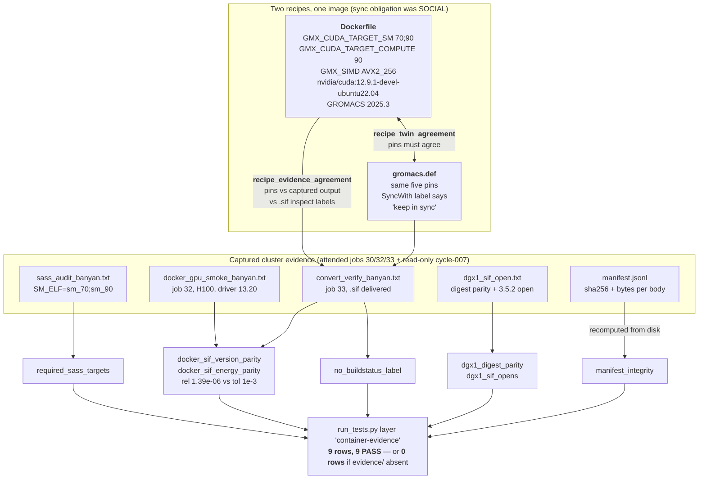

# p53-mdm2 — Findings (v0)

Date: 2026-07-31

---
type: findings
topic: p53-mdm2
date: 2026-07-31
version: v0
prior-version: 11-cycle006_findings_v0.md
key-metric: read-back checks passing: 48 of 48 (prior: 39 of 39, delta: +9)
decision-required: confirm
---

## Headline Result

metric: The container campaign's **cluster evidence is now under test in the repo**, and the stage-once-run-anywhere claim is **observed byte-for-byte** rather than asserted from matching `df` output
value: 48 of 48 checks pass (9 new `container-evidence` rows); one sha256 `1fc04f8b…d20c81ac` computed independently from banyan and from dgx1 agrees, and a singularity-ce 4.2.2 image `inspect`s (rc 0) and `exec`s (rc 0) under dgx1's singularity 3.5.2; 15 of 20 audited Success Gates ticked; 7 stale runbook falsehoods repaired
unit: checks / gates / hosts
prior: 39 of 39 checks, zero tests over `cluster/`, portability asserted from `df`, runbook still asserting no `.sif` exists (cycle-006 + the 2026-07-29 attended session)
direction: up

I re-ran the suite myself under the forOUSD interpreter: `ALL PASS (48/48 checks)`, with all 9 `container-evidence` rows green `[source: my own run of examples/p53_mdm2/tests/run_tests.py at commit 56ba79b]`. The PI's hard constraint holds: I confirmed independently, by redirecting the module's evidence paths without touching disk, that `run()` returns **zero** rows when `cluster/evidence/` is absent `[source: examples/p53_mdm2/tests/test_container_evidence.py:471-499, verified by execution]` — 48 − 9 = 39, so the pre-existing suite is unaffected.

**Three things this cycle did not do, stated plainly before anything else.** No dgx1 GPU has run the image — the cross-cluster check took no `--nv` and requested no device, by construction `[source: examples/p53_mdm2/cluster/evidence/manifest.jsonl seq 5, `device_access`]`. Build equivalence was measured against a **cached** compile layer (`#7`/`#8 CACHED`) and is **not** a cold-cache reproduction `[source: manifest.jsonl seq 3, `caveat`]`. The cleanup gate demanding `/` return to its pre-work free space is **not met** and was reworded rather than ticked `[source: __roadmap__/p53-mdm2-v2/p1b_container_runtime/README.md:27]`. And the campaign-level fact that frames all of it: **no p53-MDM2 MD simulation has ever run on any cluster** — everything executed so far is a smoke-test SPC water box `[source: commit 3247a9b, "minimal SPC water-box smoke system"]`.

## Results Tables

### The container-evidence layer — 9 gates, and what each actually asserts

Every row PASS `[source: my own run of test_container_evidence.py; suite output at 48/48]`. The column that matters is the third — a gate that re-derives its expectation from the same file by the same parser asserts nothing.

| Check | Assertion | Where the expectation comes from |
|---|---|---|
| `recipe_twin_agreement` | `Dockerfile` and `gromacs.def` pins agree with **each other** | pins parsed independently out of both files |
| `recipe_evidence_agreement` | those pins agree with the **captured output** and the delivered `.sif`'s `inspect` labels | recipe files vs. cluster captures — two independent artifacts |
| `manifest_integrity` | every manifest line's recorded sha256/bytes match the body file on disk | recomputed from disk, not read back from the manifest |
| `required_sass_targets` | `sm_70` **and** `sm_90` present as ELF in every captured SASS summary; rebuild summary identical | constant `_REQUIRED_SM` stated in the test module |
| `no_buildstatus_label` | no `BuildStatus` label reaches either recipe or the artifact | absence assertion over recipes + `inspect` output |
| `docker_sif_version_parity` | docker-path and sif-path `gmx --version` fields agree | two separately captured evidence files |
| `docker_sif_energy_parity` | minimisation energies agree, relative tol **1e-3**; observed **1.39e-06** | two separately captured evidence files |
| `dgx1_digest_parity` | banyan-computed digest == dgx1-computed digest | two hosts, one file |
| `dgx1_sif_opens` | `inspect` and `exec` both rc 0 under singularity 3.5.2 | captured rc values |

The highest-value assertion is **not** the SASS list. It is `recipe_evidence_agreement`, which mechanises a sync obligation both recipe headers concede is only social: `gromacs.def`'s own `SyncWith` label reads `./gromacs.def (parallel implementation - keep in sync)` `[source: evidence/dgx1_sif_open.txt, DGX1_INSPECT block]`.

### The zero-rows contract, and per-family darkness

`run_tests.py` has no skip concept and reads `passed` as a bool, so "evidence not captured yet" must produce **no row**, not a failing one `[source: test_container_evidence.py:16-27 module docstring]`.

| Condition | Rows emitted | Verified by |
|---|---|---|
| `cluster/evidence/` absent entirely | **0** | my own path-redirect run (no disk change) |
| `sass_audit_banyan.txt` absent | that family dark, others unaffected | per-file `os.path.isfile` guards at `run()` |
| evidence present, good | one PASS row per family | live suite, 9/9 PASS |
| evidence present, corrupted | FAIL row (a real defect, not a skip) | Unit A's synthetic fixtures |
| evidence present, unparseable | `ValueError` caught into a FAIL row | `_row()` wraps every check |

### Cross-cluster byte parity and the version-skew test

| Item | banyan | dgx1 | Verdict |
|---|---|---|---|
| `gromacs.sif` sha256 | `1fc04f8b…d20c81ac` | `1fc04f8b…d20c81ac` | **match** |
| bytes | 5750255616 | 5750255616 | match |
| `/home` source | `ts2:/export/home` from `10.5.1.206` | same export, same server | one filesystem, not two copies |
| singularity | `singularity-ce version 4.2.2` (writer) | `singularity version 3.5.2` (reader) | 5-year skew |
| `inspect` | — | **rc 0**, `GromacsVer: 2025.3`, `TargetSM: 70;90`, no `BuildStatus` | metadata readable |
| `exec … ls /opt/gromacs/bin` | — | **rc 0**, `gmx` present, 120984 bytes | **squashfs mounts** |
| `exec … gmx --version` | — | rc 0, `CUDA driver: 0.0` | driverless run, not a skew signal |
| payload | squashfs 4.0, **gzip**, 128 KiB blocks | same file | mechanism, not luck |

`[source: examples/p53_mdm2/cluster/evidence/dgx1_sif_open.txt; manifest.jsonl seq 4 and 5, commit a46515b]`

The `exec` is the decisive half — `inspect` only reads metadata, whereas `exec` must actually mount and read through the squashfs, which is precisely where a too-new compressor would have failed `[source: dgx1_sif_open.txt, EXEC INTERPRETATION]`. **The caveat that must not be lost:** gzip is the current builder's *default*, not a contracted guarantee; an explicit `--compress` change could reintroduce the risk `[source: dgx1_sif_open.txt, COMPRESSION INTERPRETATION; recorded as an assumption in cluster/README.md:553-556]`.

### Success-gate audit — 20 gates across four leaves, 15 met

Glyph-only changes; **no gate text was altered**, and `dirtree-rdm validate` returned rc=0 on all seven files before and after `[source: commit 14a4272 message]`.

| Leaf | Gates | Met | Unticked |
|---|---|---|---|
| `recipe_evidence_corrections` | 5 | 4 | g1 |
| `sass_portability_audit` | 4 | 3 | g2 |
| `docker_gpu_smoke` | 6 | 5 | g4 |
| `sif_delivery/convert_verify_cleanup` | 5 | 3 | g1, g5 |
| **total** | **20** | **15** | **5** |

`[source: commit 14a4272; counts re-derived by me from the ⬜/✅ glyphs in the four leaf files at HEAD]`

Separately, `dgx1_sif_open_check`'s **4 gates are all met** by Units B and D and were ticked by the orchestrator at cycle close — that leaf was not part of the audited 20 `[source: __roadmap__/…/crosscluster_readonly/dgx1_sif_open_check.md, working-tree diff at cycle close]`.

### The 5 non-met gates, by defect class — the report's most important content

| Gate | Defect class | What the evidence actually says |
|---|---|---|
| `sass_portability_audit` g2 | **falsified prediction** | Gate predicts `cuobjdump -lptx` shows `sm_90` only, matching `GMX_CUDA_TARGET_COMPUTE="90"`. Capture shows `SM_PTX=sm_70;sm_90` with `PTX_RECORDS == ELF_RECORDS == 98` `[source: evidence/sass_audit_banyan.txt:30-33]` |
| `convert_verify_cleanup` g1 | **over-claim in an interpretive clause** | Observable condition (rebuilt SASS summary + version block identical) **is** met; the trailing clause "giving the campaign its first build-reproducibility datum" is what the manifest verbatim disclaims `[source: manifest.jsonl seq 3 `caveat`; leaf line 11]` |
| `convert_verify_cleanup` g5 | **leaf/parent honesty divergence** | Parent reworded at `9be52cb` to record cleanup as NOT met; the leaf was never reworded — `git log` on the leaf shows only `c4f1d84` and `14a4272` (the glyph pass) — and the leaf's weaker wording ("`/` free space is *recorded* before and after") **is** satisfied `[source: git log on sif_delivery/convert_verify_cleanup.md; parent README.md:27 vs leaf line 15]` |
| `docker_gpu_smoke` g4 | **substantively true, misplaced** | `mdrun` exit 0 lives in the body file's sentinel; the gate requires it in `manifest.jsonl`, which records only job-level `exit_status` `[source: commit 14a4272; manifest.jsonl seq 2]` |
| `recipe_evidence_corrections` g1 | **blocked at audit time, closed later the same cycle** | At `14a4272` the runbook still asserted in the present tense that `gromacs.sif` does not exist. Unit D (`d5707ff`) repaired it; the gate is now substantively met but **still shows ⬜** `[source: recipe_evidence_corrections.md:10; verified by my own grep, below]` |

### Runbook truth repair — 7 present-tense falsehoods

The runbook was never updated after Slurm jobs 32/33, so it asserted — in its **top banner** and six further places — three things that are false `[source: commit d5707ff message]`.

| Location | Asserted | Now |
|---|---|---|
| top banner | "THE DOCKER IMAGE IS BUILT — THE `.sif` IS NOT" | delivered / GPU-run / dgx1-readable, with an explicit still-true list underneath |
| shared-NFS bullet | stage-once-run-anywhere from matching `df` | cites one sha256 computed on both clusters |
| gated step 1 | third build line unrun | job 33 recorded with digests |
| gated step 2 | upload pending | staging done; no upload was ever needed |
| gated step 3 | both halves gated | banyan half done twice; dgx1 half still gated, and explicitly **not** a GPU result |
| sub-decision (c) | open | settled by events |
| GPU-0 allocation | "could not determine" | determined — Slurm does hand out the contended card |
| risk register: SIF version skew | speculative open risk + mitigation plan | **observation** with citation and the gzip-is-a-default caveat (this is `dgx1_sif_open_check` g4) |

The docker-group≈root risk was left **byte-identical**, per the leaf's scope `[source: commit d5707ff]`. The dated-changelog idiom was preserved: cycle-006 entries untouched, the 2026-07-30 entry's clauses labelled *superseded* rather than deleted, a new 2026-07-31 entry added `[source: examples/p53_mdm2/cluster/README.md:649 and the following entry]`.

I re-ran the gate's own grep myself. `grep -rniE 'not been built|never built|gromacs\.sif does not exist|no GPU has executed'` over `cluster/` returns **zero hits (rc=1)**. A broader sweep (`NOTHING HAS BEEN BUILT|has not been built|does not exist|no \.sif`) returns exactly **one** hit — `gromacs.def:19`, which is about the *subuid mapping* not existing on dgx1, an unrelated and still-true statement. The superseded dated quote at `README.md:649` is the one place the old claim survives, and gate 1 expressly allows quoting an old claim as explicitly superseded `[source: my own greps at commit 56ba79b; recipe_evidence_corrections.md:10]`.

### Cycle-007 commits (branch `topic/p53-mdm2`)

| Hash | Unit | Change |
|---|---|---|
| `14a4272` | C | tick 15 of 20 verified Success Gates; glyph-only |
| `a46515b` | B | dgx1 read-only open check + evidence + manifest seq 4/5 |
| `58223d8` | A | `test_container_evidence.py` (513 lines) + `container-evidence` layer |
| `d5707ff` | D | SIF version skew rewritten as an observation; 7 runbook falsehoods repaired |
| `56ba79b` | D | correct R13's index entry to the observed state |

`[source: git log on topic/p53-mdm2]`. `71bb6dd` is a **discarded** commit, reachable only via reflog: it swept in Unit A's staged files, was soft-reset, and `a46515b` is the real commit — no files were touched on disk `[source: git reflog, entries 02:50:28 → 02:51:23]`.

## Observations

| Signal | Baseline / Expected | Observed [source] | Interpretation |
|---|---|---|---|
| SIF version skew, open since R07 | a 2019 runtime may not mount an image written by a 2024 one; mitigation plan was per-cluster rebuilds | `inspect` rc 0 **and** `exec` rc 0 under 3.5.2; payload is squashfs 4.0 / gzip / 128 KiB `[source: evidence/dgx1_sif_open.txt]` | **Risk did not materialise, and we know why** — so it converts from risk to observation. But the "why" is a builder default, so the entry stays with a caveat rather than being deleted |
| Stage-once-run-anywhere | asserted from matching `df` output since R07 | one sha256 computed on banyan and on dgx1 agrees; same NFSv4 export from `10.5.1.206`; size and nanosecond mtime identical `[source: evidence/dgx1_sif_open.txt STEP 1]` | First **byte-level** test of the claim. It holds. Cheap, and it should have been done three cycles ago |
| `gmx --version` on dgx1 | leaf predicted failure naming `libcuda.so.1`, to be read as absent GPU passthrough | exited **0** with `CUDA driver: 0.0`; `ldd` shows no `libcuda` and nothing not-found, agreeing with `LIBCUDA_DT_NEEDED=no` `[source: evidence/dgx1_sif_open.txt; sass_audit_banyan.txt:34]` | The prediction was **wrong, benignly**. GROMACS resolves the driver lazily. Carries **no** information about skew, and is **not** evidence the image can drive a dgx1 GPU |
| PTX architecture list | `sm_90` only, per `GMX_CUDA_TARGET_COMPUTE="90"` | `SM_PTX=sm_70;sm_90`, `PTX_RECORDS == ELF_RECORDS == 98`, and **no `compute_*` token anywhere in the evidence** `[source: sass_audit_banyan.txt:30-33; my own grep for `compute_` over evidence/ returns nothing]` | The only gate in the campaign whose *prediction* was contradicted rather than merely unverified. A benign reading exists; it is **inference**, and the capture cannot disambiguate it → **Q-008** |
| Cluster-tool permissions | cycle-006 had two dispatches refused by the auto-mode classifier | **zero refusals this cycle**; the read-only unattended path worked end to end `[source: evidence/manifest.jsonl seq 4/5 `agent: claude-opus-5 (unattended cycle-007)`, `read_only: true`]` | Direct contrast with cycle-006 and a data point for the Q-006 policy: read-only cluster work *is* unattended-viable |
| `fs_checksum` MCP tool on dgx1 | should behave as the banyan twin did on the same 5.75 GB path | `Error executing tool fs_checksum: could not communicate with process` — an **endpoint failure, not a permission refusal**; fell back to `sha256sum` `[source: evidence/dgx1_sif_open.txt DIGEST_DGX1; manifest.jsonl seq 5 `digest_method`]` | In scope for the PI's Q-003 beta-feedback mandate. The banyan call succeeded on the same path, so this is dgx1-side |
| Success-gate quality | gates are either met or not-yet-met | 3 of 5 non-met gates are **gate-text defects**, not missing work `[source: commit 14a4272; the defect-class table above]` | Auditing gates against evidence surfaces bad *specifications*, not just incomplete execution. This is the audit's real yield |

## Charts & Visualizations

What the new test layer actually locks down — the three-way consistency the runbook previously enforced socially:


<!-- Caption: the container-evidence layer's dependency model. Bidirectional edge = recipe-vs-recipe; downward edges = recipe-vs-evidence. Every family is dark (zero rows) when its evidence file is absent, so the layer cannot redden the suite for work not yet done. Suite total 48/48; without evidence/ it is 39/39. -->

Where the portability claim actually stands — each rung, and what it rests on:

```
 THE STAGE-ONCE-RUN-ANYWHERE CLAIM: rung by rung, R07 -> today
 ==============================================================================
 rung                                   rests on                     status
 ------------------------------------------------------------------------------
 6  p53-MDM2 MD produces science        a real system, not a          NOT STARTED
    on either cluster                   water box                    (no MD sim
                                                                      has EVER run)
 ------------------------------------ PI-ATTENDED FRONTIER (Q-006) -----------
 5  dgx1 GPU executes the image        singularity exec --nv         UNTESTED
                                        + a device request            by construction
 4  cold-cache rebuild reproduces      an uncached compile layer     NOT MEASURED
    the image                           (#7/#8 were CACHED)          (cleanup also
                                                                      NOT met: last
                                                                      ~10 GB needs
                                                                      docker image
                                                                      prune over 52
                                                                      dangling imgs)
 ============================= observed as of 2026-07-31 ======================
 3  dgx1 runtime OPENS and READS       inspect rc 0 + exec rc 0      *** NEW ***
    the banyan-written image            under singularity 3.5.2       cycle-007
                                        (gzip squashfs = the why)
 2  both clusters see the SAME BYTES   one sha256 computed on        *** NEW ***
                                        banyan and on dgx1, equal     cycle-007
 1  banyan GPU executes the image      job 32/33, CUDA driver        attended
                                        13.20, compute cap 9.0        2026-07-30
 0  both architectures are real SASS   SM_ELF=sm_70;sm_90,           attended
                                        98 ELF records                2026-07-29
 ------------------------------------------------------------------------------
 rungs 0-1 attended (jobs 30/32/33) | rungs 2-3 unattended read-only, this cycle
 rungs 4-6 open. Rung 3's mechanism is a builder DEFAULT, not a guarantee.
```
<!-- Caption: the proof frontier. Cycle-007 added rungs 2 and 3 without touching a GPU or writing to either cluster. Everything above the frontier line is PI-attended per the Q-006 answer; rung 6 is the campaign's actual scientific goal and has not begun. -->

## Contradictions & Surprises

- **A Success Gate's prediction was contradicted by the evidence, not merely unverified.** `sass_portability_audit` g2 predicted PTX for `sm_90` only; the capture reads `SM_PTX=sm_70;sm_90` with PTX and ELF record counts *equal* at 98. The benign reading — that `cuobjdump -lptx` names each PTX record after its **enclosing cubin**, so `sm_70` is the container's arch and not the PTX's target — is plausible but is **inference**: I confirmed myself that the evidence contains **no `compute_*` token at all** to disambiguate. Deliberately **not** promoted to a finding, and deliberately **not** encoded in the new test module either way — encoding the gate's prediction would go red, encoding the observation would bless a possibly-stale gate `[source: sass_audit_banyan.txt; my own grep over evidence/; Q-008]`.
- **A leaf and its parent disagree about honesty, and the leaf is the more flattering one.** The PI reworded the cleanup gate in the **parent** at `9be52cb` to record the original as NOT met. The **leaf** was never reworded, and its weaker wording ("`/` free space is *recorded* before and after") **is** satisfied by the evidence — so a reader of the leaf alone would tick it and conclude cleanup was complete. The asymmetry, not either wording, is the defect `[source: git log on the leaf shows only c4f1d84 and the glyph pass 14a4272; parent README.md:27]`.
- **Two of the three PI warnings are enforced by the *manifest*, not by prose.** `manifest.jsonl` seq 3 carries the cached-layer disclaimer verbatim as a `caveat` field, and seq 5 carries the "NOT evidence the image can use a dgx1 GPU" disclaimer the same way. That is a good pattern worth keeping: the disclaimer travels with the evidence rather than living only in a report someone may not read `[source: examples/p53_mdm2/cluster/evidence/manifest.jsonl]`.
- **The one tool failure this cycle was an endpoint crash, not a permission refusal** — the exact inverse of cycle-006's blocker. `mcp__plugin_dgx1_dgx1-hpc__fs_checksum` returned `could not communicate with process` while the banyan twin succeeded on the same 5.75 GB path; `sha256sum` was the fallback and is recorded as `digest_method` in the manifest. **Zero dispatches were refused by any permission classifier this cycle** `[source: evidence/dgx1_sif_open.txt DIGEST_DGX1; manifest.jsonl seq 5]`.
- **Two gates are now substantively met but still show ⬜, and both are the orchestrator's to tick, not mine.** `recipe_evidence_corrections` g1 (closed by Unit D's runbook repair — my own grep returns zero hits) and the parent `p1b_container_runtime` README's last gate, "`Dockerfile`↔`gromacs.def` pin agreement is enforced by a test in `run_tests.py`, not by convention" (closed by Unit A's `recipe_twin_agreement`) `[source: recipe_evidence_corrections.md:10; p1b_container_runtime/README.md:28]`.

## Process Findings

Reusable lessons, filed here rather than as incidents, and in scope for the PI's Q-003 beta-feedback mandate.

| Finding | What happened | Lesson |
|---|---|---|
| **Three sub-agents sharing one git working tree collided twice** | (i) Unit B's commit swept in Unit A's staged files, because Unit A staged them in the window between Unit B's verify and its commit; split by soft-reset plus explicit pathspec — `71bb6dd` discarded, `a46515b` is the real commit, **no files touched on disk** `[source: git reflog 02:50:28 → 02:51:23]`. (ii) Unit A's zero-rows test renamed `evidence/` aside while Units B and C were reading it, briefly showing four tracked files as deleted; one restore nested `evidence.aside/` inside `evidence/` before repair. Final history is correctly split and the tree verified clean with all five evidence files tracked `[source: git log; my own `ls` of evidence/ shows exactly five files]` | **Concurrent sub-agents in one worktree need `isolation: worktree`, or must be serialised.** This is the *second* cycle to hit it — cycle-006 had a cross-track collision that briefly corrupted committed evidence `[source: 11-cycle006_findings_v0.md, Contradictions]`. Once is bad luck; twice is a dispatch-pattern defect |
| **Read-only cluster work is unattended-viable; the tooling, not the policy, is the flaky part** | The whole cross-cluster check ran unattended with zero permission refusals; the only failure was a dgx1-side MCP endpoint crash with a clean shell fallback | Prefer the read-only unattended path for evidence-gathering, and **always keep a shell fallback for MCP fs tools**. The PI's own trap note already says never to trust `fs_view` as byte-faithful; add `fs_checksum` as merely *unreliable on dgx1* `[source: __threads__/p53-mdm2/INBOX.md, 2026-07-30T17:20 item 7]` |
| **Auditing gates against evidence beats auditing them against filenames** | Several leaves' Deliverables name files the PI consolidated during the attended session (`docker_gpu_smoke.sbatch`, `sif_gpu_smoke.sbatch`, `rebuild_equivalence.txt`, `sif_build.txt`, `cleanup.txt` → `docker_gpu_smoke.sh`, `convert_verify.sh`, two combined evidence files). Gates were audited against **content**, so the audit survived; the deliverable lists are now stale `[source: commit 14a4272; Q-010]` | Content-first auditing is the right default. But stale deliverable lists will mislead the next cold-start reader, so they need a pass |

## Steering Questions

Three questions are already filed via `umbod ask` (all soft) and are **not** re-posed here — burying steering questions in a report body is the anti-pattern this framework names.

- **[now] Q-008** — the falsified PTX gate. Reword against the observation, re-capture in an attended session with output that distinguishes a PTX record's target from its cubin name, or drop the gate. Nothing about `SM_PTX` is encoded in the test module pending the answer.
- **[now] Q-010** — the three gate-text defects (falsified prediction, over-claiming interpretive clause, leaf/parent divergence) plus the stale deliverable lists. These need the PI's wording, because each is a question of what the campaign should *promise*, not of what the code does.
- **[next run] Q-009** — next-cycle direction. p1b's unattended-safe work is **exhausted**; what remains (dgx1 GPU smoke, cold-cache rebuild, cleanup prune) is PI-attended by the Q-006 answer, while the INBOX opened two new workstreams: the MaBoSS producer/consumer boundary (plots-as-payloads vs. raw-arrays-as-payloads) and the talk's communication/graphics deliverables. The second one's value depends on a deadline I do not know.
- **[next run] The sub-agent dispatch pattern needs changing, and that is a decision, not a finding.** Two consecutive cycles have had shared-worktree collisions. `isolation: worktree` per sub-agent, or serialising units that share a path, both cost something — parallelism in one case, wall-clock in the other. Worth an explicit ruling rather than a third collision.
- **[later] The gzip caveat wants a cheap guard.** Rung 3's portability rests on a builder default. A one-line assertion on `unsquashfs -s` output at conversion time would turn "it happened to be gzip" into a gate — but it belongs in the convert step, which is PI-attended, so it cannot be added unattended.

## Pointers

- New test module: [test_container_evidence.py](../../examples/p53_mdm2/tests/test_container_evidence.py) · suite [run_tests.py](../../examples/p53_mdm2/tests/run_tests.py) (48/48, layer `container-evidence`)
- Evidence of record: [evidence/](../../examples/p53_mdm2/cluster/evidence/) — [manifest.jsonl](../../examples/p53_mdm2/cluster/evidence/manifest.jsonl), [dgx1_sif_open.txt](../../examples/p53_mdm2/cluster/evidence/dgx1_sif_open.txt), [convert_verify_banyan.txt](../../examples/p53_mdm2/cluster/evidence/convert_verify_banyan.txt), [docker_gpu_smoke_banyan.txt](../../examples/p53_mdm2/cluster/evidence/docker_gpu_smoke_banyan.txt), [sass_audit_banyan.txt](../../examples/p53_mdm2/cluster/evidence/sass_audit_banyan.txt)
- Runbook: [cluster/README.md](../../examples/p53_mdm2/cluster/README.md) · recipes [Dockerfile](../../examples/p53_mdm2/cluster/Dockerfile), [gromacs.def](../../examples/p53_mdm2/cluster/gromacs.def)
- Roadmap: [p1b_container_runtime/](../../__roadmap__/p53-mdm2-v2/p1b_container_runtime/) — the four audited leaves plus [dgx1_sif_open_check.md](../../__roadmap__/p53-mdm2-v2/p1b_container_runtime/sif_delivery/crosscluster_readonly/dgx1_sif_open_check.md)
- Prior reports: [13-route_b_build_observed_v0.md](13-route_b_build_observed_v0.md) (the build of record), [12-roadmap_migration_audit_v0.md](12-roadmap_migration_audit_v0.md), [11-cycle006_findings_v0.md](11-cycle006_findings_v0.md), [10-cluster_state_refresh_v0.md](10-cluster_state_refresh_v0.md)
- Questions: [QUESTIONS.md](../../__threads__/p53-mdm2/QUESTIONS.md) (Q-008/009/010) · PI brief: [INBOX.md](../../__threads__/p53-mdm2/INBOX.md), 2026-07-30T17:20

## What I Am Uncertain About

- **Every cluster fact in this report is transcribed from committed evidence, not re-observed.** I verified nothing on banyan or dgx1 — by instruction and by scope. What I *did* independently re-derive is the repo half: I re-ran the 48/48 suite, re-ran the module standalone to see 9/9, proved the zero-rows contract by path redirection, re-ran the gate's own grep (zero hits) and my own broader sweep (one hit, in the allowed superseded quote), recounted the 20/15/5 gate tally from the glyphs, checked `71bb6dd` in the reflog, and confirmed `compute_` appears nowhere in `evidence/`. If the 2026-07-29 to 2026-07-31 captures contain a transcription error, this report inherits it silently — the same disclosure R13 makes about itself `[source: 13-route_b_build_observed_v0.md, uncertainties]`.
- **My orchestrator's brief mis-attributed one of the five non-met gates, and I corrected it.** The brief listed `dgx1_sif_open_check` g4 as the 5th unticked gate of the audit. It is not: the audit covered **four** leaves (20 gates), `dgx1_sif_open_check` was not among them, and the actual 5th unticked gate is `recipe_evidence_corrections` **g1** `[source: commit 14a4272 message, which names all five explicitly]`. Both underlying facts in the brief are true — `dgx1_sif_open_check` g4 *is* the risk-register rewrite, and it *was* ticked at cycle close — they were just filed under the wrong heading. Everything else in the brief I was able to substantiate.
- **The benign reading of the PTX gate is the alternative interpretation I considered and rejected as a finding.** I think it is *probably* right — `PTX_RECORDS == ELF_RECORDS == 98` is exactly what per-cubin naming would produce, and the audit script greps `sm_[0-9]+|compute_[0-9]+` over raw text, which would pick up a filename token. But "probably right" is not a finding, and I have no `compute_*` token to test it against `[assumption: per-cubin PTX naming in cuobjdump -lptx; unverified against cuobjdump documentation, which I did not consult]`.
- **Whether the two now-met-but-unticked gates should be ticked is a judgement I deliberately did not make.** I own only this report and the index; the orchestrator owns roadmap ticks. `recipe_evidence_corrections` g1 reads as met to me on the evidence of my own grep, but the gate says "check the assertion's *status*, never a bare string count", and a careful reader might want the superseded quote at `README.md:649` looked at by a human before ticking.
- **The zero-rows behaviour I verified is the `_EVIDENCE`-absent case and the code path for per-file darkness; I did not reproduce Unit A's synthetic-fixture matrix** (good→2 PASS, corrupted→2 FAIL, malformed→`ValueError`, absent→0 rows). Reproducing it means writing fixture files into or beside `cluster/evidence/`, which is exactly the operation that caused this cycle's second collision, so I read the guards at `run()` and `_row()` instead and took the unit's account for the rest `[assumption: Unit A's fixture matrix as reported; the guards it relies on are verified by inspection and the absent case by execution]`.
- **One structural nit in the new module that nobody flagged.** `recipe_twin_agreement` reads only `Dockerfile` and `gromacs.def`, yet it is gated on `cluster/evidence/` existing — so the one check that needs no evidence at all goes dark when evidence is absent. Harmless today (evidence exists), and it keeps the zero-rows contract absolutely simple, but a future reader may find it surprising that recipe-twin drift would be undetected in a checkout with no captures `[source: test_container_evidence.py:481-482, my own reading]`.
