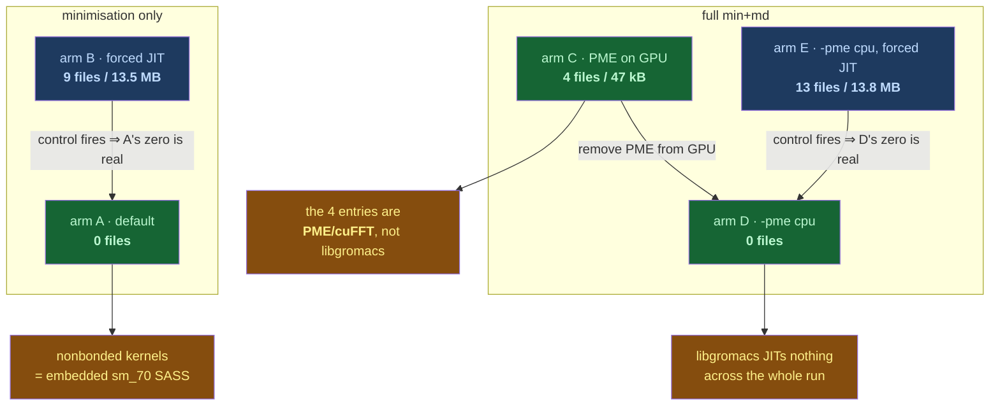

# p53-mdm2 — Cycle-008 Findings (v0)

Date: 2026-08-13

---
type: findings
topic: p53-mdm2
date: 2026-08-13
version: v0
prior-version: __reports__/p53-mdm2/14-cycle007_findings_v0.md
key-metric: read-back checks passing: 53/53 (prior: 48/48, delta: +5)
decision-required: confirm
---

## Headline Result

metric: read-back checks passing
value: 53/53
unit: checks
prior: 48/48
direction: up

Secondary, and the cycle's actual news: **both cluster container runtimes moved to
`singularity-ce 4.5.0-noble` while nobody was looking**, which simultaneously makes the
gzip guard live and dissolves the version-skew it was written to catch.

## Results Tables

### PME JIT-origin discriminator — dgx1 Slurm job 31, exit 0, 1m16s

Every arm runs against its own fresh empty `CUDA_CACHE_PATH`.

| Arm | Condition | JIT files | JIT bytes | `PME … all aspects on the GPU` in md.log |
|---|---|---|---|---|
| A | minimisation, default | 0 | 0 | — |
| B | minimisation, `CUDA_FORCE_PTX_JIT=1` | 9 | 13 486 671 | — |
| C | full min+md, PME on GPU | 4 | 47 471 | present |
| D | full min+md, `-pme cpu` | **0** | 0 | absent |
| E | full min+md, `-pme cpu`, forced JIT | **13** | 13 767 931 | absent |

Real `~/.nv/ComputeCache`: 192K before, 192K after. Arms A/B/C reproduce job 30 exactly —
same counts *and* same byte totals.

### Cluster state delta — 2026-08-12 (PI brief) → 2026-08-13 (this cycle)

| Property | banyan, as briefed | banyan, observed | dgx1, as briefed | dgx1, observed |
|---|---|---|---|---|
| Reachable | **no** (ssh denied) | **yes** | yes | yes |
| OS | mid 22→24 upgrade | 24.04.4, kernel 6.8.0-137 | 24.04.4 | 24.04.4 |
| singularity | 4.2.2 (writer) | **4.5.0-noble** | 3.5.2 (reader) | **4.5.0-noble** |
| Docker build cache | may be wiped by rebuild | **16.46 GB / 108 records, intact** | n/a | n/a |
| Docker images | 52, maybe wiped | **52 / 213.3 GB, 29 dangling** | n/a | n/a |
| `/` free | 439 G / 53% | 438 G / 52% | — | — |
| `gromacs.sif` | intact per PI re-check | intact, gzip, 128 KiB blocks | opens under 3.5.2 | — |

### Roadmap gate rollup

| File | Gates before | Gates after | Node status advanced |
|---|---|---|---|
| `crosscluster_readonly/README.md` | 0✅ / 4⬜ | **4✅ / 0⬜** | `dgx1_sif_open_check` → Done |
| `sif_delivery/README.md` | 0✅ / 5⬜ | 3✅ / 2⬜ | `crosscluster_readonly/` → Done |
| `p1b_container_runtime/README.md` | 6✅ / 1⬜ | unchanged | — |
| `sass_vs_jit_provenance.md` (CRV) | 4✅ / 1⬜ | **5✅ / 0⬜** | — |

`dirtree-rdm validate` rc=0 on all eight files, before and after. All node/Mermaid changes
via `dirtree-rdm update`; no BNF block hand-edited.

## Observations

| Signal | Baseline / Expected | Observed [source] | Interpretation |
|---|---|---|---|
| banyan reachability | unreachable, mid-upgrade | ssh rc 0, kernel 6.8.0-137, uptime 1h16m [source: `cluster/evidence/banyan_post_upgrade.txt`] | Upgrade landed ~00:50 JST 2026-08-13. The brief's central planning assumption expired hours before the cycle read it. |
| banyan singularity | 4.2.2 writes the image | `singularity-ce 4.5.0-noble`, dpkg, `/usr/bin/singularity` [source: same] | The **writer moved**. The gzip guard is live, exactly as the PI predicted. |
| dgx1 singularity | 3.5.2, the "2019 reader" | `4.5.0-noble` in job 31; `3.5.2` in job 30, same script line, 14 h earlier [source: `evidence/dgx1_pme_jit_origin.txt`, `evidence/dgx1_sass_vs_jit.txt`] | The **reader moved too**. Not predicted by anyone. The skew may have closed by both ends moving — which retires the risk *and* the evidence for portability in one stroke. |
| 4.5.0 default compressor | unknown, feared non-gzip | **undetermined read-only** — no key in `singularity.conf`, none in `--help`/man, no env var, no compressor name adjacent to the `-comp` literal in strings [source: `banyan_post_upgrade.txt`] | Genuinely unreachable without building. Recorded as undetermined rather than inferred from the version number. |
| Docker state after OS upgrade | rebuilt `/var/lib/docker` may make the next build cold for free (PI hypothesis, INBOX item 8) | build cache **identical** at 16.46 GB / 108 records, entries "4 months ago"; 52 images survive [source: `banyan_post_upgrade.txt`] | **Hypothesis falsified.** The cold-cache gate is *not* freed and still needs an explicit `--no-cache`. |
| PME-path JIT origin | 4 entries, origin undetermined | 0 under `-pme cpu`, with a 13-file control firing in the same environment [source: `evidence/dgx1_pme_jit_origin.txt`] | JIT belongs to the PME/cuFFT path, not `libgromacs`. Nothing in `libgromacs` JITs on the V100. |
| Leaf vs. parent gate state | rollup assumed automatic | leaf 4/4 ✅, all three parents 0/4 ✅ and node `Planned` [source: `__roadmap__/…/crosscluster_readonly/README.md` pre-`c35cbbe`] | Rollup is **not** automatic. Same defect class as Q-010, mirrored: parents under-read where the leaf over-read. |
| MaBoSS array size in USD | "50k samples" (PI) | one scalar `sample_count=50000`; stored arrays are 10 000 floats / 310 795 B, already marginalised [source: `__reports__/p53-mdm2/15-results_consumption_boundary_v0.md`] | The question's premise was wrong; the payload candidate is the *discarded* raw trajectory, not what is stored. |
| Harness permission classifier | refused cluster-mutating dispatch in cycle-006 | **zero refusals**; job 31 submitted first attempt via the sanctioned skill [source: WORKLOG cycle-008] | Second consecutive cycle with no refusal. Q-006's "attempt it, escalate if refused" policy is working. |

## Charts & Visualizations

The JIT-attribution argument is a control-and-treatment design, not a single measurement.
Its validity rests entirely on the diagonal — each zero is only meaningful because its
paired forced-JIT control fired in the same environment.



*Caption: arms C→D isolate the PME path; arms B and E are the positive controls that make
the zeros in A and D measurements rather than artifacts of a disabled cache. Without the
control column, the entire result would be an unfalsifiable negative.*

The runtime-version picture, which is where the cycle's risk actually moved:

```
                    2026-07-31        2026-08-12 brief      2026-08-13 observed
banyan  (writer)    4.2.2             "unreachable"         4.5.0-noble  ← moved
dgx1    (reader)    3.5.2             3.5.2                 4.5.0-noble  ← moved, unpredicted
                    └── skew: the claim the campaign rests on ──┘   └── skew now ZERO ──┘
                                                        4.2.2 still on banyan under /opt
```

*Caption: the cross-cluster portability claim was earned against a 3.5.2 reader that is no
longer dgx1's default. Both ends converging on 4.5.0 removes the risk and the evidence
together.*

## Contradictions & Surprises

- **dgx1's runtime changed mid-campaign and nothing announced it.** Two committed captures
  from the identical script line, fourteen hours apart, print different singularity
  versions. Found incidentally by a unit doing something else entirely.
- **The PI's docker hypothesis was falsified in the direction that costs work**: the build
  cache survived byte-for-byte, so the cold-cache rebuild is still owed a `--no-cache`.
- **The MaBoSS question's premise was wrong** — the 50k samples were never in the USD file,
  and the data that *should* be the payload is currently discarded to a temp dir.
- **Reusing pyMaBoSS plotting costs zero dependencies**, dissolving the objection this
  cycle expected to raise against it and leaving the opacity rule as the sole argument.
- **Roadmap rollup is not automatic**, and the failure is silent in both directions.

## Steering Questions

- **[now] Q-011** — both runtimes moved to 4.5.0. Settle the compressor with one attended
  build, pin 4.2.2 via the surviving module, or retire the guard as moot? Option three is
  cheapest and quietly deletes a claim the campaign has been making.
- **[now] Q-013** — does the opacity rule stand? It excludes the rendered-plot artifact the
  PI asked for. Everything in `p6_results_consumption/` follows from it.
- **[now] Q-012** — two parent gate-texts need the same split/reword the PI gave their
  leaves; plus `dirtree-rdm` has no command to write BNF-managed Progress tables, so they
  can only go stale.
- **[next run] Q-014** — the talk date. Workstream (2) is the only item left with no path
  forward that does not depend on the PI.
- **[later]** The campaign's real gap is unchanged: **no p53-MDM2 MD simulation has ever
  run on any cluster.** Every execution to date, on either machine, is a 2652-atom
  smoke-test water box.

## Pointers

- [Report 15 — results-consumption boundary](15-results_consumption_boundary_v0.md)
- [Report 14 — cycle-007 findings](14-cycle007_findings_v0.md)
- `examples/p53_mdm2/cluster/evidence/banyan_post_upgrade.txt` (manifest seq 9)
- `examples/p53_mdm2/cluster/evidence/dgx1_pme_jit_origin.txt` (manifest seq 10)
- `__roadmap__/container-runtime-verification/sass_vs_jit_provenance.md` — all 5 gates closed
- `__roadmap__/p53-mdm2-v2/p6_results_consumption/` — 3 new leaves, 8 steps
- `__threads__/p53-mdm2/cycles/cycle-008/WORKLOG.md`
