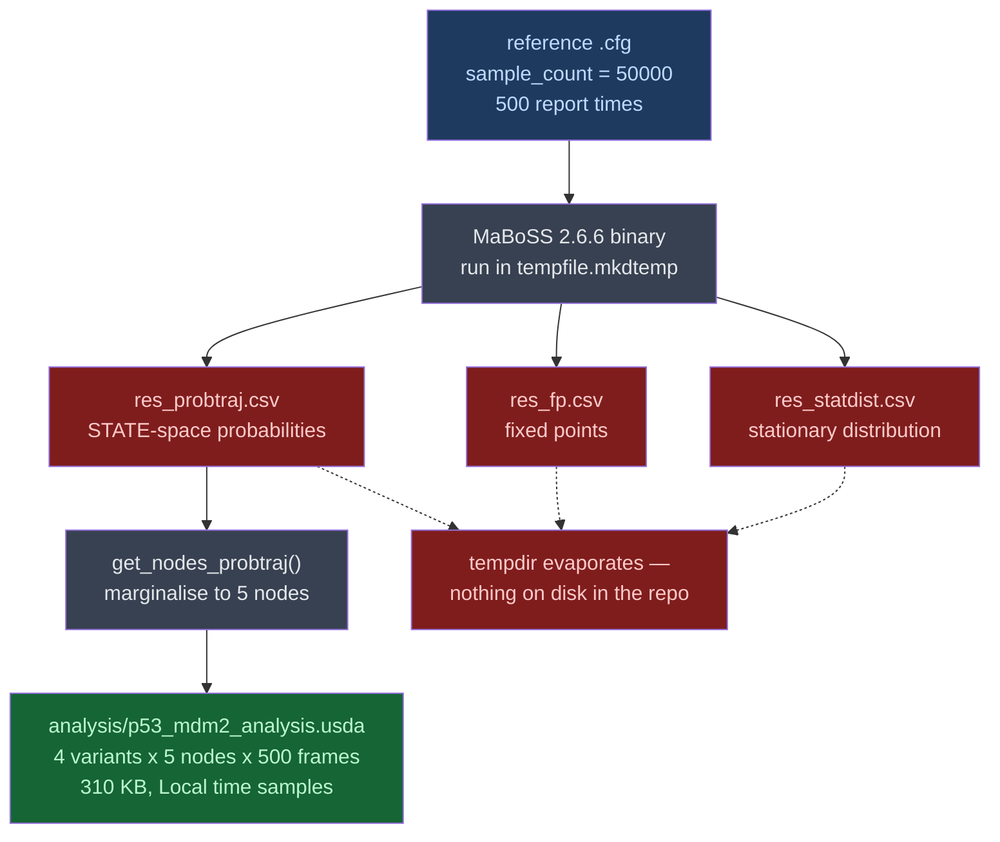
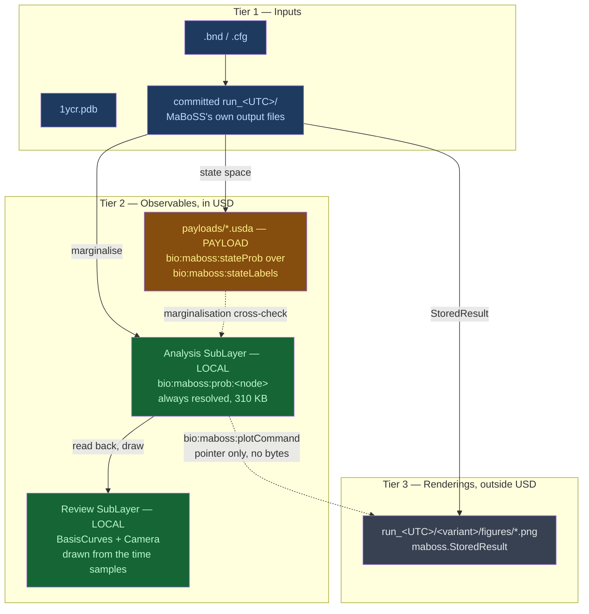

# p53-mdm2 — Results-Consumption Boundary: Architecture Analysis (v0)

Date: 2026-08-13
Cycle: cycle-008, Unit C
Author: Claude Opus 5 (async agent)
Answers: INBOX workstream (1), raised by the PI 2026-07-29, confirmed unstarted 2026-08-12

> **Honesty tagging.** Every load-bearing claim carries `[observed]` (I read it or ran it), `[inference]` (follows from something observed), or `[assumption]` (not verified — treat as open). Sections marked **RECOMMENDATION** are design proposals, not findings.

---

## The bounded answer, in three sentences

1. **The payload is the raw state-space trajectory that MaBoSS writes and this pipeline currently throws away — not the node-probability arrays already in USD, and not the plots**, because a USD payload arc targets *scene description* and can never point at a PNG, and because the arrays in USD today are 310 KB and defer nothing worth deferring.
2. **The plots are not stored in USD at all**; the result becomes human-legible by rendering the observables *as USD geometry* in a Review layer that vanilla `usdview` already draws, while MaBoSS's own matplotlib figures are generated as byproducts beside the run directory, with USD carrying only the command that regenerates them.
3. **The boundary that stops the regress is the opacity rule: USD stores what a read-back test can assert against the observables; anything a consumer serialises into bytes USD cannot verify — image, PDF, pickled figure — stays outside, and USD carries at most a regeneration pointer.**

That rule is stated to be *falsifiable and costly*: §"What the rule excludes" names what it forbids that someone will want.

---

## Executive Summary

- **Problem.** The four pipelines run end to end and the MaBoSS result reaches USD as numbers, but a scientist cannot see it. The PI asked whether MaBoSS's prepared plotting should be reused and stored as payloads, or whether the simulation arrays are the raw data that should become payloads — and flagged the risk of an infinite producers/consumers rabbit hole.
- **Proposed change.** Adopt a three-tier storage rule (inputs / observables / renderings) enforced by one discriminator (opacity), then implement its three consequences: author the design doc's unwritten **Review** department carrying the observables as `UsdGeomBasisCurves`; put MaBoSS's discarded **state-space** output behind the campaign's first **Payload** arc; and generate MaBoSS's native figures from the committed run directory via `maboss.StoredResult`, outside USD.
- **Non-goals.** No pipeline code is written this cycle (scoping only). No rewrite of `__design__/openusd_for_research_architecture.md` — all three consequences are already decisions in it (§2.1 row P, §3 Cinematography row, §4.1 fifth department), and implementing them is the INTENT's stated scope. No new dependency. No survey of alternative visualisation tools.
- **Biggest risks.** (1) The Review-layer curves live in the same Ångström world space as the atoms, so the plot's coordinate mapping is the hard part, not the drawing. (2) The state-space payload is *small*, so the arc is justified on semantics and generalisation, not on memory — and a gate claiming otherwise would be falsified by its own measurement. (3) The opacity rule excludes exactly the artifact the PI asked for, and the PI may reasonably overrule it.
- **Validation approach.** Every new artifact gets a read-back check that asserts it against the observables it derives from, per the campaign's standing anti-tautology discipline. The two gates that carry the argument are: curve vertices invert to the Analysis layer's own time samples; and the payloaded state probabilities marginalise to the node probabilities already stored.

---

## Current State — what is actually stored, and what is silently lost

Three facts had to be established by reading the code and the artifacts, because the docs do not say them and one of them contradicts the question's premise.



**Fact 1 — the "50k samples" are not in the USD file.** `[observed]` `sample_count = 50000` is the Monte Carlo trajectory count in the run config `[source: examples/p53_mdm2/maboss/reference/p53_Mdm2_runcfg.cfg]`. It reaches USD as a single scalar, `custom int bio:maboss:sampleCount = 50000` `[source: examples/p53_mdm2/analysis/p53_mdm2_analysis.usda]`. What is actually stored is 4 variants × 5 nodes × 500 frames = 10 000 floats, in a 310 795-byte ASCII layer `[observed]`. Any sizing argument built on 50 000 is wrong by four orders of magnitude — and the whole "these arrays are heavy, defer them" instinct dissolves once the real number is on the table.

**Fact 2 — what is in USD is already a reduction, not raw data.** `[observed]` `run_cfg` calls `result.get_nodes_probtraj()`, described in-code as `index=Time, cols=node, val=P(node up)` `[source: examples/p53_mdm2/maboss/run_maboss.py]`. That is the marginal over Boolean states, not the state-space trajectory. So the thing occupying the "raw data" slot in the current design is not raw.

**Fact 3 — the genuinely raw output is written and then deleted.** `[observed]` `run_cfg` runs into `tempfile.mkdtemp(prefix="maboss_run_")`, parses one DataFrame, and never returns or copies the directory `[source: examples/p53_mdm2/maboss/run_maboss.py]`. MaBoSS writes `*_probtraj.csv`, `*_fp.csv` and `*_statdist.csv` there (`statdist_traj_count = 100` is configured `[observed]`). Nothing on disk in the repo holds them: `maboss/output/` contains only the six emitted `.bnd`/`.cfg` files `[observed]`.

**Consequence.** `[inference]` The question "should the arrays be the payload?" cannot be answered as posed, because the pipeline's raw arrays do not exist yet. The payload candidate has to be *created* before it can be deferred.

---

## Why "store the plots as payloads" is not a thing

Two independent reasons, one mechanical and one architectural.

**Mechanical.** `[observed, context7 `/websites/openusd_release`]` A payload is *"a specialized type of Reference"* whose target is scene description: `SdfPayload(const SdfAssetPath& assetPath, const SdfPath& primPath)` — an asset path **plus a prim path inside it**. A PNG has no prim path. A payload arc therefore cannot point at an image, ever. The literal reading of the PI's option is malformed, and saying so plainly is the useful answer.

**Architectural.** `[observed]` The payload arc exists for deferred loading: *"payloads are not traversed greedily when a Stage is opened with `UsdStage::InitialLoadSet::LoadNone`, allowing for manual construction of a working set"*, and the performance guide frames it as publishing *"a lightweight file describing their interface, which then payloads a separate file containing the complete geometric and shading description."* `[inference]` It is a memory-management mechanism. Reaching for it to make results human-legible is using the wrong tool: legibility is a rendering problem, and nothing in the payload arc renders anything.

**How an image *would* enter USD, since the PI asked.** `[observed, context7]` Four prims: a `UsdUVTexture` shader carrying `asset inputs:file = @./plot.png@`, a `UsdPrimvarReader_float2` supplying `st`, a `UsdPreviewSurface` whose `inputs:diffuseColor` connects to the texture's `outputs:rgb`, and a `Material` bound to a quad. `[inference]` Four prims and an external asset-resolution dependency to show one picture — and the picture's *contents* remain invisible to USD, which is the substance of the objection below, not the prim count.

---

## The boundary rule — RECOMMENDATION

### Three tiers

| Tier | Example here | Where it lives | Test that decides membership |
|:--|:--|:--|:--|
| **Inputs** | `1ycr.pdb`, the `.bnd`/`.cfg`, ΔΔG, `m` and `k` | in USD, or committed beside it and named by USD | Without it the run cannot be reproduced |
| **Observables** | `bio:maboss:prob:<node>`, `bio:ddgKcalPerMol`, `bio:maboss:paramValue`; the state-space trajectory | in USD — Local if always wanted, **Payload** if bulky and rarely consulted | It is what a scientist queries or compares across variants |
| **Renderings** | matplotlib PNGs, publication figures, PDF reports | **outside** USD; USD carries a regeneration command | It is a pure function of the observables plus a styling choice |

### The discriminator

> **The opacity rule.** A representation belongs in USD when a read-back test can assert its values against the observables it derives from. A representation whose contents USD can only carry as opaque bytes belongs outside USD, and USD carries at most a pointer to the command that regenerates it — never the bytes as the primary artifact.

**Why this is the right cut**, and not merely a taste. `[inference]` The campaign's entire quality argument is falsification-resistant read-back: every committed artifact is asserted against expectations derived independently from the source data `[source: examples/p53_mdm2/README.md §"Testing discipline"]`. A PNG is the first artifact this project would ever commit that *cannot participate in that discipline*. USD cannot diff it meaningfully, cannot re-derive it, and — the real cost — **cannot detect that it is stale**. A PNG of the wrong variant, or of yesterday's ΔΔG, is byte-for-byte indistinguishable from a correct one to every tool in this repo. That is a new failure class, in a campaign whose reports repeatedly record being burned by artifacts that asserted more than the evidence supported.

**Why it stops the regress the PI feared.** `[inference]` The rabbit hole is infinite because *tools* are infinite. The rule does not enumerate tools; it tests the artifact's format. "Should consumer X go in USD?" becomes "can a read-back test assert X's values against the observables?" — and for every consumer whose output is a rendered image, the answer is no, in one step, without knowing what the tool is. The regress is cut at the file-format boundary rather than by exhausting a list.

### What the rule excludes — stated honestly

- **It excludes the artifact the PI asked for.** A committed `p53_probability.png` inside the stage is forbidden by this rule. If the PI wants a picture that travels inside the `.usda` and survives a `usdz` package, the rule must be overruled — and the price is the staleness class above, which should then be mitigated by a checksum-of-source-observables attribute rather than left implicit.
- **It excludes stored derived statistics with no formula in USD.** A committed "AUC per variant" attribute is admissible only if USD also carries enough to recompute it. `[inference]` This is arguably a feature: the existing `bio:maboss:p53TimeAverage` on the `integration/` join passes, because the time samples it averages are on the same stage.
- **It admits images that are *inputs*.** A micrograph, a gel scan, a published figure — nothing in USD can re-derive them, so USD is the only place their provenance lives. `[inference]` They enter as Tier 1, via the four-prim texture route above. This exception is the sanity check that the rule is not "no images ever".
- **It does not forbid visuals.** It forbids *serialised renderings of data USD already holds*. That distinction is what makes the recommendation below possible.

---

## Proposed State



### The Review layer — RECOMMENDATION

`[inference]` The USD-native answer to "we want to see it" is already written in the design doc: §3's Cinematography row maps *publication visuals* to **Hydra rendering**, not to imported images, and §4.1's fifth department `05_review.usd` (annotations, cameras, PI comments) is the layer that has never been authored `[source: examples/p53_mdm2/README.md §"Not yet done" — "No Review layer"]`.

So: emit the node-probability series as **linear `UsdGeomBasisCurves`** — one curve per node per variant — plus an axis frame and a `UsdGeomCamera`, in a Review SubLayer above Analysis. `[observed, context7]` Linear BasisCurves need `points` and `curveVertexCounts` only; `basis` does not apply to the linear type, and `widths` is what turns an infinitely thin wire into something visible.

Four properties earn it its place:

- **It satisfies the opacity rule** — every vertex is assertable against `bio:maboss:prob:<node>` on the same stage, so it is the data in a renderable arrangement rather than a picture of the data.
- **It meets the PI's own stated bar.** `[observed]` The PI's benchmark is foundation_demo_v8's trajectories visualised *"in the vanilla `usdview`"*. Geometry clears that bar with no external asset resolution and no matplotlib in the viewer.
- **It composes.** It varies with the `Genotype` selection like everything else, and scrubbing the timeline moves the molecule and the plot together — which is the closed loop the PI describes, and which a static PNG structurally cannot give.
- **It is non-destructive**, sitting above Analysis in the SubLayer stack for the same reason Analysis sits above Perturbation: a later review overrides without touching what it reviews.

`[inference]` **The hard part is coordinates, not drawing.** The stage is `metersPerUnit = 1e-10` and the complex spans tens of units, so probabilities in [0,1] against 500 frames are unusable in world space raw. The mitigation is also what makes the gate possible: record the mapping — frame range, probability range, plot box width and height — as `bio:review:` attributes on the plot Scope, so a reader can invert stage units back to (frame, probability) using only what the stage says. A hard-coded mapping would make the read-back check impossible to write.

---

## Should pyMaBoSS's own plotting be reused? — RECOMMENDATION: yes, outside USD

**Verified capability** `[observed]` — read from the installed package at `/Users/hacker/Documents/src/AOUSD/forOUSD/lib/python3.11/site-packages/maboss/` (version 0.8.15), cross-checked against upstream HEAD.

> **Correction to the topic INTENT.** `[observed]` The repository named there, `sysbio-curie/pyMaBoSS`, returns 404 and does not redirect. The canonical repository is **`colomoto/pyMaBoSS`**.

| Method on `BaseResult` | Shows | Backing file | Works on `StoredResult`? |
|:--|:--|:--|:--|
| `plot_trajectory` | line plot, probability per *network state* vs time, `prob_cutoff=0.01` | `*_probtraj.csv` | yes |
| `plot_node_trajectory` | line plot, P(node ON) vs time | `*_probtraj.csv` | yes, with a caveat |
| `plot_piechart` | pie of state probabilities at the **last** time point only | `*_probtraj.csv` | yes |
| `plot_entropy_trajectory` | `TH` and `H` vs time | `*_probtraj.csv` | yes |
| `plot_fixpoint` | pie of fixed-point probabilities | `*_fp.csv` | yes |
| `plot_observed_graph` | networkx transition graph | `*_observed_graph.csv` | **no** — `AttributeError` |

**The decisive finding** `[observed]`: `maboss.StoredResult(path, prefix)` is a pure post-hoc file reader — it runs no simulation, never imports the in-process backend, and only points the file accessors at a directory. So pyMaBoSS's plots work directly on output the *standalone colomoto binary* wrote, which is the only backend this project trusts `[source: examples/p53_mdm2/maboss/run_maboss.py — the `cmaboss` beta "returns an EMPTY / flaky node-name set … so it is NOT trusted"]`. The three usage modes are `Result` (pyMaBoSS shells the binary), `CMaBoSSResult` (in-process), and `StoredResult` (files only); mode three is the exact fit.

**Cost is near zero** `[observed]`: `run_maboss.py` already does `import maboss`, so matplotlib, pandas, networkx and scikit-learn are already paid for at import time. Reusing the plots adds no dependency. `[inference]` This defeats the footprint objection I expected to make — the honest reason to keep the figures out of USD is the opacity rule, not the import cost.

**Caveats that will bite** `[observed]`:

- Plot methods **return `None`** (the figure is stashed on a private attribute) and pyMaBoSS **never calls `savefig`**. Pass an explicit `Axes`, save from a figure the caller owns.
- Two helpers call `plt.legend` / `plt.ylim` on the pyplot *current* axes rather than the axis handed in — so give each plot its own figure.
- `StoredResult.palette` starts empty and colours are assigned in first-seen order, so **the same Boolean state can be drawn in different colours across variants**. For a four-variant comparison — the entire point of this demo — that is actively misleading unless the palette is set explicitly.
- `StoredResult` infers the node list by splitting `" -- "`-joined state labels, so **a node never ON in any state simply will not appear**, whereas the Analysis layer carries an all-zero series for it.
- `plot_observed_graph` also needs graphviz, which pyMaBoSS does not declare as a requirement.

**Not verified** `[assumption]`: that `StoredResult` round-trips against real MaBoSS **2.6.6** output. The parser was read line by line and its expectations match the documented probtraj layout, but nothing was executed against a real 2.6.6 output file — the parser requires tab-separated data with a literal `State` header column. One `plot_trajectory` call against a real run directory closes this; it is Step 1 of the `native_plots/` leaf.

---

## Contracts & Invariants

**Storage placement contract**

| Datum | Arc | Prim | Attribute |
|:--|:--|:--|:--|
| node marginals | Local | `/p53_MDM2_complex/maboss/<variant>` | `bio:maboss:prob:<node>`, time-sampled — **unchanged** |
| state-space series | **Payload** | same prim | `token[] bio:maboss:stateLabels` (uniform) + `float[] bio:maboss:stateProb`, time-sampled |
| plot geometry | Local (Review layer) | `/p53_MDM2_complex/review/<variant>/<node>` | `UsdGeomBasisCurves` — `points`, `curveVertexCounts`, `widths` |
| axis mapping | Local (Review layer) | `/p53_MDM2_complex/review` | `bio:review:frameRange`, `bio:review:probRange`, `bio:review:plotWidth`, `bio:review:plotHeight` |
| figure provenance | Local | `/p53_MDM2_complex/maboss` | `string bio:maboss:plotCommand` — a command, never an asset path |

**Invariants**

1. **Local wins over Payload** (LIVERPS), so the node marginals resolve with the payload unloaded — the stage keeps its cheap always-available summary and gains an on-demand raw layer beneath it. `[observed: LIVERPS ordering, design doc §2.1 + context7 glossary]`
2. **No committed `.usda` carries an image-extension asset path as an attribute value.** Enforced by a static check, not convention.
3. **Every Review-layer vertex inverts, via the recorded mapping, to a `bio:maboss:prob:<node>` sample on the same stage**, within tolerance.
4. **Marginalising `bio:maboss:stateProb` over states where a node is ON reproduces `bio:maboss:prob:<node>`.** This is a genuinely independent oracle for hop 4, which the campaign has not had.
5. **Departmental non-destructiveness holds**: opening the Analysis layer alone resolves no `review/` Scope and no `bio:review:` attribute, mirroring the existing Biology-layer assertion.
6. **`bio:` sub-namespace discipline preserved** — `bio:review:` joins `bio:md:`, `bio:mutation:`, `bio:ddg:`, `bio:maboss:`.

**Error model.** A missing run directory, payload layer or Review layer makes the corresponding test module return **zero rows**, never a failing row — `run_tests.py` has no skip concept and reads `passed` as a bool `[source: __roadmap__/p53-mdm2-v2/README.md §Gotchas]`. A missing MaBoSS binary continues to raise `MabossUnavailableError` and skip honestly rather than fabricate.

---

## Alternatives Considered

| # | Option | Verdict | Reason |
|:--|:--|:--|:--|
| A | Payload the rendered plots | **Rejected — malformed** | A payload arc targets a layer + prim path; a PNG has neither `[observed, context7]` |
| B | Embed plots as textured quads in the stage (`UsdUVTexture` + `UsdPreviewSurface`) | **Rejected for derived plots; retained for Tier-1 images** | Mechanically fine, but stores bytes USD cannot verify or detect as stale. Kept as the route for micrographs and published figures, which nothing can re-derive |
| C | Payload the node-probability arrays already in USD | **Rejected** | 310 KB total; deferring it buys nothing, and it is the summary a reader always wants `[observed]` |
| D | Leave the state-space output discarded | **Rejected** | Loses the only independent oracle available for hop 4, and leaves the Payload arc unexercised in a campaign whose thesis is the LIVERPS mapping |
| E | Render plots in-stage as geometry (Review layer) | **Chosen** | Satisfies the opacity rule, meets the vanilla-`usdview` bar, composes with `Genotype` and the timeline, and implements §4.1's unwritten fifth department |
| F | Reuse pyMaBoSS plotting as a *pipeline stage* writing into USD | **Rejected** | Output is opaque bytes; violates the rule for the same reason as B |
| G | Reuse pyMaBoSS plotting as an *out-of-band byproduct* via `StoredResult` | **Chosen** | Zero new dependency, community-standard figures, and it needs the run directory that option D's fix creates anyway |

**Tradeoffs accepted.** `[inference]` The Review-layer curves will never look as polished as matplotlib, and reproducing matplotlib's typography in USD geometry is not attempted — axis *labels* as text are deliberately out of scope, because `UsdGeomBasisCurves` has no text primitive and chasing one would be exactly the over-engineering the INTENT warns against. The native figures cover the polished-output need; the in-stage curves cover the composable, verifiable, scrub-with-the-molecule need. Neither is asked to be the other.

---

## Risks & Mitigations

| # | Risk | Severity | Mitigation |
|:--|:--|:--|:--|
| 1 | Curves are invisible or unusable at Ångström world scale — a plot 1 unit tall next to a 50 Å complex | High | The mapping is recorded as attributes and tuned as data, not code. The `[behavioral]` gate **records what `usdview` shows** rather than predicting legibility, so a bad first attempt is a finding, not a failed build |
| 2 | The payload is small (~1–2 MB estimated `[assumption]`), so "deferred loading" reads as ceremony | Medium | Said plainly in the layer documentation and in the leaf. The gate **measures and reports** the on-disk size instead of asserting heaviness — the cycle-007 audit's lesson about gates that predict |
| 3 | `StoredResult` may not parse MaBoSS 2.6.6 output | Medium | Marked `[assumption]`; it is the first executable step of the `native_plots/` leaf, so it fails early and cheaply |
| 4 | Committed run directories accrete and bloat the repository | Medium | Exactly one run directory is committed as the evidence of record, following the `data/ddmut_ppi_live/` precedent; further `run_*` directories are ignored |
| 5 | Evidence capture silently untracked | Low | `.gitignore` swallows `*.log`; verify with `git check-ignore -v` before trusting any capture `[source: __roadmap__/p53-mdm2-v2/README.md §Gotchas]` |
| 6 | Unstable pyMaBoSS palette makes the four-variant comparison misleading | Medium | Set `res.palette` explicitly before plotting; it is a plain public dict `[observed]` |
| 7 | The PI overrules the opacity rule and wants PNGs in-stage | — | Not a defect. §"What the rule excludes" states the cost so the choice is informed; the mitigation would be a checksum-of-source-observables attribute beside any stored image |

---

## Roadmap Handoff

Authored this cycle under `__roadmap__/p53-mdm2-v2/p6_results_consumption/` — `dirtree-rdm validate` **rc=0** on all six files.

```
p6_results_consumption/                       (dir)
  review_layer_plots.md                       3 steps  — Review SubLayer, in-stage curves
  raw_probtraj_payload.md                     3 steps  — persist run output, Payload arc, cross-checks
  native_plots/                               (dir)
    pymaboss_stored_result_plots.md           2 steps  — StoredResult figures, boundary gate
```

`[inference]` Depth encodes one real dependency and nothing else: `StoredResult` cannot read a run directory that does not exist, so `native_plots/` is nested below the leaf that creates it. The two depth-0 leaves are genuinely parallel — different modules, different layers, no shared files. Verification tooling is deliberately absent, per the PI's ruling that it belongs in `__roadmap__/container-runtime-verification/`.

**Load-bearing ordering note:** Step 1 of `raw_probtraj_payload.md` (persist MaBoSS's output instead of discarding it) unlocks *both* the payload and the native figures. It is the cheapest step in the subtree and the one everything else waits on.

---

## What the PI must decide

1. **Does the opacity rule stand?** It forbids committing a rendered plot inside the stage. Everything above follows from it; overruling it is legitimate and only needs saying.
2. **Is the Review layer's job presentation or annotation?** The design doc's §4.1 names it "annotations, cameras, PI comments". This report puts result curves there. If the PI wants Review reserved for human commentary, the curves need their own department and the departmental table grows to six.
3. **Should the committed run directory be the reference run, or should every run be committed?** This report recommends one, following the `ddmut_ppi_live` precedent; the alternative trades repository size for a full experimental record.
4. **Is the state-space payload worth doing at this model size at all?** It is honestly ceremonial for a 5-node model. `[inference]` The argument for doing it now is that it buys the campaign's only independent oracle for hop 4 and exercises an arc the LIVERPS thesis claims — but a PI who wants the arc exercised against a real MD trajectory instead would be making a defensible call, and that trajectory still does not exist on any machine.
