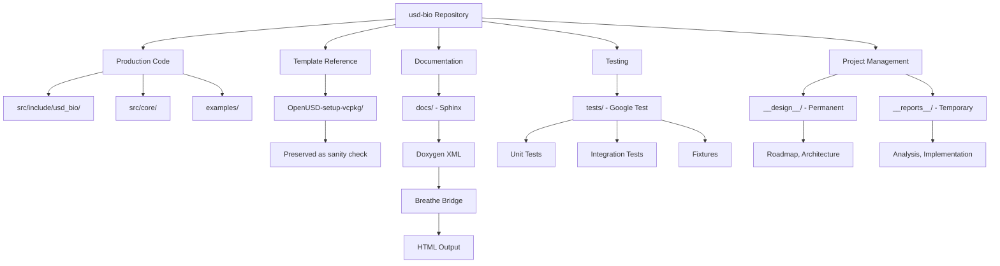

# USD-Bio Repository Reorganization Planning Report

**Project**: USD-Bio – OpenUSD Extensions for Biology Data
**Report Date**: 2025-11-13
**Phase**: Planning & Architecture
**Report Type**: Planning Phase Analysis
**Status**: Approved for Implementation

---

## Executive Summary

This report documents the comprehensive planning phase for transforming the usd-bio repository from a minimal OpenUSD template into a production-ready C++ extension project for handling biology data in scientific metaverses. The planning included:

1. **Repository structure analysis**: Current template state and reorganization requirements
2. **Technical stack research**: Industry standards for C++ documentation (Sphinx + Doxygen + Breathe) and testing (Google Test)
3. **Architecture decisions**: Separation of template artifacts from production code
4. **Organizational alignment**: Integration with cracking-shells playbook standards

**Key Decisions**:
- ✅ **Documentation**: Doxygen + Sphinx + Breathe (C++ industry standard)
- ✅ **Testing**: Google Test (GTest) with CMake integration
- ✅ **Code Organization**: New `src/` directory for production code, preserve `OpenUSD-setup-vcpkg/` as reference
- ✅ **Roadmap**: Deferred detailed milestone planning to next iteration (foundation setup first)

---

## 1. Current Repository State Analysis

### 1.1 Template Artifacts

**Current Structure**:
```
usd-bio/
├── OpenUSD-setup-vcpkg/          # Template code with USD tutorials
│   ├── src/main.cpp               # ~1010 lines of test functions
│   ├── headers/main.h             # Function declarations
│   └── CMakeLists.txt             # Build configuration
├── extras/                        # USD geometry assets
│   └── top.geom.usd
├── vcpkg/                         # Submodule for dependency management
├── CMakeLists.txt                 # Root build configuration
├── CMakePresets.json              # Multi-platform presets
├── vcpkg.json                     # Dependencies (TBB, USD)
├── README.md                      # Currently empty ("# USDTest")
└── cracking-shells-playbook/      # Organizational standards
```

**Verified Dependencies** (from `vcpkg.json`):
- `usd` (Pixar OpenUSD)
- `tbb` (Thread Building Blocks v2020_U3#8)
- vcpkg baseline: `fc6345e114c2e2c4f9714037340ccb08326b3e8c`

**Template Status**:
- ✅ OpenUSD successfully installed and compiling
- ✅ Tutorial code functional (verified via terminal execution)
- ✅ CMake build system established
- ⚠️ No test suite structure
- ⚠️ No documentation system
- ⚠️ No formal project structure for extension development

### 1.2 Organizational Standards Integration

**Relevant Cracking-Shells Instructions**:
- ✅ `reporting.instructions.md` – Report structure and versioning
- ✅ `roadmap-generation.instructions.md` – Milestone-based planning
- ✅ `work-ethics.instructions.md` – Root cause analysis, iteration discipline
- ✅ `git-workflow.md` – Conventional commits, milestone branching
- ✅ `analytic-behavior.instructions.md` – Analysis-first approach
- ✅ `readme.instructions.md` – README structure and content

**Not Directly Applicable** (Python-specific):
- `python_docstrings.instructions.md`
- `testing.instructions.md` (Wobble framework)
- Some `documentation-*.instructions.md` files (mkdocstrings for Python)

---

## 2. Technical Stack Research & Decisions

### 2.1 Documentation Stack: Doxygen + Sphinx + Breathe

**Decision Rationale**:

**Industry Standard for C++**: Doxygen is the de facto standard for C++ API documentation, used by:
- LLVM project
- Boost libraries
- OpenUSD (internally)
- Most enterprise C++ projects

**How the Stack Works**:
1. **Doxygen** parses C++ source code and special comments → generates XML output
2. **Breathe** reads Doxygen XML → bridges to Sphinx via reStructuredText directives
3. **Sphinx** renders final HTML documentation with professional themes

**Example Workflow**:
```cpp
// In C++ header (src/include/usd_bio_extension.h):
/// \brief Main processor for USD biomedical data
/// \param stage The USD stage to process
/// \return Processed stage with biology metadata
UsdStageRefPtr processBiologyData(const UsdStageRefPtr& stage);
```

```rst
.. In Sphinx documentation (docs/api/processor.rst):
.. doxygenclass:: USDProcessor
   :project: usd-bio
   :members:
```

**Advantages for USD-Bio**:
- **Alignment**: OpenUSD uses Doxygen-compatible comments internally
- **ReadTheDocs native**: Seamless integration for future public deployment
- **Professional appearance**: Material theme with searchable, indexed API docs
- **C++ domain**: Built-in support for C++ constructs (classes, namespaces, templates)

**Comparison to MkDocs**:
| Aspect | Sphinx + Doxygen + Breathe | MkDocs |
|--------|---------------------------|---------|
| **C++ API auto-generation** | ✅ Industry standard | ⚠️ Experimental plugin only |
| **Code domain support** | ✅ Native C++ domain | ❌ Limited |
| **ReadTheDocs** | ✅ Native support | ✅ Supported but limited for C++ |
| **Used by** | LLVM, Boost, scientific C++ | Python projects, web docs |

**Implementation Plan**:
- `Doxyfile` at repository root with `GENERATE_XML = YES`
- `docs/conf.py` (Sphinx configuration) with Breathe extension
- `docs/requirements.txt` for Python dependencies (Sphinx, Breathe, theme)
- `.readthedocs.yaml` configured for future deployment (build locally for now)

### 2.2 Testing Framework: Google Test (GTest)

**Decision Rationale**:

**Industry Standard**: Google Test is the dominant C++ testing framework:
- Used by Google, LLVM, Boost
- OpenUSD uses GTest internally
- Enterprise C++ standard

**CMake Built-in vs. GTest**:
| Feature | CMake `enable_testing()` | Google Test |
|---------|-------------------------|-------------|
| **What it provides** | Test runner (ctest) | Full testing framework |
| **Assertions** | ❌ Manual (exit codes) | ✅ Rich (`EXPECT_EQ`, `ASSERT_NE`, etc.) |
| **Fixtures** | ❌ None | ✅ Setup/teardown support |
| **Mocking** | ❌ None | ✅ GMock for mock objects |
| **Output** | Basic pass/fail | Human-readable, detailed |
| **Parameterized tests** | ❌ None | ✅ Run tests with multiple inputs |

**CMake `enable_testing()` is NOT a testing framework**—it's just a test discovery and execution wrapper. GTest provides the actual testing infrastructure.

**Example GTest Test**:
```cpp
#include <gtest/gtest.h>
#include "usd_bio/processor.h"

TEST(USDBioProcessor, CreateStageReturnsValid) {
    auto processor = std::make_unique<USDBioProcessor>();
    auto stage = processor->createStage();
    
    ASSERT_NE(stage, nullptr);
    EXPECT_TRUE(stage->IsValid());
}
```

**Implementation Plan**:
- Add `gtest` to `vcpkg.json` dependencies
- Create `tests/CMakeLists.txt` with GTest CMake integration
- Create test source files in `tests/` directory
- Configure `tests/fixtures/` for test data

### 2.3 Code Organization: Separate Production from Template

**Decision Rationale**:

**Current Issue**: Template artifacts mixed with future production code creates:
- Confusion about what's "real" vs. "proof-of-concept"
- Difficulty removing tutorial code later
- Unclear CI/CD targets

**Approved Structure**:
```
usd-bio/
├── OpenUSD-setup-vcpkg/          ← PRESERVED: Template reference
│   └── src/main.cpp               (keeps working as sanity check)
│
├── src/                           ← NEW: Production extension code
│   ├── CMakeLists.txt
│   ├── include/
│   │   ├── usd_bio/
│   │   │   ├── extension.h       (public API)
│   │   │   ├── processor.h
│   │   │   └── geometry.h
│   └── core/
│       ├── extension.cpp
│       ├── processor.cpp
│       └── geometry.cpp
│
├── tests/                         ← NEW: GTest suite
│   ├── CMakeLists.txt
│   ├── test_processor.cpp
│   ├── test_geometry.cpp
│   └── fixtures/
│       └── test_data.usd
│
├── examples/                      ← NEW: Tutorial/demo code
│   ├── CMakeLists.txt
│   └── basic_usage.cpp            (migrated from original main.cpp)
│
├── docs/                          ← NEW: Sphinx documentation
│   ├── conf.py
│   ├── index.rst
│   ├── api/
│   ├── user_guide/
│   ├── developer_guide/
│   └── resources/
│
├── __design__/                    ← NEW: Permanent design docs
│   └── usd_bio_roadmap_v0.1.0.md
│
└── __reports__/                   ← NEW: Temporary work reports
    └── project_setup/
        └── 00-repository_reorganization_planning_v0.md
```

**Benefits**:
1. **Clear separation**: Template artifacts don't pollute production code
2. **Flexibility**: Can delete `OpenUSD-setup-vcpkg/` later without affecting real code
3. **CI/CD simplicity**: Tests run against `src/`, not template code
4. **Team clarity**: Immediate understanding of what's real vs. reference
5. **Playbook alignment**: Organized, intentional structure

---

## 3. Documentation Strategy

### 3.1 ReadTheDocs Compatibility Without Public Deployment

**Question**: Can we use ReadTheDocs with private repositories in free mode?

**Answer**: No. ReadTheDocs free tier only supports public documentation.

**Approved Strategy**: ReadTheDocs-Compatible Local Build

**Implementation**:
1. Configure `.readthedocs.yaml` now (standard format)
2. Use Sphinx + Doxygen + Breathe (ReadTheDocs-native stack)
3. Build locally: `sphinx-build docs docs/_build`
4. Serve locally: `python -m http.server -d docs/_build/html`
5. **When repository becomes public**: Connect GitHub account to ReadTheDocs—no configuration changes needed

**`.readthedocs.yaml` Template**:
```yaml
version: 2
build:
  os: ubuntu-22.04
  tools:
    python: "3.10"

sphinx:
  configuration: docs/conf.py

python:
  install:
    - requirements: docs/requirements.txt

# When project becomes public, just connect GitHub account
# No configuration changes needed
```

**Benefits**:
- ✅ Future-proof: Zero changes when going public
- ✅ Local development: Full documentation preview during development
- ✅ No lock-in: Standard Sphinx configuration works anywhere
- ✅ Team collaboration: Serve on internal network/VPN

### 3.2 Documentation Structure

**Doxygen Configuration** (`Doxyfile`):
```
PROJECT_NAME = "USD-Bio"
INPUT = src/include
RECURSIVE = YES
GENERATE_XML = YES
XML_OUTPUT = docs/doxygen_xml
EXTRACT_ALL = YES
JAVADOC_AUTOBRIEF = YES
```

**Sphinx Configuration** (`docs/conf.py`):
```python
extensions = ['breathe', 'sphinx.ext.autodoc']

breathe_projects = {
    "usd-bio": "doxygen_xml/"
}
breathe_default_project = "usd-bio"

html_theme = 'sphinx_rtd_theme'
```

**Directory Structure**:
```
docs/
├── conf.py                    # Sphinx configuration
├── index.rst                  # Documentation home
├── requirements.txt           # Sphinx, Breathe, theme
├── user_guide/
│   ├── installation.rst
│   ├── quick_start.rst
│   └── examples.rst
├── developer_guide/
│   ├── architecture.rst
│   ├── building.rst
│   └── contributing.rst
├── api/
│   ├── extension.rst          # Uses doxygenclass directives
│   ├── processor.rst
│   └── geometry.rst
├── resources/
│   ├── diagrams/
│   └── images/
└── doxygen_xml/               # Generated by Doxygen
```

---

## 4. Testing Strategy

### 4.1 Google Test Integration

**CMake Integration Pattern**:

**Root `CMakeLists.txt`** (add to existing):
```cmake
# Enable testing
option(BUILD_TESTS "Build test suite" ON)
if(BUILD_TESTS)
    enable_testing()
    add_subdirectory(tests)
endif()
```

**`vcpkg.json`** (add dependency):
```json
{
  "name": "usd-bio",
  "version": "0.1.0",
  "dependencies": [
    "tbb",
    "usd",
    "gtest"
  ],
  ...
}
```

**`tests/CMakeLists.txt`** (new file):
```cmake
find_package(GTest CONFIG REQUIRED)

add_executable(usd_bio_tests
    test_processor.cpp
    test_geometry.cpp
)

target_link_libraries(usd_bio_tests PRIVATE
    GTest::gtest
    GTest::gtest_main
    usd_bio_lib
)

add_test(NAME AllTests COMMAND usd_bio_tests)
```

### 4.2 Test Organization

**Directory Structure**:
```
tests/
├── CMakeLists.txt
├── test_processor.cpp          # Unit tests for processor module
├── test_geometry.cpp           # Unit tests for geometry module
├── test_integration.cpp        # Integration tests
└── fixtures/
    ├── test_data.usd           # Test USD files
    └── biology_sample.usd      # Sample biology data
```

**Test Example**:
```cpp
// tests/test_processor.cpp
#include <gtest/gtest.h>
#include <usd_bio/processor.h>

class ProcessorTest : public ::testing::Test {
protected:
    void SetUp() override {
        processor = std::make_unique<USDBioProcessor>();
    }
    
    std::unique_ptr<USDBioProcessor> processor;
};

TEST_F(ProcessorTest, CreateStageSucceeds) {
    auto stage = processor->createStage();
    ASSERT_NE(stage, nullptr);
    EXPECT_TRUE(stage->IsValid());
}

TEST_F(ProcessorTest, ProcessBiologyDataAddsMetadata) {
    auto stage = processor->createStage();
    processor->processBiologyData(stage);
    
    // Verify biology metadata was added
    auto metadata = stage->GetMetadata(TfToken("biology"));
    EXPECT_TRUE(metadata.has_value());
}
```

---

## 5. Roadmap Planning Approach

### 5.1 Deferred Detailed Planning

**Decision**: Defer detailed milestone/task planning to next iteration.

**Rationale**:
- Current focus: Foundation setup (directory structure, tooling, build system)
- Detailed milestones require deeper understanding of biology data requirements
- Foundation must be solid before defining feature milestones

**Current Planning Phase Deliverables**:
1. ✅ This planning report (analysis and decisions)
2. ⏳ Initial roadmap draft (high-level phases only)
3. ⏳ Directory structure creation
4. ⏳ Updated README.md

### 5.2 Next Iteration Planning Topics

**For Detailed Roadmap v1.0**:
- Biology data schema analysis (what data types need representation?)
- OpenUSD schema extension requirements
- Integration points with existing USD features
- Performance benchmarks and optimization targets
- Detailed milestone breakdown with tasks and success gates

---

## 6. Implementation Plan

### 6.1 Directory Structure Creation

**Phase 1: Core Directories**:
```bash
# Create permanent design directory
mkdir __design__

# Create temporary reports directory
mkdir -p __reports__/project_setup

# Create source directory structure
mkdir -p src/include/usd_bio
mkdir -p src/core

# Create test directory structure
mkdir -p tests/fixtures

# Create examples directory
mkdir examples

# Create documentation structure
mkdir -p docs/{api,user_guide,developer_guide,resources/diagrams}
```

**Phase 2: Configuration Files**:
- `Doxyfile` (Doxygen configuration)
- `docs/conf.py` (Sphinx configuration)
- `docs/requirements.txt` (Python dependencies)
- `.readthedocs.yaml` (ReadTheDocs compatibility)
- `tests/CMakeLists.txt` (GTest integration)
- `src/CMakeLists.txt` (Extension library build)

**Phase 3: Documentation**:
- Update `README.md` (project identity, installation, quick start)
- Create `__design__/usd_bio_roadmap_v0.1.0.md` (initial roadmap)
- Create directory READMEs in `__reports__/` and `__design__/`

### 6.2 Dependency Updates

**`vcpkg.json` additions**:
```json
{
  "name": "usd-bio",
  "version": "0.1.0",
  "dependencies": [
    "tbb",
    "usd",
    "gtest"
  ],
  "builtin-baseline": "fc6345e114c2e2c4f9714037340ccb08326b3e8c",
  "overrides": [
    {
      "name": "tbb",
      "version-string": "2020_U3#8"
    }
  ]
}
```

### 6.3 Git Workflow Integration

**Branch Strategy** (from roadmap):
```
main (production, v1.0.0 release only)
  └── dev (development integration)
      ├── milestone/1.1-foundation-setup
      │   ├── task/1.1.1-directory-structure
      │   ├── task/1.1.2-documentation-system
      │   └── task/1.1.3-testing-framework
      ├── milestone/1.2-core-architecture
      └── ...
```

**Conventional Commits** (from `git-workflow.md`):
```
feat(docs): add Sphinx + Doxygen + Breathe documentation system
test(core): add Google Test integration and initial test structure
chore(build): add GTest dependency to vcpkg.json
docs(readme): rewrite README with project identity and quick start
```

---

## 7. Success Criteria for Foundation Setup

**Directory Structure**:
- ✅ `__design__/` created with initial roadmap
- ✅ `__reports__/` created with this planning report
- ✅ `src/include/usd_bio/` created for public headers
- ✅ `src/core/` created for implementation
- ✅ `tests/` created with GTest integration
- ✅ `docs/` created with Sphinx + Doxygen setup
- ✅ `examples/` created for tutorial code

**Build System**:
- ✅ GTest dependency added to `vcpkg.json`
- ✅ `tests/CMakeLists.txt` configured with GTest
- ✅ `src/CMakeLists.txt` configured for extension library
- ✅ Root `CMakeLists.txt` updated with testing option

**Documentation**:
- ✅ `Doxyfile` configured for C++ parsing and XML generation
- ✅ `docs/conf.py` configured with Breathe extension
- ✅ `docs/requirements.txt` lists Sphinx, Breathe, theme
- ✅ `.readthedocs.yaml` configured for future deployment
- ✅ Documentation builds locally: `sphinx-build docs docs/_build`

**Project Documentation**:
- ✅ `README.md` rewritten with project identity
- ✅ `__design__/usd_bio_roadmap_v0.1.0.md` created
- ✅ Directory READMEs created in `__reports__/` and `__design__/`

**Verification**:
- ✅ `cmake --preset=<preset>` succeeds
- ✅ `ctest` runs successfully (even if no tests yet)
- ✅ `sphinx-build docs docs/_build` generates HTML documentation
- ✅ Original `OpenUSD-setup-vcpkg/` still compiles as reference

---

## 8. Visual Architecture



---

## 9. Next Steps

**Immediate** (this work session):
1. ✅ Complete this planning report
2. ⏳ Create initial roadmap draft (`__design__/usd_bio_roadmap_v0.1.0.md`)
3. User review and approval

**Next Iteration** (after approval):
1. Create directory structure
2. Configure build system with GTest
3. Set up Doxygen + Sphinx + Breathe documentation system
4. Rewrite README.md
5. Create initial C++ skeleton code with Doxygen comments
6. Verify all systems build and run

**Future Iterations**:
1. Detailed roadmap refinement with biology data analysis
2. Core architecture implementation
3. Schema extension development
4. Integration testing
5. Documentation completion
6. Release preparation

---

## 10. Lessons Learned (Meta-Analysis)

### 10.1 Planning Phase Insights

**Research-First Approach Validated**:
- Deep technical research (Context7 for documentation/testing standards) produced confident, evidence-based decisions
- Comparison analysis (Sphinx vs. MkDocs, GTest vs. CMake testing) eliminated ambiguity
- Industry standard alignment (LLVM, Boost, OpenUSD practices) ensures future compatibility

**Separation of Concerns Benefits**:
- Keeping template code separate from production code prevents confusion
- Clear directory structure facilitates team onboarding
- Separate concerns enable independent evolution (can archive template later)

**Playbook Alignment Strategy**:
- Not all playbook instructions apply (Python-specific tooling)
- Core principles apply universally (reporting, work ethics, git workflow)
- Adaptation required for C++ context (documentation and testing frameworks)

### 10.2 Decision Quality Metrics

**Documentation Stack Decision**:
- ✅ Industry alignment: LLVM, Boost use same stack
- ✅ OpenUSD compatibility: Doxygen comments already understood
- ✅ Future-proof: ReadTheDocs-compatible from day one
- ✅ Local development: Can build and serve privately

**Testing Framework Decision**:
- ✅ OpenUSD alignment: GTest used internally
- ✅ Feature completeness: Mocking, fixtures, parameterized tests
- ✅ CMake integration: vcpkg + CMake native support
- ✅ Team familiarity: Industry standard, abundant resources

**Code Organization Decision**:
- ✅ Clarity: Production vs. template immediately obvious
- ✅ Flexibility: Can remove template without affecting production
- ✅ CI/CD: Clear test targets
- ✅ Playbook alignment: Organized, intentional structure

---

**Report Version**: v0 (Initial Planning)
**Status**: Approved for Implementation
**Next Steps**: Create initial roadmap draft, await user approval, proceed to implementation
