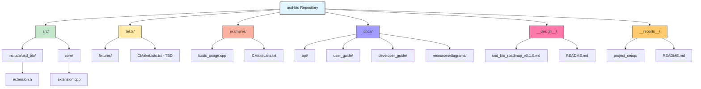

# Milestone 1.1: Directory Structure & Configuration

**Phase**: 1 - Foundation Setup
**Milestone**: 1.1
**Version Target**: v0.1.0
**Status**: Ready for Implementation

---

## Objective

Establish the complete directory structure for production code, documentation, testing, and project management, with all necessary configuration files to support the usd-bio extension development.

---

## Implementation Steps

### Step 1: Create Core Directory Structure

**Action**: Create all primary directories for the project.

```powershell
# From repository root
mkdir -p src/include/usd_bio
mkdir -p src/core
mkdir -p tests/fixtures
mkdir examples
mkdir -p docs/api
mkdir -p docs/user_guide
mkdir -p docs/developer_guide
mkdir -p docs/resources/diagrams
```

**Expected Result**:
```
usd-bio/
├── src/
│   ├── include/usd_bio/
│   └── core/
├── tests/
│   └── fixtures/
├── examples/
├── docs/
│   ├── api/
│   ├── user_guide/
│   ├── developer_guide/
│   └── resources/diagrams/
├── __design__/
└── __reports__/project_setup/
```

**Verification**: `ls -R` shows all directories created.

---

### Step 2: Create Placeholder Header Files

**Action**: Create minimal placeholder headers to verify build system.

**File**: `src/include/usd_bio/extension.h`
```cpp
#ifndef USD_BIO_EXTENSION_H
#define USD_BIO_EXTENSION_H

/*!
@file extension.h
@brief USD-Bio extension main entry point
*/

namespace usd_bio {
    
/*!
@brief Get extension version string
@return Version string in format "Major.Minor.Patch"
*/
const char* GetVersion();

} // namespace usd_bio

#endif // USD_BIO_EXTENSION_H
```

**File**: `src/core/extension.cpp`
```cpp
#include "usd_bio/extension.h"

namespace usd_bio {

const char* GetVersion() {
    return "0.1.0";
}

} // namespace usd_bio
```

**Verification**: Files exist and contain valid C++ syntax.

---

### Step 3: Configure CMake for Source Library

**Action**: Create `src/CMakeLists.txt` to build usd-bio library.

**File**: `src/CMakeLists.txt`
```cmake
# USD-Bio Extension Library
project(usd_bio VERSION 0.1.0 LANGUAGES CXX)

# Source files
set(USD_BIO_SOURCES
    core/extension.cpp
)

# Header files
set(USD_BIO_HEADERS
    include/usd_bio/extension.h
)

# Create library
add_library(usd_bio_lib STATIC
    ${USD_BIO_SOURCES}
    ${USD_BIO_HEADERS}
)

# Set C++20 standard
target_compile_features(usd_bio_lib PUBLIC cxx_std_20)

# Include directories
target_include_directories(usd_bio_lib
    PUBLIC
        $<BUILD_INTERFACE:${CMAKE_CURRENT_SOURCE_DIR}/include>
        $<INSTALL_INTERFACE:include>
)

# Link USD libraries
find_package(pxr CONFIG REQUIRED)
target_link_libraries(usd_bio_lib
    PUBLIC
        usd
)

# Install targets
install(TARGETS usd_bio_lib
    EXPORT usd_bio_targets
    LIBRARY DESTINATION lib
    ARCHIVE DESTINATION lib
    RUNTIME DESTINATION bin
)

install(DIRECTORY include/
    DESTINATION include
)
```

**Verification**: CMake configuration parses without errors.

---

### Step 4: Update Root CMakeLists.txt

**Action**: Modify root `CMakeLists.txt` to include new source directory.

**File**: `CMakeLists.txt` (add after OpenUSD-setup-vcpkg)
```cmake
# Existing content remains...

# USD-Bio Extension Library
option(BUILD_USD_BIO "Build USD-Bio extension library" ON)
if(BUILD_USD_BIO)
    add_subdirectory(src)
endif()

# Testing (will be configured in Milestone 1.3)
option(BUILD_TESTS "Build test suite" OFF)
if(BUILD_TESTS)
    enable_testing()
    add_subdirectory(tests)
endif()
```

**Verification**: CMake configures with `BUILD_USD_BIO=ON`.

---

### Step 5: Create Examples Directory Structure

**Action**: Set up example program structure.

**File**: `examples/CMakeLists.txt`
```cmake
# USD-Bio Examples

add_executable(basic_usage
    basic_usage.cpp
)

target_link_libraries(basic_usage
    PRIVATE
        usd_bio_lib
)
```

**File**: `examples/basic_usage.cpp`
```cpp
#include <iostream>
#include <usd_bio/extension.h>

int main() {
    std::cout << "USD-Bio Extension v" 
              << usd_bio::GetVersion() 
              << std::endl;
    return 0;
}
```

**Verification**: Example compiles and runs successfully.

---

### Step 6: Create Project Management Directory READMEs

**Action**: Document directory purposes.

**File**: `__design__/README.md`
```markdown
# Design Documents

Permanent design documentation for the USD-Bio extension project.

## Contents

- `usd_bio_roadmap_v*.md` - Project roadmap with phases, milestones, and versioning
- Architecture documentation (added as project evolves)
- API specifications (added as project evolves)
- Design decision records (added as needed)

## Purpose

This directory contains **permanent** documentation that serves as long-term reference for:
- Strategic project planning
- Architectural decisions and rationale
- API design specifications
- System design documents

**Lifecycle**: Documents maintained indefinitely as project reference material.

---

**Last Updated**: 2025-11-13
```

**File**: `__reports__/README.md`
```markdown
# Work Reports

Temporary work reports documenting analysis, implementation, testing, and debugging activities.

## Organization

Reports are organized by topic in subdirectories:
- `project_setup/` - Repository setup and planning
- `analysis/` - Technical analysis reports
- `testing/` - Test definition and execution reports
- `debugging/` - Debugging session reports
- (Additional topic directories as needed)

## Purpose

This directory contains **temporary** documentation that tracks:
- Development progress and decisions
- Implementation reports
- Debugging sessions
- Knowledge transfer

**Lifecycle**: Periodic cleanup (archive or delete after project phase completion).

---

**Last Updated**: 2025-11-13
```

**Verification**: README files exist and describe directory purposes.

---

## Success Gates

**Directory Structure**:
- ✅ All production directories created (`src/include/usd_bio/`, `src/core/`)
- ✅ All documentation directories created (`docs/api/`, `docs/user_guide/`, etc.)
- ✅ All testing directories created (`tests/`, `tests/fixtures/`)
- ✅ Project management directories created (`__design__/`, `__reports__/`)
- ✅ Examples directory created

**Configuration Files**:
- ✅ `src/CMakeLists.txt` configured for library build
- ✅ Root `CMakeLists.txt` updated with BUILD_USD_BIO option
- ✅ `examples/CMakeLists.txt` configured for example programs

**Placeholder Code**:
- ✅ `src/include/usd_bio/extension.h` created with Doxygen comments
- ✅ `src/core/extension.cpp` created with implementation
- ✅ `examples/basic_usage.cpp` created and functional

**Documentation**:
- ✅ `__design__/README.md` documents permanent design directory
- ✅ `__reports__/README.md` documents temporary reports directory

**Build Verification**:
- ✅ CMake configures successfully: `cmake --preset=<preset>`
- ✅ Project builds successfully: `cmake --build out/build/<preset>`
- ✅ Example runs successfully: `./out/build/<preset>/examples/basic_usage`
- ✅ Output displays: "USD-Bio Extension v0.1.0"

---

## Visual Structure



---

## Next Steps

After this milestone completes:
1. Proceed to Milestone 1.2: Documentation System
2. Configure Doxygen to parse `src/include/usd_bio/` headers
3. Set up Sphinx + Breathe integration
4. Verify documentation generation

---

**Milestone Version**: v0
**Status**: Ready for Implementation
