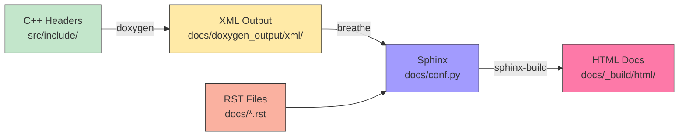

# Milestone 1.2: Documentation System

**Phase**: 1 - Foundation Setup
**Milestone**: 1.2
**Version Target**: v0.1.1
**Status**: Ready for Implementation
**Pre-condition**: Milestone 1.1 complete (directory structure established)

---

## Objective

Configure Doxygen + Sphinx + Breathe documentation system for C++ API documentation, establish ReadTheDocs-compatible build configuration, and create initial documentation structure.

---

## Implementation Steps

### Step 1: Create Doxyfile Configuration

**Action**: Configure Doxygen for C++ parsing and XML generation.

**File**: `Doxyfile` (repository root)
```doxygen
# USD-Bio Doxygen Configuration

PROJECT_NAME           = "USD-Bio"
PROJECT_NUMBER         = 0.1.0
PROJECT_BRIEF          = "OpenUSD Extensions for Biology Data"

OUTPUT_DIRECTORY       = docs/doxygen_output
CREATE_SUBDIRS         = NO

INPUT                  = src/include
RECURSIVE              = YES
FILE_PATTERNS          = *.h *.hpp

EXTRACT_ALL            = YES
EXTRACT_PRIVATE        = NO
EXTRACT_STATIC         = YES

GENERATE_HTML          = NO
GENERATE_LATEX         = NO
GENERATE_XML           = YES
XML_OUTPUT             = xml

JAVADOC_AUTOBRIEF      = YES
QT_AUTOBRIEF           = YES

OPTIMIZE_OUTPUT_FOR_C  = NO
MARKDOWN_SUPPORT       = YES
```

**Verification**: Run `doxygen Doxyfile` and verify `docs/doxygen_output/xml/` contains XML files.

---

### Step 2: Create Sphinx Configuration

**Action**: Set up Sphinx with Breathe extension.

**File**: `docs/conf.py`
```python
# USD-Bio Sphinx Configuration

import os
import sys

# Project information
project = 'USD-Bio'
copyright = '2025, RIKEN, PRIMe'
author = 'Eliott Jacopin'
release = '0.1.0'

# General configuration
extensions = [
    'breathe',
    'sphinx.ext.autodoc',
    'sphinx.ext.napoleon',
    'sphinx.ext.viewcode',
]

templates_path = ['_templates']
exclude_patterns = ['_build', 'Thumbs.db', '.DS_Store']

# Breathe configuration
breathe_projects = {
    "usd-bio": "doxygen_output/xml/"
}
breathe_default_project = "usd-bio"

# HTML output options
html_theme = 'sphinx_rtd_theme'
html_static_path = ['_static']
html_theme_options = {
    'navigation_depth': 4,
}

# Source file encoding
source_suffix = '.rst'
master_doc = 'index'
```

**Verification**: File syntax valid (Python parses without errors).

---

### Step 3: Create Python Requirements File

**Action**: Document Python dependencies for Sphinx build.

**File**: `docs/requirements.txt`
```text
sphinx>=7.0.0
breathe>=4.35.0
sphinx-rtd-theme>=2.0.0
```

**Verification**: `pip install -r docs/requirements.txt` succeeds.

---

### Step 4: Create Documentation Index Structure

**Action**: Create main documentation index with navigation.

**File**: `docs/index.rst`
```rst
USD-Bio Documentation
=====================

Welcome to USD-Bio, an OpenUSD extension for biology data representation in scientific metaverses.

.. toctree::
   :maxdepth: 2
   :caption: User Guide
   
   user_guide/installation
   user_guide/quick_start
   user_guide/examples

.. toctree::
   :maxdepth: 2
   :caption: Developer Guide
   
   developer_guide/architecture
   developer_guide/building
   developer_guide/contributing

.. toctree::
   :maxdepth: 2
   :caption: API Reference
   
   api/extension

Indices and Tables
==================

* :ref:`genindex`
* :ref:`search`
```

**File**: `docs/user_guide/installation.rst`
```rst
Installation
============

Prerequisites
-------------

- CMake 3.20 or higher
- C++20 compatible compiler
- vcpkg for dependency management
- OpenUSD (installed via vcpkg)

Building from Source
--------------------

Clone the repository:

.. code-block:: bash

   git clone https://github.com/LittleCoinCoin/usd-bio.git
   cd usd-bio

Configure and build:

.. code-block:: bash

   cmake --preset=<your-preset>
   cmake --build out/build/<preset>

The library will be built in the output directory.
```

**File**: `docs/user_guide/quick_start.rst`
```rst
Quick Start
===========

Basic Usage
-----------

Include the USD-Bio extension header:

.. code-block:: cpp

   #include <usd_bio/extension.h>
   #include <iostream>

   int main() {
       std::cout << "USD-Bio v" << usd_bio::GetVersion() << std::endl;
       return 0;
   }

Next Steps
----------

- Explore the :doc:`examples <examples>` for common use cases
- Read the :doc:`../developer_guide/architecture` for design details
- Check the :doc:`../api/extension` for API documentation
```

**File**: `docs/user_guide/examples.rst`
```rst
Examples
========

This page will contain example use cases for USD-Bio.

.. note::
   Examples will be added as features are implemented in Phase 2+.
```

**File**: `docs/developer_guide/architecture.rst`
```rst
Architecture
============

USD-Bio Extension Overview
---------------------------

USD-Bio extends OpenUSD to support biology-specific data representation.

.. note::
   Detailed architecture documentation will be added in Phase 2 after schema design is complete.

Current Structure
-----------------

- **src/include/usd_bio/** - Public API headers
- **src/core/** - Implementation files
- **tests/** - Google Test test suite
- **examples/** - Example programs
```

**File**: `docs/developer_guide/building.rst`
```rst
Building USD-Bio
================

Development Setup
-----------------

1. Install prerequisites (see :doc:`../user_guide/installation`)
2. Configure CMake with development options:

.. code-block:: bash

   cmake --preset=<preset> -DBUILD_TESTS=ON -DBUILD_USD_BIO=ON

3. Build the project:

.. code-block:: bash

   cmake --build out/build/<preset>

Running Tests
-------------

After building with ``BUILD_TESTS=ON``:

.. code-block:: bash

   cd out/build/<preset>
   ctest

Building Documentation
----------------------

Install Python dependencies:

.. code-block:: bash

   pip install -r docs/requirements.txt

Generate Doxygen XML:

.. code-block:: bash

   doxygen Doxyfile

Build HTML documentation:

.. code-block:: bash

   sphinx-build docs docs/_build/html

View documentation by opening ``docs/_build/html/index.html``.
```

**File**: `docs/developer_guide/contributing.rst`
```rst
Contributing to USD-Bio
========================

.. note::
   Detailed contribution guidelines will be established in Milestone 1.4.

Development Workflow
--------------------

1. Fork the repository
2. Create a branch following the naming convention: ``task/<task-id>-<description>``
3. Make your changes
4. Run tests to ensure nothing breaks
5. Submit a pull request

Code Standards
--------------

- C++20 standard
- Follow OpenUSD coding conventions
- Document public APIs with Doxygen comments
- Include unit tests for new features
```

**File**: `docs/api/extension.rst`
```rst
Extension API
=============

Main Extension Header
---------------------

.. doxygenfile:: extension.h
   :project: usd-bio
```

**Verification**: All RST files contain valid reStructuredText syntax.

---

### Step 5: Create ReadTheDocs Configuration

**Action**: Configure for future ReadTheDocs deployment (compatible but not deployed).

**File**: `.readthedocs.yaml` (repository root)
```yaml
version: 2

build:
  os: ubuntu-22.04
  tools:
    python: "3.10"
  commands:
    - doxygen Doxyfile
    - pip install -r docs/requirements.txt
    - sphinx-build -b html docs docs/_build/html

sphinx:
  configuration: docs/conf.py

python:
  install:
    - requirements: docs/requirements.txt

formats: all
```

**Verification**: YAML syntax valid.

---

### Step 6: Test Documentation Build Locally

**Action**: Verify complete documentation pipeline.

**Commands**:
```powershell
# Install Python dependencies
pip install -r docs/requirements.txt

# Generate Doxygen XML
doxygen Doxyfile

# Build Sphinx documentation
sphinx-build docs docs/_build/html

# Serve locally (optional)
python -m http.server -d docs/_build/html 8000
```

**Expected Result**:
- Doxygen generates XML in `docs/doxygen_output/xml/`
- Sphinx builds HTML in `docs/_build/html/`
- Documentation opens in browser at `http://localhost:8000`
- Extension API appears in API Reference section

**Verification**: Browse to `docs/_build/html/index.html` and verify navigation, API docs visible.

---

## Success Gates

**Configuration Files**:
- ✅ `Doxyfile` configured for XML generation from `src/include/`
- ✅ `docs/conf.py` configured with Breathe extension
- ✅ `docs/requirements.txt` lists all Python dependencies
- ✅ `.readthedocs.yaml` configured for future deployment

**Documentation Structure**:
- ✅ `docs/index.rst` provides main navigation
- ✅ User guide pages created (installation, quick start, examples)
- ✅ Developer guide pages created (architecture, building, contributing)
- ✅ API reference page configured with Breathe directives

**Build Pipeline**:
- ✅ `doxygen Doxyfile` generates XML without errors
- ✅ `sphinx-build docs docs/_build/html` succeeds
- ✅ HTML documentation renders correctly
- ✅ API documentation includes `extension.h` content
- ✅ Navigation links work correctly

**Documentation Quality**:
- ✅ Installation instructions clear and accurate
- ✅ Quick start example compiles and runs
- ✅ Architecture overview explains project structure
- ✅ Building instructions work for developers

---

## Visual Pipeline



---

## Next Steps

After this milestone completes:
1. Proceed to Milestone 1.3: Testing Framework
2. Integrate Google Test with CMake
3. Create test directory structure
4. Set up CI/CD workflow

---

**Milestone Version**: v0
**Status**: Ready for Implementation
