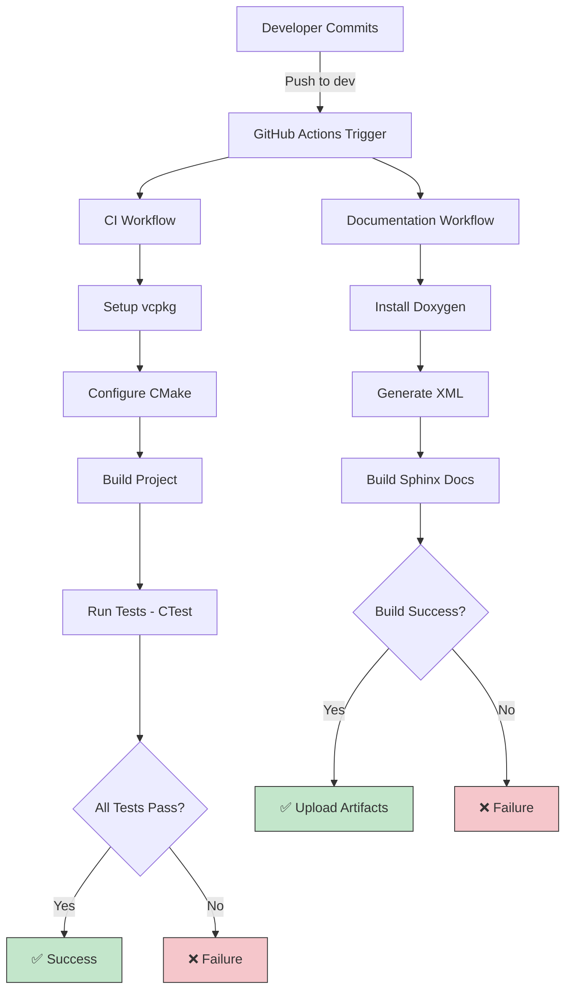

# Milestone 1.3: Testing Framework

**Phase**: 1 - Foundation Setup
**Milestone**: 1.3
**Version Target**: v0.1.2
**Status**: Ready for Implementation
**Pre-condition**: Milestone 1.1 complete (directory structure and src/ library built)

---

## Objective

Integrate Google Test framework with CMake build system, create test directory structure with fixtures, establish CI/CD workflow, and verify testing infrastructure with initial smoke tests.

---

## Implementation Steps

### Step 1: Add Google Test Dependency

**Action**: Update vcpkg.json to include GTest.

**File**: `vcpkg.json` (modify existing)
```json
{
  "name": "usd-bio",
  "version": "0.1.0",
  "dependencies": [
    "tbb",
    "usd",
    "gtest"
  ],
  "builtin-baseline": "fc6345e114c2e2c4f9714037340ccb08326b3e8c",
  "overrides": [
    {
      "name": "tbb",
      "version-string": "2020_U3#8"
    }
  ]
}
```

**Commands**:
```powershell
# Regenerate vcpkg dependencies
vcpkg integrate install
cmake --preset=<preset>
```

**Verification**: CMake finds `GTest::gtest` and `GTest::gtest_main` targets.

---

### Step 2: Create Test CMakeLists Configuration

**Action**: Configure Google Test integration in tests directory.

**File**: `tests/CMakeLists.txt`
```cmake
# USD-Bio Test Suite

# Find Google Test
find_package(GTest CONFIG REQUIRED)

# Smoke test executable
add_executable(usd_bio_smoke_test
    smoke_test.cpp
)

target_link_libraries(usd_bio_smoke_test
    PRIVATE
        GTest::gtest
        GTest::gtest_main
        usd_bio_lib
)

# Register test with CTest
add_test(NAME SmokeTest COMMAND usd_bio_smoke_test)

# Additional test executables will be added in future milestones
```

**Verification**: CMake configures tests without errors.

---

### Step 3: Create Initial Smoke Test

**Action**: Write minimal test to verify framework integration.

**File**: `tests/smoke_test.cpp`
```cpp
#include <gtest/gtest.h>
#include <usd_bio/extension.h>

/*!
@file smoke_test.cpp
@brief Smoke test suite for USD-Bio extension
*/

TEST(SmokeTest, ExtensionVersionExists) {
    const char* version = usd_bio::GetVersion();
    ASSERT_NE(version, nullptr);
    EXPECT_STREQ(version, "0.1.0");
}

/*!
@brief Smoke test: Verify USD library is linked
@details This test checks that the USD headers are accessible.
		 More comprehensive USD tests will be added in future milestones.
*/
TEST(SmokeTest, USDLibraryAvailable) {
    // Basic test that USD headers are accessible
    // More comprehensive USD tests will be added in future milestones
    SUCCEED() << "USD library linked successfully";
}
```

**Verification**: Test compiles successfully.

---

### Step 4: Update Root CMakeLists for Testing

**Action**: Enable testing option in root CMakeLists.txt.

**File**: `CMakeLists.txt` (modify BUILD_TESTS section)
```cmake
# Existing content...

# USD-Bio Extension Library
option(BUILD_USD_BIO "Build USD-Bio extension library" ON)
if(BUILD_USD_BIO)
    add_subdirectory(src)
endif()

# Testing
option(BUILD_TESTS "Build test suite" ON)
if(BUILD_TESTS)
    enable_testing()
    add_subdirectory(tests)
endif()

# Examples (optional)
option(BUILD_EXAMPLES "Build example programs" ON)
if(BUILD_EXAMPLES AND BUILD_USD_BIO)
    add_subdirectory(examples)
endif()
```

**Verification**: CMake configures with `BUILD_TESTS=ON`.

---

### Step 5: Create Test Fixtures Directory Structure

**Action**: Organize test data and fixtures.

**File**: `tests/fixtures/README.md`
```markdown
# Test Fixtures

This directory contains test data files and fixtures for USD-Bio tests.

## Contents

- `*.usd` - USD stage files for testing
- `*.usda` - ASCII USD files for testing
- `biology/` - Biology-specific test data (added in Phase 2+)

## Usage

Tests reference fixtures using relative paths from the test binary location.

Example:
```cpp
const std::string fixturePath = "fixtures/test_stage.usd";
auto stage = UsdStage::Open(fixturePath);
```

## Guidelines

- Keep fixtures minimal (small file sizes)
- Use descriptive names indicating test purpose
- Document complex fixtures with comments
```

**Verification**: Directory exists with README.

---

### Step 6: Run Tests Locally

**Action**: Build and execute test suite.

**Commands**:
```powershell
# Configure with tests enabled
cmake --preset=<preset> -DBUILD_TESTS=ON

# Build
cmake --build out/build/<preset>

# Run tests with CTest
cd out/build/<preset>
ctest --output-on-failure

# Or run test executable directly
./tests/usd_bio_smoke_test
```

**Expected Output**:
```
[==========] Running 2 tests from 1 test suite.
[----------] 2 tests from SmokeTest
[ RUN      ] SmokeTest.ExtensionVersionExists
[       OK ] SmokeTest.ExtensionVersionExists (0 ms)
[ RUN      ] SmokeTest.USDLibraryAvailable
[       OK ] SmokeTest.USDLibraryAvailable (0 ms)
[----------] 2 tests from SmokeTest (0 ms total)
[==========] 2 tests from 1 test suite ran. (0 ms total)
[  PASSED  ] 2 tests.
```

**Verification**: All tests pass, CTest reports 100% success.

---

### Step 7: Create GitHub Actions CI Workflow

**Action**: Set up automated testing on push/PR.

**File**: `.github/workflows/ci.yml`
```yaml
name: CI

on:
  push:
    branches: [ dev ]
  pull_request:
    branches: [ dev ]

jobs:
  build-and-test:
    strategy:
      matrix:
        os: [windows-latest, ubuntu-latest, macos-latest]
        build_type: [Debug, Release]
    
    runs-on: ${{ matrix.os }}
    
    steps:
    - uses: actions/checkout@v4
      with:
        submodules: recursive
    
    - name: Setup vcpkg
      uses: lukka/run-vcpkg@v11
      with:
        vcpkgDirectory: '${{ github.workspace }}/vcpkg'
        vcpkgJsonGlob: 'vcpkg.json'
    
    - name: Configure CMake
      run: |
        cmake --preset=default -DBUILD_TESTS=ON -DCMAKE_BUILD_TYPE=${{ matrix.build_type }}
    
    - name: Build
      run: cmake --build out/build/default --config ${{ matrix.build_type }}
    
    - name: Run Tests
      working-directory: out/build/default
      run: ctest -C ${{ matrix.build_type }} --output-on-failure
```

**File**: `.github/workflows/documentation.yml`
```yaml
name: Documentation

on:
  push:
    branches: [ dev ]
  pull_request:
    branches: [ dev ]

jobs:
  build-docs:
    runs-on: ubuntu-latest
    
    steps:
    - uses: actions/checkout@v4
    
    - name: Setup Python
      uses: actions/setup-python@v5
      with:
        python-version: '3.10'
    
    - name: Install Dependencies
      run: |
        sudo apt-get update
        sudo apt-get install -y doxygen
        pip install -r docs/requirements.txt
    
    - name: Generate Doxygen XML
      run: doxygen Doxyfile
    
    - name: Build Sphinx Documentation
      run: sphinx-build docs docs/_build/html
    
    - name: Upload Documentation Artifact
      uses: actions/upload-artifact@v4
      with:
        name: documentation
        path: docs/_build/html
```

**Verification**: Commit workflows and verify they appear in GitHub Actions tab.

---

## Success Gates

**Google Test Integration**:
- ✅ `gtest` dependency added to `vcpkg.json`
- ✅ `tests/CMakeLists.txt` configured with GTest find_package
- ✅ Test executables link against GTest libraries
- ✅ CTest discovers and runs tests

**Test Structure**:
- ✅ `tests/smoke_test.cpp` contains initial validation tests
- ✅ `tests/fixtures/` directory created with README
- ✅ Tests compile without errors
- ✅ Tests run successfully with `ctest`

**Build System**:
- ✅ Root CMakeLists.txt has `BUILD_TESTS` option (default ON)
- ✅ CMake configures with tests enabled
- ✅ `enable_testing()` called when BUILD_TESTS=ON
- ✅ Test suite builds in CI and local environments

**CI/CD Workflow**:
- ✅ `.github/workflows/ci.yml` created for build and test automation
- ✅ `.github/workflows/documentation.yml` created for docs validation
- ✅ Workflows run on push to `dev` branch and PRs
- ✅ Multi-platform testing (Windows, Linux, macOS)
- ✅ Multi-configuration testing (Debug, Release)

**Test Execution**:
- ✅ `ctest --output-on-failure` shows test results
- ✅ All smoke tests pass
- ✅ Test output is clear and actionable
- ✅ CI workflow reports test status

---

## Visual Testing Flow



---

## Next Steps

After this milestone completes:
1. Proceed to Milestone 1.4: Project Documentation
2. Rewrite README.md with comprehensive project overview
3. Document architecture decisions
4. Create contribution guidelines

---

**Milestone Version**: v0
**Status**: Ready for Implementation
