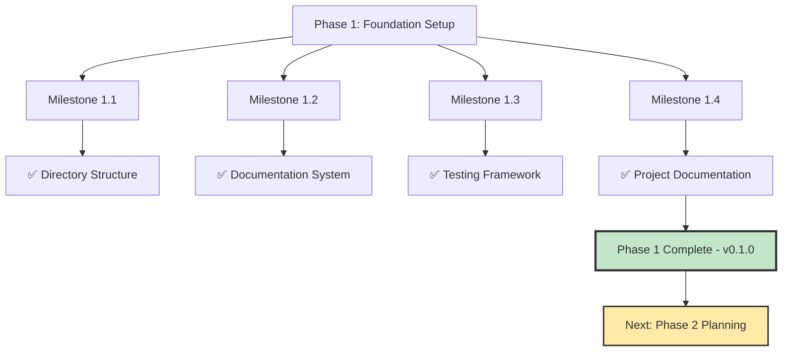

# Milestone 1.4: Project Documentation

**Phase**: 1 - Foundation Setup
**Milestone**: 1.4
**Version Target**: v0.1.0 (Phase 1 Complete)
**Status**: Ready for Implementation
**Pre-condition**: Milestones 1.1-1.3 complete (infrastructure established)

---

## Objective

Create comprehensive README.md with project identity and getting-started guide, document architecture decisions, establish contribution guidelines aligned with OpenUSD conventions, and complete Phase 1 documentation.

---

## Implementation Steps

### Step 1: Rewrite README.md

**Action**: Create comprehensive project overview following `readme.instructions.md` standards.

**File**: `README.md` (replace existing)
```markdown
# USD-Bio: OpenUSD Extensions for Biology Data

[](https://github.com/LittleCoinCoin/usd-bio/actions)
[](https://github.com/LittleCoinCoin/usd-bio/actions)
[](LICENSE.md)
[](https://github.com/LittleCoinCoin/usd-bio)

**OpenUSD extensions for representing and manipulating biology data in scientific metaverses.**

Following the success of OpenUSD's physics extensions (UsdPhysics), USD-Bio enables biology-specific data representation, from molecular to organism scales, within the Universal Scene Description ecosystem.

---

## What is USD-Bio?

USD-Bio is a C++ extension library for [Pixar's OpenUSD](https://openusd.org/) that provides:

- **Biology-specific USD schemas** for molecular, cellular, tissue, and organism data
- **Data import/export pipelines** for common biology file formats
- **Integration with USD stage manipulation** for 3D visualization workflows
- **Performance-optimized** operations for large-scale biological datasets

**Status**: v0.1.0 - Foundation setup complete, core features in development (Phase 2+)

---

## Why USD-Bio?

### Problem
Modern computational biology generates massive 3D datasets (protein structures, cellular imaging, tissue scans), but lacks standardized representation for collaborative visualization and analysis in metaverse environments.

### Solution
USD-Bio extends OpenUSD's proven architecture to biology data, enabling:
- **Interoperability** across biology visualization tools
- **Scalability** for massive datasets (millions of atoms, billions of cells)
- **Collaboration** through standardized scene descriptions
- **Integration** with existing USD workflows (rendering, animation, simulation)

### Value Proposition
Researchers can visualize, analyze, and collaborate on biological data using industry-standard USD tooling, without custom format converters or proprietary platforms.

---

## Quick Start

### Prerequisites

- **CMake** 3.20 or higher
- **C++20** compatible compiler (MSVC 2019+, GCC 10+, Clang 12+)
- **vcpkg** for dependency management
- **Git** with submodule support

### Installation

**1. Clone the repository with submodules:**
```bash
git clone --recursive https://github.com/LittleCoinCoin/usd-bio.git
cd usd-bio
```

**2. Bootstrap vcpkg (if not already installed):**
```bash
# Windows
.\vcpkg\bootstrap-vcpkg.bat

# Linux/macOS
./vcpkg/bootstrap-vcpkg.sh
```

**3. Configure and build:**
```bash
# Windows (MSVC)
cmake --preset=MSVC-x64
cmake --build out/build/MSVC-x64 --config Release

# Linux (GCC)
cmake --preset=GCC
cmake --build out/build/GCC --config Release

# macOS (Clang)
cmake --preset=Clang
cmake --build out/build/Clang --config Release
```

**4. Run tests (optional):**
```bash
cd out/build/<preset>
ctest --output-on-failure
```

### Basic Usage

```cpp
#include <usd_bio/extension.h>
#include <iostream>

int main() {
    // Verify USD-Bio is loaded
    std::cout << "USD-Bio Extension v" 
              << usd_bio::GetVersion() 
              << std::endl;
    
    // More examples coming in Phase 2+
    return 0;
}
```

---

## Documentation

- **[User Guide](docs/user_guide/)** - Installation, quick start, examples
- **[Developer Guide](docs/developer_guide/)** - Architecture, building, contributing
- **[API Reference](docs/api/)** - Complete C++ API documentation
- **[Roadmap](__design__/usd_bio_roadmap_v0.1.0.md)** - Project phases and milestones

**Build documentation locally:**
```bash
pip install -r docs/requirements.txt
doxygen Doxyfile
sphinx-build docs docs/_build/html
```

Open `docs/_build/html/index.html` in your browser.

---

## Project Structure

```
usd-bio/
├── src/                    # Extension library source code
│   ├── include/usd_bio/    # Public API headers
│   └── core/               # Implementation files
├── tests/                  # Google Test test suite
├── examples/               # Example programs
├── docs/                   # Sphinx + Doxygen documentation
├── __design__/             # Permanent design documents (roadmap, architecture)
├── __reports__/            # Temporary work reports (analysis, implementation)
└── OpenUSD-setup-vcpkg/    # Template reference (preserved for validation)
```

---

## Development Status

**Current Phase**: Phase 1 - Foundation Setup ✅ Complete (v0.1.0)

**Completed Milestones**:
- ✅ Directory structure and build system
- ✅ Documentation framework (Doxygen + Sphinx + Breathe)
- ✅ Testing framework (Google Test + CI/CD)
- ✅ Project documentation and contribution guidelines

See [Roadmap](__design__/usd_bio_roadmap_v0.1.0.md) for an overview.

---

## Contributing

We welcome contributions! Please read our [Contributing Guide](docs/developer_guide/contributing.rst) before submitting PRs.

### Development Workflow

1. Fork the repository
2. Create a branch: `task/<task-id>-<description>` (following milestone structure)
3. Make changes following our [Code Style Guide](CONTRIBUTING.md)
4. Run tests: `ctest --output-on-failure`
5. Build documentation to verify changes
6. Submit a pull request to `dev` branch

### Code Standards

- **C++20** standard with modern idioms
- **OpenUSD conventions** for naming and structure
- **Doxygen comments** for all public APIs
- **Unit tests** for new features (>90% coverage goal)
- **Conventional commits** (see [Git Workflow](cracking-shells-playbook/instructions/git-workflow.md))

---

## License

USD-Bio is licensed under the [MIT License](LICENSE.md).

This project builds on [Pixar's OpenUSD](https://github.com/PixarAnimationStudios/OpenUSD), used under the Modified Apache 2.0 License.

---

## Acknowledgments

- **Pixar Animation Studios** - OpenUSD foundation
- **PRIMe Collaboration** - Research support and domain expertise
- **OpenUSD Community** - Patterns and best practices

---

## Citation

If you use USD-Bio in your research, please cite:

```bibtex
@software{usd_bio_2025,
  title={USD-Bio: OpenUSD Extensions for Biology Data},
  author={PRIMe Collaboration},
  year={2025},
  url={https://github.com/LittleCoinCoin/usd-bio},
  version={0.1.0}
}
```

---

**Status**: v0.1.0 | **License**: MIT | **Community**: PRIMe Collaboration
```

**Verification**: README displays correctly on GitHub, all links work, badges render.

---

### Step 2: Create Contributing Guide

**Action**: Document contribution process and code standards.

**File**: `CONTRIBUTING.md`
```markdown
# Contributing to USD-Bio

Thank you for your interest in contributing to USD-Bio!

## Development Setup

See [Building USD-Bio](docs/developer_guide/building.rst) for complete setup instructions.

## Contribution Workflow

### 1. Branch Naming Convention

Follow the project's milestone-based branching strategy:

- **Milestone branches**: `milestone/<milestone-id>-<description>`
  - Example: `milestone/2.1-schema-definition`
- **Task branches**: `task/<task-id>-<description>`
  - Example: `task/2.1.1-molecular-schema`
- **Bug fix branches**: `fix/<issue-number>-<description>`
  - Example: `fix/42-memory-leak`

### 2. Commit Message Format

Use [Conventional Commits](https://www.conventionalcommits.org/):

```
<type>(<scope>): <description>

[optional body]

[optional footer]
```

**Types**:
- `feat`: New feature
- `fix`: Bug fix
- `docs`: Documentation changes
- `test`: Test additions or modifications
- `refactor`: Code refactoring
- `chore`: Build system or dependency updates
- `ci`: CI/CD configuration changes

**Examples**:
```
feat(schema): add molecular data USD schema
test(processor): add unit tests for stage creation
docs(api): document UsdBioProcessor class
fix(build): correct CMake find_package for GTest
```

### 3. Code Standards

**C++ Style**:
- C++20 standard
- Follow [OpenUSD Coding Guidelines](https://openusd.org/release/contributing_to_usd.html)
- Use meaningful variable and function names
- Avoid abbreviations except standard ones (USD, API, etc.)

**Documentation**:
- Doxygen comments for all public APIs
- Brief description with `\brief`
- Parameter documentation with `\param`
- Return value documentation with `\return`

Example:
```cpp
/// \brief Process biology data and add metadata to USD stage
/// \param stage The USD stage to modify
/// \param data Biology data to process
/// \return True if processing succeeded, false otherwise
bool ProcessBiologyData(UsdStageRefPtr stage, const BioData& data);
```

**Testing**:
- Unit tests for all new features
- Use Google Test framework
- Aim for >90% code coverage
- Tests must pass before PR approval

### 4. Pull Request Process

1. **Create PR** against `dev` branch (not `main`)
2. **Title**: Use conventional commit format
3. **Description**: 
   - What changes were made
   - Why (link to issue if applicable)
   - Testing performed
   - Documentation updated
4. **Checks**: Ensure CI/CD passes (build + tests)
5. **Review**: Address reviewer feedback
6. **Merge**: Squash and merge after approval

## Code Review Guidelines

**For Contributors**:
- Keep PRs focused and reasonably sized
- Respond to feedback promptly
- Update based on review comments

**For Reviewers**:
- Verify code follows style guide
- Check test coverage
- Validate documentation updates
- Test locally if significant changes

## Questions?

- Open a GitHub Discussion for general questions
- Comment on relevant Issues for specific problems
- Tag maintainers for urgent matters

---

Thank you for contributing to USD-Bio! 🧬
```

**Verification**: File displays correctly on GitHub.

---

### Step 3: Document Architecture Decisions

**Action**: Create architecture decision record for Phase 1 choices.

**File**: `__design__/architecture_decisions_phase1.md`
```markdown
# Architecture Decisions - Phase 1 Foundation

**Date**: 2025-11-13
**Phase**: 1 - Foundation Setup
**Status**: Approved and Implemented

---

## Overview

This document records key architectural decisions made during Phase 1 foundation setup. These decisions establish patterns that will influence the entire project.

---

## Decision 1: Documentation Stack - Doxygen + Sphinx + Breathe

**Context**: Need C++ API documentation system compatible with ReadTheDocs for future public deployment.

**Alternatives Considered**:
1. **MkDocs** - Simple, Markdown-based
2. **Doxygen standalone** - C++ standard, but limited presentation
3. **Doxygen + Sphinx + Breathe** - Industry standard bridge

**Decision**: Doxygen + Sphinx + Breathe

**Rationale**:
- Industry standard for C++ projects (LLVM, Boost)
- OpenUSD uses Doxygen-compatible comments internally
- ReadTheDocs native support
- Professional presentation with Material themes
- Scalable for large API surface

**Consequences**:
- ✅ Future-proof for public deployment
- ✅ Excellent C++ domain support
- ⚠️ Requires Python toolchain (acceptable trade-off)
- ⚠️ More complex than MkDocs (but worth it for C++)

---

## Decision 2: Testing Framework - Google Test

**Context**: Need robust C++ testing framework with mocking support.

**Alternatives Considered**:
1. **CMake enable_testing() only** - Minimal test runner
2. **Catch2** - Modern C++, BDD-friendly
3. **Google Test** - Industry standard

**Decision**: Google Test (GTest)

**Rationale**:
- OpenUSD uses GTest internally (alignment)
- Industry standard (Google, LLVM, Boost)
- Rich assertion library
- GMock for mocking (critical for USD APIs)
- Excellent CMake integration via vcpkg

**Consequences**:
- ✅ Aligns with OpenUSD practices
- ✅ Comprehensive testing features
- ✅ Large ecosystem and documentation
- ⚠️ Slightly more verbose than Catch2 (acceptable)

---

## Decision 3: Code Organization - Separate src/ from Template

**Context**: Need clear separation between production code and template artifacts.

**Alternatives Considered**:
1. **Keep everything in OpenUSD-setup-vcpkg/** - Simple but confusing
2. **New src/ directory** - Clear separation

**Decision**: New `src/` directory, preserve `OpenUSD-setup-vcpkg/` as reference

**Rationale**:
- Clear distinction between production and proof-of-concept
- Enables future template archival without affecting production
- Simplifies CI/CD targeting
- Improves team onboarding clarity

**Consequences**:
- ✅ Production code clearly identified
- ✅ Template preserved for reference/validation
- ✅ Clean CI/CD targets
- ⚠️ Slightly more complex directory structure (worth it)

---

## Decision 4: Git Workflow - Milestone-Based Branching

**Context**: Need structured workflow for milestone-based development.

**Alternatives Considered**:
1. **GitHub Flow** (feature branches only)
2. **GitFlow** (develop, release, hotfix branches)
3. **Milestone-based** (milestone/X.Y → task/X.Y.Z → dev → main)

**Decision**: Milestone-based branching with strict merge gates

**Rationale**:
- Aligns with roadmap structure (phases → milestones → tasks)
- Clear version progression
- Quality gates at each level
- Follows organization's git-workflow.md standards

**Consequences**:
- ✅ Clear traceability from roadmap to commits
- ✅ Quality gates enforced at milestone level
- ✅ Supports parallel task development
- ⚠️ More branches to manage (automated cleanup helps)

---

## Decision 5: Version Strategy - 0.x.y Development Series

**Context**: Need versioning scheme that signals development phase.

**Decision**: 
- Major=0 during development (breaking changes allowed)
- Major=1 for production release (stable API)
- Minor increments per phase
- Patch increments per milestone

**Rationale**:
- SemVer standard for pre-1.0 development
- Clear signal that API not yet stable
- Allows iteration without version churn
- Aligns with milestone completion tracking

**Consequences**:
- ✅ Clear development vs. production signal
- ✅ Flexibility for API changes
- ✅ Version tracks progress
- ⚠️ Users know to expect changes before v1.0.0

---

## Lessons Learned

**What Worked Well**:
- Research-first approach (Context7 documentation research) produced confident decisions
- Industry standard alignment reduces future friction
- Clear separation of concerns (production vs. template) prevents confusion

**What to Watch**:
- Documentation build time (may need caching as project grows)
- Test execution time (parallelize as suite expands)
- Branch management (automate cleanup of merged branches)

---

**Document Version**: v1
**Next Update**: After Phase 2 architecture design
```

**Verification**: Document clearly explains Phase 1 decisions.

---

### Step 4: Update Project Management READMEs

**Action**: Finalize directory documentation.

**File**: `__design__/README.md` (update)
```markdown
# Design Documents

Permanent design documentation for the USD-Bio extension project.

## Contents

- **[usd_bio_roadmap_v0.1.0.md](./usd_bio_roadmap_v0.1.0.md)** - Project roadmap (v0 - high-level phases)
- **[architecture_decisions_phase1.md](./architecture_decisions_phase1.md)** - Phase 1 architectural decisions
- (Additional documents added as project evolves)

## Purpose

This directory contains **permanent** documentation for:
- Strategic project planning (roadmaps)
- Architectural decisions and rationale
- API design specifications
- System design documents

**Lifecycle**: Documents maintained indefinitely as project reference material.

---

**Last Updated**: 2025-11-13
```

**File**: `__reports__/project_setup/README.md` (update)
```markdown
# Project Setup Reports

Repository reorganization planning, Phase 1 implementation plans, and foundation setup documentation.

## Documents

### Planning Phase
- **[00-repository_reorganization_planning_v0.md](./00-repository_reorganization_planning_v0.md)** - Comprehensive planning report
  - Technical stack research (Sphinx+Doxygen+Breathe, Google Test)
  - Repository structure analysis
  - Implementation strategy

### Phase 1 Implementation Plans
- **[01-milestone_1.1_directory_structure_v0.md](./01-milestone_1.1_directory_structure_v0.md)** - Directory setup steps
- **[01-milestone_1.2_documentation_system_v0.md](./01-milestone_1.2_documentation_system_v0.md)** - Documentation stack setup
- **[01-milestone_1.3_testing_framework_v0.md](./01-milestone_1.3_testing_framework_v0.md)** - Testing framework integration
- **[01-milestone_1.4_project_documentation_v0.md](./01-milestone_1.4_project_documentation_v0.md)** - Project documentation completion

## Status

- ✅ Phase 1: Foundation Setup - Implementation Plans Complete
- ⏳ Phase 1: Awaiting Implementation Execution
- ⏳ Phase 2+: Deferred to future work sessions

---

**Last Updated**: 2025-11-13
```

**Verification**: READMEs accurately reflect current state.

---

## Success Gates

**README.md**:
- ✅ Project identity clearly stated (what, why, how)
- ✅ Quick start instructions accurate and complete
- ✅ Prerequisites documented
- ✅ Installation steps verified
- ✅ Basic usage example provided
- ✅ Documentation links functional
- ✅ Project structure explained
- ✅ Development status current
- ✅ Contributing section present
- ✅ License and citation information included

**Contributing Guidelines**:
- ✅ `CONTRIBUTING.md` created with workflow documentation
- ✅ Branch naming conventions explained
- ✅ Commit message format specified (Conventional Commits)
- ✅ Code standards documented (C++20, OpenUSD conventions)
- ✅ Doxygen documentation requirements specified
- ✅ Testing requirements stated (>90% coverage goal)
- ✅ PR process documented

**Architecture Documentation**:
- ✅ `__design__/architecture_decisions_phase1.md` created
- ✅ All Phase 1 decisions documented with rationale
- ✅ Alternatives considered and trade-offs explained
- ✅ Consequences of decisions stated
- ✅ Lessons learned captured

**Directory Documentation**:
- ✅ `__design__/README.md` updated with current contents
- ✅ `__reports__/project_setup/README.md` updated with all Phase 1 plans
- ✅ Directory purposes clearly explained
- ✅ Document lifecycle explained (permanent vs. temporary)

**Verification**:
- ✅ README renders correctly on GitHub
- ✅ All links in README functional
- ✅ Contributing guide accessible and clear
- ✅ Architecture decisions document well-organized
- ✅ Directory READMEs provide clear navigation

---

## Phase 1 Complete

Upon completion of this milestone, **Phase 1: Foundation Setup is complete**.

**Phase 1 Success Criteria Met**:
- ✅ All directories created and documented
- ✅ CMake builds successfully with GTest integration
- ✅ Doxygen generates XML from C++ headers
- ✅ Sphinx + Breathe renders API documentation locally
- ✅ Google Test suite runs successfully
- ✅ CI/CD workflow validates builds and tests
- ✅ README.md provides comprehensive project overview
- ✅ Contributing guidelines established
- ✅ Architecture decisions documented
- ✅ Template reference (`OpenUSD-setup-vcpkg/`) still compiles

**Version**: v0.1.0 achieved

**Next Phase**: Phase 2 - Core Architecture & Schema Definition (detailed planning required)

---

## Visual Completion



---

**Milestone Version**: v0
**Status**: Ready for Implementation
