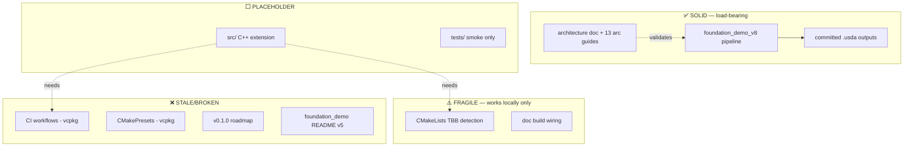

# usd-bio — State of the Project (v0)

Date: 2026-06-17

---
type: findings
topic: restart
date: 2026-06-17
version: v0
prior-version: none
key-metric: phase-readiness: prototyping-complete, Phase-2-blocked (prior: N/A, delta: N/A)
decision-required: confirm
---

> **Purpose.** Orientation snapshot for the `restart` cycle. If a fresh agent
> picked up usd-bio cold tomorrow, this is what it would need to know: what
> exists, what is solid vs. fragile, what is stale, what blocks the next push,
> and how the backlog should be sliced into `working-async` topics.
> Claims are tagged `[source: <path>]` or `[assumption: …]`. Two parallel
> survey sub-agents produced the underlying evidence this cycle.

## Headline Result

metric: phase-readiness
value: Python prototyping validated; C++ Phase-2 blocked on build/CI; backlog (2)(3)(4) unblocked in Python
unit: qualitative
prior: N/A (first orientation cycle)
direction: new

**One-paragraph orientation.** usd-bio is an OpenUSD extension for biology data, currently in a **manual Python prototyping phase** building toward a future C++ USD schema `[source: CLAUDE.md "Current Phase"]`. The keystone artifact is `examples/foundation_demo_v8/` — a coherent, self-verifying, runnable pipeline (PDB parse → trajectory clips → class-prim templates → LIVERPS demos → committed `.usda` outputs) that demonstrates every architectural pattern against the real ShinobuLab ABL-kinase dataset `[source: examples/foundation_demo_v8/converters/, demos/]`. The architecture is locked in a permanent design doc that has been validated at the pattern level `[source: __design__/openusd_for_research_architecture.md]`. The C++ side (`src/`, `tests/`) is a version-stub placeholder only. The build, CI, and CMake presets are **stale around the removed vcpkg toolchain** and would not work on a clean checkout — this is the single biggest blocker, but it blocks only C++ Phase-2 schema work, not the Python-level demo backlog.

## Results Tables

### Status at a glance — major components

| Component | Path | Maturity | Runnable? |
|---|---|---|---|
| v8 prototype pipeline (keystone) | `examples/foundation_demo_v8/` | **solid** | yes (needs custom `pxr` env) `[source: examples/foundation_demo_v8/converters/pdb_parser.py:250]` |
| Generated USD outputs (committed) | `…/foundation_demo_v8/assets/`, `…/output/` | **solid** | are the artifacts (448k-line assembly, 309k-line clip) `[source: git ls-files]` |
| 13 composition-arc guides | `…/foundation_demo_v8/docs/` | **solid** | n/a `[source: file inventory]` |
| Architecture vision (permanent) | `__design__/openusd_for_research_architecture.md` | **solid** | n/a `[source: doc line 5]` |
| C++ extension lib | `src/core/extension.cpp` | **placeholder** (`GetVersion()` only) | builds to `libusd_bio.a` `[source: src/core/extension.cpp]` |
| C++ tests | `tests/smoke_test.cpp` | **stub** (one `SUCCEED()`) | builds to `smoke_test` `[source: tests/smoke_test.cpp:20]` |
| Build system | `CMakeLists.txt`, `CMakePresets.json` | **fragile** (works locally; presets stale) | partial `[source: CMakePresets.json:10]` |
| CI workflows | `.github/workflows/` (5) | **broken/stale** (vcpkg removed, CI still requires it) | no `[source: .github/workflows/ci.yml]` |
| Docs build | `docs/`, `Doxyfile`, `.readthedocs.yaml` | **partial/untested** | unverified `[source: docs/conf.py:23]` |
| v0.1.0 roadmap | `__design__/usd_bio_roadmap_v0.1.0.md` | **stale** (pre-prototyping, C++-only) | n/a `[source: doc header 2025-11-13]` |

### Solid vs. fragile — the keystone and the placeholders

| Verdict | Artifact | Why |
|---|---|---|
| **Keystone** | `foundation_demo_v8/` Python pipeline + committed `.usda` | Only load-bearing, runnable, self-verifying artifact; proves class-prim taxonomy, `representation` VariantSet, Value Clips, departmental layering on real data `[source: …/converters/*.py, demos/trajectory_demo.py:72]` |
| **Placeholder** | `src/` + `tests/` C++ scaffold | Build-smoke target only; zero schema/biology code `[source: src/core/extension.cpp; tests/smoke_test.cpp]` |
| **Fragile** | build/CI/presets | All coupled to vcpkg, which was removed (`b36d3d0`); TBB detection hand-rolled and won't fire on clean macOS-arm `[source: CMakeLists.txt:16-39]` |

### Reconciliation performed this cycle (Deliverable 2)

| Action | Items | Status |
|---|---|---|
| Archived (verified fully superseded) | `analysis/02`, `03`, `05` → `analysis/archive/` | done, commit `326a3aa` |
| Kept in place (unique content remains) | `analysis/04, 06, 07, 08, 09, 10` | flagged, not moved |
| Surfaced, not silently fixed | 6 contradictions (see below) | reported |

## Observations

| Signal | Baseline / Expected | Observed [source] | Interpretation |
|---|---|---|---|
| Stated project phase | One consistent phase | README says "Phase 2+ in development"; CLAUDE.md + perspective doc say "manual prototyping, before C++" `[source: README.md:23 vs CLAUDE.md "Current Phase"]` | README overstates maturity; prototyping is the real phase |
| Demo version of record | Matches repo | `foundation_demo/README.md` says "Version 5 (Current)"; repo has `foundation_demo_v8` `[source: foundation_demo/README.md:7 vs perspective doc:4]` | README evolutionary-log is 3 iterations stale |
| LIVERPS spelling | Consistent | Archived reports use 6-letter "LIVRPS"; permanent doc + CLAUDE.md use 7-letter "LIVERPS" `[source: analysis/03 vs architecture:23]` | Resolved evolution; stale spelling only persisted in now-archived reports |
| Build reproducibility | Clean checkout builds | Local `build/` succeeded only via TBB path not in the CMake search list `[source: build/CMakeCache.txt vs CMakeLists.txt:16-39]` | Build depends on undocumented local override; fresh clone would FATAL_ERROR |
| CI exercises current build | CI green = build works | All 5 workflows bootstrap vcpkg that no longer exists `[source: .github/workflows/ci.yml]` | No regression net for C++ work |
| "Phase 1 complete" | One meaning | Roadmap Phase 1 = C++ infra; report `02-checkpoint` "Phase 1 complete" = Python foundation-demo env `[source: README.md:137 vs checkpoint doc:1-25]` | Two unrelated workstreams share one label |

## Charts & Visualizations

### Subsystem maturity map



### p53-mdm2 pipeline reuse from v8 (Deliverable 3, item 4)

```
MD → USD            ████████░░  HIGH reuse  (pdb_parser + xtc_to_clips + templates)
USD → MD (ΔG srv)   ██░░░░░░░░  LOW         (VariantSet/Genotype designed, not built)
USD → MaBoSS        ░░░░░░░░░░  NONE        (greenfield)
MaBoSS → USD        ░░░░░░░░░░  NONE        (greenfield; reuses USD-write idioms)
```
*One of four pipelines has substantial reusable scaffolding; three are greenfield `[source: examples/foundation_demo_v8/converters/; repo-wide grep for maboss|p53|mdm2 → only INTENT.md]`.*

## Gaps & Blockers

**Blocking before C++ Phase-2 (schema) work can begin:**

- **No trustworthy build path.** CMakePresets still point at a nonexistent `vcpkg/scripts/buildsystems/vcpkg.cmake`; TBB detection won't fire on a clean macOS-arm checkout `[source: CMakePresets.json:10-12; CMakeLists.txt:16-39]`.
- **CI is dead.** All 5 workflows require vcpkg that was removed; no regression net `[source: .github/workflows/*.yml]`.
- **No schema-gen scaffolding.** Phase 2 needs `usdGenSchema`/`schema.usda` plumbing; none exists `[source: src/core/extension.cpp]`.

**Nice-to-have (not blocking):** real GTest fixtures (`tests/fixtures/` is README-only); validated doc build; converter portability (hard-coded `~/Documents/career/Projects/USDBio/ShinobuLab/...` paths `[source: …/xtc_to_clips.py:59]`); correcting the stale v8 ROADMAP statuses and `foundation_demo/README.md`.

**Key decoupling:** the broken C++ build/CI blocks *Phase-2 schema work* but does **not** block backlog items (2)(3)(4), which are all expressible in the Python prototype layer `[assumption: backlog (4)'s pipelines are I/O + service integration, per INTENT:76-83]`.

## Contradictions & Surprises

- README claims "Phase 2+ in development" while the project is actually pre-C++ prototyping — a cold agent reading only README would mis-scope its work `[source: README.md:23]`.
- `foundation_demo/README.md` "evolutionary log" is frozen at v5 while the repo is at v8 — **flagged, not fixed**: reconstructing the v6–v8 history would require fabricating entries I cannot source `[source: foundation_demo/README.md:7]`.
- The local C++ build only succeeded via an undocumented TBB override — the committed CMake logic alone would fail on a clean clone `[source: build/CMakeCache.txt]`.
- Two different "Phase 1 complete" claims refer to unrelated workstreams (C++ infra vs. Python demo env) `[source: README.md:137 vs checkpoint doc]`.
- `out/build/Clang/` holds a stale failed vcpkg configure whose log shows vcpkg cannot build USD on arm64-osx — the very reason vcpkg was abandoned; misleading to a cold agent (gitignored, local-only) `[source: out/build/Clang/vcpkg-manifest-install.log]`.

## Proposed Topic Slicing for the Backlog (Deliverable 3)

Read from the live `USD Bio` macOS reminders list (4 items; item 1 already marked complete) `[source: macOS Reminders "USD Bio"]`. The brief is transcribed verbatim in `__threads__/restart/INTENT.md:65-87`. Recommended `working-async` topics, in dependency order — **for PI approval; not scaffolded this cycle:**

| # | Proposed topic slug | Scope (one line) | Done-criteria | Depends on |
|---|---|---|---|---|
| T1 | `v8-gap-analysis` | Diff `foundation_demo_v8` against its own `ROADMAP/` and the architecture doc; enumerate what is missing/incomplete (e.g. deferred solvent PointInstancer). | A gap report under `__reports__/v8-gap-analysis/` listing each gap with severity + evidence. | none — **ready now** |
| T2 | `v8-gap-implementation` | Close the gaps T1 finds, in the Python prototype. | Each agreed gap closed with a runnable demo + committed `.usda`; v8 ROADMAP statuses corrected. | T1 |
| T3 | `p53-mdm2-infra-extraction` | Extract/generalize v8 infra reusable for the multi-scale p53-mdm2 case; build the 4 pipelines (MD→USD reuse; USD→MD ΔG server; USD→MaBoSS; MaBoSS→USD). | A reuse map + at least the MD→USD pipeline generalized off ABL specifics; stubs/designs for the 3 greenfield pipelines. | T2 (loosely) |
| T4 | `cpp-build-revival` | Off-cycle infra fix: drop vcpkg from CMakePresets + CI, make TBB detection robust, validate doc build. | Clean-checkout `cmake -B build` succeeds; CI green; doc build passes. | none — independent; **prerequisite for any future C++ Phase-2** |

**Ordering rationale.** T1 is pure read/assess and ready immediately. T2 follows T1. T3 is the largest and depends loosely on T2 (a cleaner v8 is easier to extract from). T4 is independent of the demo backlog and can run in parallel — but it gates the eventual C++ schema phase, so it should not be deferred indefinitely. The reminders' own tags suggest effort sizing: T1 ~90m, T2 ~180m, T3 ~120m `[source: macOS Reminders tags est90m/est180m/est120m]`.

**On the async rhythm itself (reminder item 1, the test run):** this `restart` cycle was partly the Tier-2 daily-cycle test run. The per-cycle rhythm worked: `wkas` enforced ordering cleanly, the manifest read order oriented the cycle fast, and the team-leader split (parallel survey sub-agents → synthesis) fit a broad assessment well. One friction: the runtime woke on `main`, not `topic/restart`; `begin-cycle` would have refused had I not checked out the branch first — worth confirming the runtime checks out the topic branch automatically.

## Steering Questions

- [now] **Approve the 4-topic slicing (T1–T4) and ordering?** Confirm or revise before any are scaffolded with `wkas init`. (See proposed table.)
- [now] **Should `cpp-build-revival` (T4) run in parallel now, or wait until the Python demo backlog lands?** It is independent but gates all future C++ work.
- [next run] **Is archiving 02/03/05 the right aggressiveness?** Reports 04/06–10 were kept; confirm whether you want a second pass to migrate doc-10's code samples into the demo and then archive it too.
- [next run] **Should the stale `foundation_demo/README.md` (v5) and v8 `ROADMAP/` statuses be corrected** as part of T1/T2, or now as a trivial chore?
- [later] **When does `bio:` convention become a `UsdBio` C++ schema?** The architecture doc defers this; it is the Phase-2 trigger and worth an explicit decision criterion.

## Pointers

- Reconciliation commit: `326a3aa` (archive 02/03/05) + archive README at `__reports__/foundation_demo/analysis/archive/README.md`
- Keystone architecture: `__design__/openusd_for_research_architecture.md`
- Post-v8 assessment (most current design thinking): `__reports__/foundation_demo/perspective/01_v8_to_production_perspective.md`
- Keystone code: `examples/foundation_demo_v8/converters/`, `…/demos/`, `…/ROADMAP/`
- Stale infra: `.github/workflows/`, `CMakePresets.json`, `__design__/usd_bio_roadmap_v0.1.0.md`
- Backlog source: macOS Reminders "USD Bio"; transcribed in `__threads__/restart/INTENT.md:65-87`

## What I Am Uncertain About

- **Whether the Python demos run today.** Assessed from code structure, self-verify asserts, and committed `.usda` outputs — not a live run (would need the custom `pxr` env + the ~1.2 GB ShinobuLab dataset) `[assumption: committed outputs + verify scaffolding imply runnable]`.
- **Whether the local C++ build reflects committed CMake or a manual override** — `build/CMakeCache.txt` resolved TBB to a path absent from the script's search list `[assumption: inferred -DTBB_*/CMAKE_PREFIX_PATH override]`.
- **Doc-10's code samples** — could not confirm whether they were superseded by actual committed scripts in `examples/`; kept doc-10 conservatively rather than archive it.
- **p53-mdm2 feasibility detail** — no p53/MaBoSS code or design exists in-repo; the reuse map is from the architecture intent + v8 converters, not from any existing integration `[source: repo-wide grep]`.
- **Backlog completeness** — read the 4 live reminders; cannot rule out backlog context the PI holds outside the reminders list.
