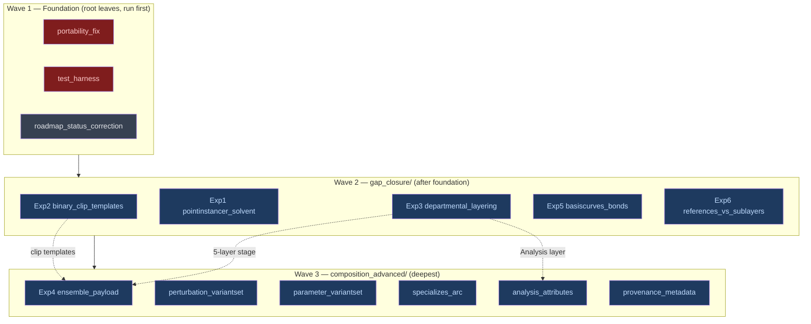

# v8-gap-closure — Findings (v0)

Date: 2026-06-25

---
type: findings
topic: v8-gap-closure
date: 2026-06-25
version: v0
prior-version: none
key-metric: roadmap leaves done: 0 of 14 (prior: N/A, delta: N/A)
decision-required: confirm
---

## Headline Result

metric: in-scope gaps closed
value: 0
unit: of 13 gap/defect items (audit refreshed, roadmap authored, no implementation yet)
prior: N/A (first cycle)
direction: new

Cycle-000 was a **scoping cycle**: it re-validated the 2026-02-15 gap report against current code and turned it into a dependency-ordered, BFS-executable roadmap. No gap was closed this cycle by design — closure begins next cycle at the foundation wave.

## Results Tables

### Refreshed gap status (in-scope §3 + §5, against current code)

| Item | 2026-02-15 claim | Current status | Class |
|------|------------------|----------------|-------|
| §3.1a Solvent / PointInstancer | excluded | **still-open** — no PointInstancer in code [source: demos/water_demo.py] | deferred-by-design |
| §3.1b File format | `.usda` text | **still-open** — all 6 outputs `.usda` [source: output/] | deferred-by-design |
| §3.1c Trajectory frames | 20 frames, 1 XTC | **still-open** — 20 frames, single clip [source: output/trajectory_demo.usda] | deferred-by-design |
| §3.1d / §3.2 Bonds | per-bond Cylinder | **still-open** — Cylinder prims [source: templates/04_create_assembly.py:99] | deferred-by-design |
| §3.3 References (asset libs) | not demonstrated | **still-open** — no AddReference [source: colgrep zero hits] | deferred-by-design |
| §3.3 Payloads | not demonstrated | **still-open** — no AddPayload [source: colgrep zero hits] | deferred-by-design |
| §3.3 Ensemble VariantSet (ReplicaID) | not demonstrated | **still-open** — zero occurrences | deferred-by-design |
| §3.3 Perturbation VariantSet (Genotype) | not demonstrated | **still-open** — zero occurrences | deferred-by-design |
| §3.3 Parameter VariantSet (ForceField) | not demonstrated | **still-open** — zero occurrences | deferred-by-design |
| §3.3 Specializes arc | not demonstrated | **still-open** — no GetSpecializes [source: colgrep zero hits] | deferred-by-design |
| §3.3 Departmental layering | Biology+Dynamics only | **partially-closed** — still 2 layers [source: trajectory_demo.py:43-44] | deferred-by-design |
| §3.3 Analysis as attributes | not demonstrated | **still-open** — no RMSD/PMF attrs | deferred-by-design |
| §3.4 Provenance | flat `bio:source` string | **still-open** — unchanged [source: templates/04_create_assembly.py:167-174] | deferred-by-design |
| §5 Exp 1–6 | all needed | **all still-open** — no deliverables [source: cycle-000 audit] | deferred-by-design |
| Defect: hard-coded paths | flagged in restart | **confirmed** — 3 files + 1 ROADMAP literal [source: xtc_to_clips.py:60-68; 04_create_assembly.py:45-48; pdb_parser.py:313-317] | genuine defect |
| Defect: test coverage | near-zero | **confirmed** — only data-dict + version-string tests; ad-hoc data-gated `verify_*` blocks [source: tests/test_element_data.py; tests/smoke_test.cpp] | genuine defect |
| v8 `ROADMAP/` statuses | n/a | **stale** — M1/M2/M3 all complete but README shows In Progress/Blocked [source: ROADMAP/README.md:19-21] | stale-status |

### Roadmap shape (14 leaves, depth = execution order)

| Wave | Depth | Leaves |
|------|-------|--------|
| Foundation | root leaves (run first) | portability_fix, test_harness, roadmap_status_correction |
| Gap closure | `gap_closure/` (after foundation) | binary_clip_templates (Exp2), pointinstancer_solvent (Exp1), departmental_layering (Exp3), basiscurves_bonds (Exp5), references_vs_sublayers (Exp6) |
| Advanced arcs | `gap_closure/composition_advanced/` (deepest) | ensemble_payload (Exp4), perturbation_variantset, parameter_variantset, specializes_arc, analysis_attributes, provenance_metadata |

## Observations

| Signal | Baseline / Expected | Observed [source] | Interpretation |
|--------|--------------------|--------------------|----------------|
| Gap closure since report | some drift over 4 months | nothing material closed [source: cycle-000 audit] | The Feb backlog is still authoritative; refresh confirms it rather than replacing it |
| New code added since report | n/a | water_template + water_demo, ion_properties, 13 docs [source: filesystem] | Additions are pattern demos, not gap closures; none retire a §3/§5 item |
| Test read-back | none expected | `Usd.Stage.Open` only in ad-hoc, data-gated `verify_*` `__main__` blocks [source: cycle-000 audit] | Confirms the INTENT's "tautological tests" risk — the harness must be built before trusting any later gate |
| Departmental layering | 5 layers in vision | 2 layers in code [source: trajectory_demo.py:43-44] | Partial; Exp 3 must build the full 5-layer stage before ensemble/analysis arcs can consume it |

## Charts & Visualizations

Execution order is encoded by directory depth (BFS runs a directory's leaves before its subdirectories):

Caption: 14-leaf roadmap. Solid arrows = BFS depth ordering (hard). Dotted arrows = data dependencies that justified nesting Exp 4 and analysis_attributes one level deeper.

## Contradictions & Surprises

- The `test_harness` is sequenced as **foundation**, not a gap-closure leaf, because the INTENT makes it the regression net every later closure depends on — building it late would let tautological tests pass silently. This deviates from §5's pure information-value ordering, which has no harness item; the deviation is intentional and documented here and in the campaign README.

## Steering Questions

- [now] Confirm the roadmap **sequencing**: foundation-first (harness before any experiment), independent §5 experiments parallel in wave 2, dependent arcs in wave 3. Reject now if you want a different cut.
- [next run] The foundation wave's `portability_fix` introduces a `USDBIO_DATA_DIR` env var as the data-location contract — confirm that name/mechanism, since every later experiment references it.
- [later] §5 priority tags (Exp 1/2 high, 3/4/5 medium, 6 low) were used only as a tiebreak within waves, not to serialize independent work. Flag if you want strict priority serialization instead.

## Pointers

- Roadmap: [`__roadmap__/v8-gap-closure/`](../../__roadmap__/v8-gap-closure/README.md)
- Authoritative backlog: [`01_v8_to_production_perspective.md`](../foundation_demo/perspective/01_v8_to_production_perspective.md) §3, §5
- Architecture vision: [`openusd_for_research_architecture.md`](../../__design__/openusd_for_research_architecture.md)
