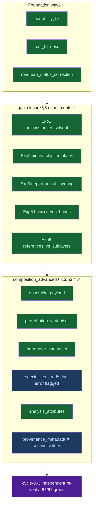

# v8-gap-closure — Findings (v0)

Date: 2026-07-04

---
type: findings
topic: v8-gap-closure
date: 2026-07-04
version: v0
prior-version: none
key-metric: tests-green: 67/67 (prior: 30/30 claimed cycle-002, delta: +37 independently re-run)
decision-required: confirm
---

## Headline Result

metric: independent re-verification of the completed v8-gap-closure roadmap
value: 67/67
unit: tests passing (main harness 30/30 + composition_advanced 37/37), all exit 0
prior: 30/30 (cycle-002, main harness only; comp-advanced suites reported per-suite)
direction: stable

Cycle-003 is an **independent verification / consolidation cycle**. The PI acked cycle-002's
proposed-resolution (per their stated rule: a cycle is a boundary, continue on a green roadmap,
close only on a critical issue or a PI-approval-needing inconsistency) rather than closing. Before
the PI closes, this cycle re-ran **all** committed test evidence from a fresh process under the
canonical `forOUSD` interpreter — no generator state in scope — to confirm the completion claims
survive independent replay. They do, cleanly.

## Results Tables

### Fresh test run (forOUSD venv: pxr 0.25.11 / mdtraj 1.11.1)

| Suite | Result | Exit | Notes |
|-------|--------|------|-------|
| `examples/foundation_demo_v8/tests/run_tests.py` | 30/30 | 0 | compliance ×12, domain ×12, readback ×3, golden ×3 |
| `tests/composition_advanced/test_analysis_attributes.py` | 4/4 | 0 | time-sampled bio:rmsd/pmf/contactCount |
| `tests/composition_advanced/test_ensemble_payload.py` | 6/6 | 0 | ReplicaID VariantSet → Payload swap |
| `tests/composition_advanced/test_parameter_variantset.py` | 9/9 | 0 | ForceField VariantSet (Amber99/Charmm36) |
| `tests/composition_advanced/test_perturbation_variantset.py` | 9/9 | 0 | Genotype VariantSet (WildType/T315I) |
| `tests/composition_advanced/test_provenance_metadata.py` | 4/4 | 0 | structured 6-field lineage |
| `tests/composition_advanced/test_specializes_arc.py` | 5/5 | 0 | Inherits-vs-Specializes contrast |
| **Total** | **67/67** | all 0 | none failed to run |

### Roadmap-status truthfulness audit (15 leaves)

| Wave | Leaves | Status on disk | Verdict |
|------|--------|----------------|---------|
| Foundation | portability_fix, test_harness, roadmap_status_correction | all ✅, demo + tests present | truthful |
| gap_closure §5 | Exp1 pointinstancer, Exp2 binary_clip_templates, Exp3 departmental_layering, Exp5 basiscurves_bonds, Exp6 references_vs_sublayers | all ✅, demo + `.usda`/`.usdc` + read-back tests present | truthful |
| composition_advanced §3.3/§3.4 | ensemble_payload, perturbation_variantset, parameter_variantset, specializes_arc, analysis_attributes, provenance_metadata | all ✅, demo + `.usda` + read-back tests present | truthful |

Every leaf marked ✅ Done has a committed demo script, a committed `.usda`/`.usdc` artifact, and a
read-back test suite that this cycle re-ran green. No status is unbacked by evidence.

## Observations

| Signal | Baseline / Expected | Observed [source] | Interpretation |
|--------|--------------------|--------------------|----------------|
| Interpreter parity | forOUSD has both pxr + mdtraj (Q-001 answer) | pxr 0.25.11 / mdtraj 1.11.1.post1 both import [source: sub-agent fresh run, `. ./load_env.sh` + forOUSD python3] | Q-001 answer confirmed; no interpreter split; XTC + USD coexist |
| Main harness | 30/30 (cycle-002 claim) | 30/30, exit 0 [source: run_tests.py fresh run] | completion claim replays exactly |
| Comp-advanced suites | per-suite counts in cycle-002 HANDOFF | 37/37 across 6 suites, all exit 0 [source: fresh per-file runs] | all arc claims replay exactly |
| Falsification-resistance | tests read artifacts back as a cold consumer | 3 files verified: fresh `Usd.Stage.Open`, hardcoded sentinels sourced from on-disk `.usda`, one cross-checked against `clips/rep_01.usda` timeSamples [source: `test_specializes_arc.py:126,173`, `test_ensemble_payload.py:42-54,160`, `test_perturbation_variantset.py:44-55`] | tests are genuinely non-tautological, not re-asserting generator memory |
| Ensemble time-sample offset | cycle-002 flagged unexplained t=2.4 vs t=1.0 | no such value exists; `_TIME=1.0`, clip authors startTimeCode=endTimeCode=1, single sample at key 1 [source: sub-agent direct check of `test_ensemble_payload.py:39` + `clips/rep_01.usda`] | prior uncertainty does not reproduce in committed state — resolved |

## Charts & Visualizations

Caption: All 15 roadmap leaves ✅ Done and independently re-verified (67/67 tests green). Two leaves
carry PI-facing residual notes (blue ⚑): the Specializes architecture-doc error and the provenance
sentinel values — both explicitly out of the current INTENT scope.

## Contradictions & Surprises

- The cycle-002 "t=2.4 vs t=1.0 ensemble time-sample offset" uncertainty **does not reproduce**. A
  direct read of the test and its clip stub shows a single, consistent sample at t=1. The earlier
  note appears to have been an artifact of a transient/exploratory observation, not a defect in the
  committed state.

## Steering Questions

- **[now] Close, or pull in the flagged doc-correction?** The in-scope backlog (INTENT §3 gaps + §5
  experiments) is complete and independently re-verified. The only PI-approval-needing item is the
  architecture-doc R03 §2.1/§7 Specializes claim, which is empirically **backwards** (real USD:
  a Specializes base is always *weaker* than instance opinions). Correcting `__design__/` is
  currently **out of INTENT scope** ("do not alter the architecture doc's decisions"). Confirm-and-close,
  or authorize a scope expansion / new topic to fix the doc? (Recorded as the soft steering question this cycle.)
- **[later] Provenance realism.** `provenance_metadata` uses representative sentinel values (2HYY.pdb,
  AMBER99SB-ILDN, GENESIS 2.1.0), not real ShinobuLab run metadata. Acceptable for the prototype;
  wiring real lineage would be a data-sourcing task, likely under the p53-mdm2 / next topic.

## Pointers

- Prior: [`02-knowledge_transfer_v0.md`](02-knowledge_transfer_v0.md) — cycle-002 full roadmap completion
- [`00-audit_and_roadmap_v0.md`](00-audit_and_roadmap_v0.md) — cycle-000 refreshed gap audit + roadmap
- Roadmap: [`__roadmap__/v8-gap-closure/README.md`](../../__roadmap__/v8-gap-closure/README.md)
- Gap source: [`__reports__/foundation_demo/perspective/01_v8_to_production_perspective.md`](../foundation_demo/perspective/01_v8_to_production_perspective.md)
- Tests: `examples/foundation_demo_v8/tests/run_tests.py`, `tests/composition_advanced/`

## What I am uncertain about

- Whether the PI intends the architecture-doc Specializes correction to be pulled into this topic or
  deferred to a new one — this is the open steering question, deliberately not decided unilaterally
  because doc edits are out of the current INTENT scope.
- Provenance sentinel values remain representative assumptions, not verified against a real
  ShinobuLab run manifest `[assumption: no real run-metadata source was provided in INTENT/INBOX]`.
- No other uncertainties this cycle: the fresh independent run reproduced every completion claim and
  the one prior open uncertainty (ensemble time offset) did not recur.
