# v8-gap-closure — Findings (v0): broken usdview outputs + Q-002 follow-ups

Date: 2026-07-06

---
type: findings
topic: v8-gap-closure
date: 2026-07-06
version: v0
prior-version: __reports__/v8-gap-closure/03-findings_v0.md
key-metric: usdview_regression_check gates: 44 pass / 0 fail / 1 known-residual (prior: N/A, delta: new harness)
decision-required: confirm
---

## Headline Result

metric: PI-reported broken-output items resolved + systemic regression net stood up
value: 4/4 INBOX items dispositioned; curves_demo bug fixed at both root causes; 6-gate headless harness green
unit: items / demos / gates
prior: N/A (first cycle responding to this INBOX)
direction: new

The four INBOX bug reports were **not** a set of unrelated glitches. Two distinct realities: (1) the
`output/clips/*` files are *intended intermediate value-clip payloads*, misread as broken because
nothing documented "do not open these directly" — fixed by documentation; (2) `curves_demo.usda` was a
*genuine two-cause bug* — now fixed and independently verified. A headless regression harness was built
(the PI's explicit Item-4 ask) and, in the process, surfaced the same bug *class* in three more demos
that were never reported.

## Results Tables

### INBOX item disposition

| # | PI report | Verdict | Action taken |
|---|-----------|---------|--------------|
| 1 | clips render as grey static cylinders, Play dead | Intended intermediate artifact, under-documented | README + doc callouts; harness classifies them as payloads |
| 2 | "if intended, document how to run demos/clips" | Real doc gap | New `README.md` + callouts in docs 11 & 13 |
| 3 | `curves_demo.usda` wrong location + double display | **Genuine bug** (2 causes) | Fixed both causes; regenerated outputs; new read-back test |
| 4 | clean remnants OR root-cause + automated debug cycle | Not remnants (all tested/load-bearing) | Built `tests/usdview_regression_check.py` (6 gates) |

### curves_demo.usda — before vs after fix

| Property | Before (broken) | After (fixed) | Source |
|----------|-----------------|---------------|--------|
| Default `representation` on fresh open | none (curves-only, 0 atoms) | `ballstick` | `Usd.Stage.Open` read-back |
| Atom `xformOp:translate` resolve source | `ResolveInfoSourceDefault` (static PDB frame) | `ResolveInfoSourceValueClips` | orchestrator verify |
| Atom displacement t0→t19 | ~0 Å (frozen) | 19.32 Å | orchestrator verify |
| Atom / Bonds centroid separation | tens of Å (two disjoint clusters) | 1.25–2.7 Å (co-located) | sub-agent B + gate 4 |

### Regression harness baseline (`tests/usdview_regression_check.py`)

| Result | Count | Notes |
|--------|-------|-------|
| gates passed | 44 | across 9 viewer entry points + 6 payload artifacts |
| gates failed (new) | 0 | exit code 0 = clean baseline |
| known residuals | 1 | `solvent_demo` gate-2, allow-listed false-positive (documented) |
| gates skipped | 45 | payload files skip viewer gates; gate-5 render off by default |

## Observations

| Signal | Baseline / Expected | Observed [source] | Interpretation |
|--------|--------------------|--------------------|----------------|
| Clip payloads opened directly | grey cylinders, no atoms, dead Play | `HasAuthoredTimeCodeRange()==False`, only bond Cylinders, no displayColor `[source: diagnosis.md Item 1]` | Working-as-designed; the topology + colors + variants live in the sublayer, not the clip |
| curves atoms vs bonds position | should share one MD frame | atoms at static PDB `(-16,9,10)`, bonds at MD `(54-67,...)` `[source: diagnosis.md Item 3b]` | Clip drove only Bonds — root cause of "wrong location" |
| Default variant selection | every viewer demo should open with geometry visible | 4 demos had no default selection `[source: harness gate 2]` | Same bug class as curves cause (a); 3 were latent/unreported |
| `usdchecker` on broken curves_demo | should flag the bug | reports "Success!" `[source: diagnosis.md Item 4 / gate 6]` | Compliance ≠ intent-conformance; semantic gates 2–4 are what catch these |
| Trajectory clip data provenance | PI unsure if `.usdc` uses real data | all clips (`.usda` + `.usdc`) derive from real ShinobuLab XTC via mdtraj `[source: converters/xtc_to_clips.py:63,225,483-551; usda_to_usdc.py]` | Both formats are real ShinobuLab data; `.usdc` = binary re-encode or fresh-from-XTC per replica |

## Charts & Visualizations

Value-clip composition — why a clip payload looks "broken" alone vs. correct when composed:

```mermaid
flowchart TD
    subgraph WRONG["PI opened this directly → grey static cylinders"]
      C["clips/trajectory_clip.usda<br/>(bond Cylinders only, no atoms,<br/>no color, no time range)"]
    end
    subgraph RIGHT["Correct viewer entry point"]
      D["output/trajectory_demo.usda<br/>startTimeCode=0 endTimeCode=19"]
      D -->|subLayer| T["assembly topology<br/>(Sphere gprims, CPK color,<br/>representation VariantSet)"]
      D -->|UsdClipsAPI| C
    end
    style WRONG fill:#3a2020,stroke:#a55
    style RIGHT fill:#20321f,stroke:#5a5
```



curves_demo desync (fixed): before, the clip drove only `Bonds`; after, one position array drives both.

```
BEFORE (bug)                          AFTER (fix, commit 10ce135)
  Bonds.points ── MD frame  ●┐         Bonds.points ──┐
  atom Xforms  ── PDB frame ○┘ split    atom translate ─┴─ same per-frame
   → two disjoint clusters               positions[] array → co-located (Δ≈1-3 Å)
```

## Contradictions & Surprises

- The harness caught **3 unreported demos** (`binary_demo`, `departmental_demo`, `solvent_demo`) with the
  same "no default variant selection" defect as curves cause (a) — fixed in the same cycle. This is the
  harness doing exactly its intended job before a human hit it in usdview.
- Sub-agent B found a **deeper latent bug**: the `/World`-wrapper variant cascade used by several demos
  (`trajectory_demo`, `assembly_demo`, etc.) is *decorative* — `GetVariantEditContext()` silently no-ops
  when the target prim is outside the variant-owning prim's namespace. Harmless where both gprim types are
  always visible, so it was invisible until curves (where `Bonds` is mode-gated) exposed the pattern. Left
  **out of scope** this cycle (verified, noted in commit messages/comments) — flagged here for a decision.
- `provenance_metadata` sentinel `2HYY.pdb` is actually **wrong**: the real ShinobuLab starting structure
  is `atp-complex-solv35.pdb` `[source: ShinobuLab/README.md]`. Engine (`GENESIS`) and force field (Amber
  family) are directionally correct; version strings are unconfirmed placeholders.

## Steering Questions

- [now] **Q-002 doc fix — done under your direction (b).** context7 confirmed the Specializes claim was
  backwards (PcpArcType enum: Specialize = weakest; glossary: specialized prim overrides base); I corrected
  `__design__/…architecture.md` §2.1/§7 (commit `6d109e9`). Confirm this satisfies (b).
- [now] **Real provenance wiring?** You want live-meeting-ready demos on real ShinobuLab data. The clips
  already are real; but `provenance_metadata` uses placeholders (`2HYY.pdb` is wrong). Want me to wire the
  real six-field lineage (GENESIS/Amber/`atp-complex-solv35.pdb` + real settings from the data-dir README/
  `.docx`) next cycle? — this is a small, in-spirit scope addition.
- [next run] **Fix the `/World`-cascade latent bug across all demos?** It's not currently viewer-visible but
  it's a real authoring defect and a foot-gun for future variant work. Fold into next cycle or defer to a
  dedicated topic?
- [next run] **Defensive time-range on clip payload files?** Optional (diagnosis Item 1 action #2) — makes a
  standalone-opened clip scrub instead of showing a dead Play button. Cheap but touches committed `.usdc`.
- [later] Re-affirm close vs. continue: the reported bugs are fixed and the regression net is green; the
  remaining items above are enhancements, not blockers.

## Pointers

- Diagnosis (root-cause, evidence): scratchpad `diagnosis.md` (session-scoped, not committed) — key findings folded into this report and commit messages.
- Harness: `examples/foundation_demo_v8/tests/usdview_regression_check.py`
- Runbook: `examples/foundation_demo_v8/README.md`; doc callouts in `docs/11_trajectory_demo_guide.md`, `docs/13_value_clips_for_trajectories.md`
- Curves fix commits: `10ce135`, `b160e7c`; class fix: `e7e36ca`, `47b836c`, `f81e3c9`; harness: `b7953da`, `e035cb1`; new test: `tests/test_curves_demo.py`
- Doc correction: `6d109e9` (`__design__/openusd_for_research_architecture.md`)
- Prior findings: `__reports__/v8-gap-closure/03-findings_v0.md`

## What I am uncertain about

- Play-button behavior claims are inferred from stage metadata (`HasAuthoredTimeCodeRange`) + `usdrecord`, not an interactive GUI session (no GUI usdview in this environment) `[assumption: standard usdview timeline-widget behavior]`.
- Gate-3/gate-4 thresholds (visibility-exclusivity heuristic; centroid tolerance `0.5×bbox`, floor 5.0) are calibrated to this repo's known cases, not a broad corpus — starting points, may need tuning.
- Whether `clip.001.usdc` and `clip.002.usdc` map to two *distinct* replica XTCs or the same file twice was not byte-verified this cycle; the generator supports distinct replicas and 10 real XTCs exist `[source: analysis/0_traj/sort_traj_1..10.xtc]`.
- The `/World`-cascade no-op is verified for the curves case but I did not exhaustively re-verify every demo's cascade; sub-agent B verified several directly.
