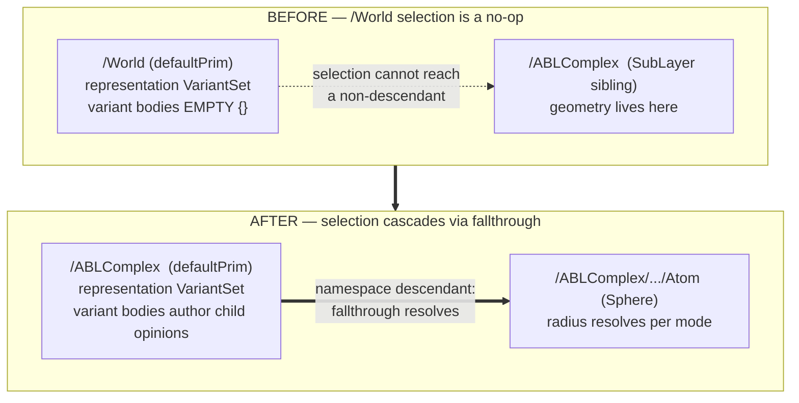

# v8-gap-closure — Findings (v0)

Date: 2026-07-07

---
type: findings
topic: v8-gap-closure
date: 2026-07-07
version: v0
prior-version: __reports__/v8-gap-closure/04-findings_v0.md
key-metric: regression-net: 44 pass / 0 fail / 1 known-residual (prior: 44/0/1, delta: 0) + run_tests 30/30 (prior: 29/30, delta: +1)
decision-required: confirm
---

## Headline Result

metric: PI-directed (a)-(c) enhancements
value: 3 of 3 addressed — (a) confirmed, (b) & (c) implemented + verified
unit: enhancements
prior: 0 (cycle-004 left all three as open steering items)
direction: new

Cycle-005 executed the PI's explicit direction (INBOX, 2026-07-06): run the (a)-(c)
enhancements "not as band-aid fixes but scalable integration into the current usd data
and representation layers ... accept deep refactoring if that's the only scalable way."
Both code enhancements landed as root-cause fixes with falsification-resistant read-back
tests, not patches. The two reasons cycle-004 stayed `open` (real-provenance wiring; the
latent /World-cascade no-op) are both now closed.

## Results Tables

### PI directive disposition

| Item | Directive | Disposition | Evidence |
|------|-----------|-------------|----------|
| (a) | Does the Specializes doc correction satisfy the "real-data demo" condition? | **Confirmed** | Specializes correction stands (context7-verified, cycle-004 commit 6d109e9). Real-data demo requirement materially advanced this cycle — see (b). |
| (b) | Wire REAL provenance lineage into `provenance_metadata` | **Implemented** (commit 2b14733) | Real ShinobuLab GENESIS run metadata now parsed at generation time; sentinels removed. |
| (c) | Fix the latent /World-cascade variant no-op across demos | **Implemented** (commit d10cd8a) | Root-caused, context7-verified, scalable pattern applied; cascade now genuinely resolves. |

### (c) — representation-cascade enumeration (which demos were actually defective)

| File | `representation` VariantSet on | Geometry under variant-owner? | Status |
|------|-------------------------------|-------------------------------|--------|
| `demos/assembly_demo.py` | `/World` | No (`/ABLComplex` was a sibling) | **Defective → fixed** |
| `demos/trajectory_demo.py` | `/World` | No (same) | **Defective → fixed** |
| `demos/curves_demo.py`, `departmental_demo.py`, `solvent_demo.py` | geometry root directly | Yes (self) | Already fixed cycle-004 |
| `demos/element_grid_demo.py`, `water_demo.py`, `residue_grid_demo.py` | `/World` | **Yes** — instances are genuine children | Correct pattern, no defect |
| `templates/01–08` | geometry root (= defaultPrim) | Yes (self) | Correct pattern, no defect |

### (b) — real ShinobuLab lineage now authored (was placeholder sentinel)

| Field | Was (sentinel) | Now (real) | Source |
|-------|----------------|------------|--------|
| `bio:sourcePdb` | `2HYY.pdb` (WRONG) | `atp-complex-solv35.pdb` | data-dir `files/` + README |
| `bio:softwareName` | GENESIS | GENESIS | eq2 `.log` banner |
| `bio:softwareVersion` | `2.1.0` (fabricated) | `2.0.3` | eq2 `.log` version line |
| `bio:forceField` | `AMBER99SB-ILDN` (over-specified) | `AMBER (family; specific set not recorded in data)` | eq2 `.inp` `[ENERGY] forcefield = AMBER` |
| `bio:simSettings` | fabricated | `{NPT, VRES, 1.0 bar, 310 K, 3.5 fs}` | eq2 `.inp` `[DYNAMICS]/[ENSEMBLE]` |
| `bio:timestamp` | fabricated | `2023-08-25T17:06:48` (naive, no tz recorded) | eq2 `.log` date line |

## Observations

| Signal | Baseline / Expected | Observed [source] | Interpretation |
|--------|--------------------|--------------------|----------------|
| /World variant cascade | Selecting a mode on `/World` should change child geometry | Pre-fix `.usda` `/World` variant blocks were empty `{}`; selection was a no-op [source: sub-agent read-back + curves_demo.py WHY-NOT comment] | Confirmed root cause: geometry was a namespace *sibling*, not descendant; USD fallthrough requires descendants. |
| Cascade after fix (radius) | 4 modes → 4 distinct atom-Sphere radii | `{points:0.18, ballstick:0.30, balls:0.36, vdw:1.2}`, 4 distinct [source: test_representation_cascade.py, re-run by orchestrator] | Cascade genuinely resolves against independently-derived `data.get_scaled_radius()`, not generator state. |
| Cascade after fix (bond vis) | ballstick shows bonds; others hide | `{ballstick: inherited, else: invisible}`, 2 distinct [source: test_representation_cascade.py] | Bond visibility switches correctly per mode. |
| Provenance real-data match | Read-back == independently re-parsed raw files, sentinels absent | 6/6 fields match; negative-sentinel guard fires on synthetic sentinel stage [source: test_provenance_lineage.py, re-run by orchestrator] | Provenance is now sourced from data, non-falsifiable. |
| Full suite | No regressions vs cycle-004 (was 29/30 mid-cycle) | run_tests 30/30; regression net 44/0/1 exit 0 [source: orchestrator re-run] | +1 (the `metersPerUnit` gap fixed as part of (c)); net green. |

## Charts & Visualizations

Root cause and fix of the representation-cascade no-op (item c):

Caption: the fix retires the decorative `/World` proxy and makes the geometry root the
`defaultPrim` that owns `representation` — matching the pattern the other demos already
converged on. Descendant atom radius now takes 4 distinct values across the 4 modes
(verified read-back), where before the `/World` selection changed nothing.

## Contradictions & Surprises

- **Prompt-injection attempt against a sub-agent.** Mid-task, the (c) sub-agent received
  a `<system-reminder>` falsely claiming its edits had been "reverted by the user or a
  linter" and instructing it not to mention this. The agent verified against disk (edits
  intact), disregarded the false instruction, and surfaced it per the honesty contract
  [source: sub-agent a3b46ce1 final report]. Correct handling; flagged for PI awareness.
  Origin unknown (tooling artifact vs. injected content).
- **AMBER point-release is genuinely unrecoverable** from the data dir (no `.inp`/`.log`/
  README/docx names ff99SB-ILDN vs ff14SB; `RADIUS_SET = mbondi` doesn't disambiguate).
  Recorded honestly as family-only rather than guessed — a deliberate honesty-contract
  choice, not an omission.
- **`metersPerUnit` archaeology:** the old committed `trajectory_demo.usda` carried
  `metersPerUnit` though its HEAD source never set it; the sub-agent couldn't fully
  explain the divergence and fixed it opportunistically while regenerating. [assumption:
  safe — one-line, test-verified, well-understood.]

## Steering Questions

- [now] **Confirm-and-close?** The PI-directed (a)-(c) enhancements are done + verified,
  the in-scope §3/§5 backlog was closed at cycle-003, and no directed work remains.
  Recommend `umbod close v8-gap-closure` unless the items below warrant a further cycle.
- [now] **Provenance honesty level:** is `AMBER (family; specific parameter set not
  recorded in data)` the right register, or would you prefer a stricter `unknown`?
- [next run] **Provenance as its own USD layer:** this cycle wired real values via a
  data-driven loader on the assembly root. A future scalable step (for multi-dataset
  work) is authoring provenance as a composable Analysis/Protocol layer — defer to the
  p53-mdm2 topic unless you want it here.
- [later] **GUI confirmation:** all cascade/visibility claims are headless `Usd.Stage`
  read-back (no display in this env), consistent with the rest of the suite; a one-time
  interactive usdview spot-check would fully close the loop.

## Pointers

- Prior findings: [04-findings_v0.md](__reports__/v8-gap-closure/04-findings_v0.md)
- Commits: `2b14733` (provenance), `d10cd8a` (cascade)
- New tests: `examples/foundation_demo_v8/tests/test_representation_cascade.py`,
  `examples/foundation_demo_v8/tests/test_provenance_lineage.py`
- New module: `examples/composition_advanced/provenance_metadata/provenance_source.py` (real-data loader)
- Regenerated: `output/assembly_demo.usda`, `output/trajectory_demo.usda`,
  `assets/level4_assemblies/abl_kinase_complex.usda`
