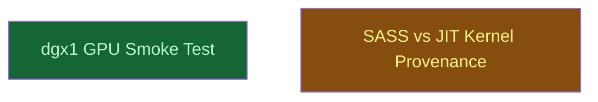

# container-runtime-verification

## Context
A **byproduct campaign**, deliberately kept out of `p53-mdm2-v2/` so that verification tooling does not pollute the scientific work roadmap. It consumes the `gromacs.sif` delivered by `p53-mdm2-v2/p1b_container_runtime/sif_delivery/` and produces evidence about *how that image actually executes* on each cluster — which GPU runs it, and whether its CUDA kernels come from embedded SASS or from just-in-time compilation. It produces no MD science and blocks no scientific node; it exists because several campaign claims about portability turned out to rest on inference rather than observation.

## Goal
Establish, by observation rather than inference, what the delivered `gromacs.sif` actually does on each cluster's GPU — and keep the resulting assertions under test in `run_tests.py` so they cannot silently rot.

## Pre-conditions
- [x] `gromacs.sif` exists on the shared NFS home with a known digest — `1fc04f8b…d20c81ac`, 5750255616 bytes, delivered by banyan job 33
- [x] Both clusters mount the same `ts2:/export/home`, proven byte-for-byte rather than from matching `df` output
- [x] Q-008 settled: PTX is embedded for **both** `sm_70` and `sm_90`, so a working run on either architecture no longer implies that architecture's SASS was used
- [ ] An attended session for anything that requests a GPU, per the Q-006 policy

## Success Gates
- ✅ `[run]` A dgx1 GPU is observed executing the image — non-zero `CUDA driver`, the detected-GPU block at compute capability 7.0, and nonbonded work on the device, captured verbatim
- ✅ `[run]` The two clusters agree on physics from the same image: minimisation potential energy within one part in a thousand across a V100 and an H100
- ✅ `[run]` Whether the V100 uses embedded `sm_70` SASS or JIT-compiles PTX is settled by measurement with a working positive control, not asserted
- ⬜ `[run]` The origin of the JIT activity observed on the PME path is attributed to either `libgromacs` PTX or an independently-shipped CUDA library
- ✅ `[static]` Every assertion here is gated in `examples/p53_mdm2/tests/run_tests.py` and returns zero rows when its evidence is absent

## Gotchas
- **A zero exit status does not prove device execution.** GROMACS falls back to CPU nonbondeds with only a log note, so every GPU claim must rest on the `md.log` detected-GPU block and a nonbonded kernel timing row, never on `mdrun` succeeding.
- **`~/.nv/ComputeCache` is on the shared NFS home, so the JIT cache is shared between banyan and dgx1.** A cache entry seen after a dgx1 run may have been written by a banyan run. Any JIT measurement must redirect `CUDA_CACHE_PATH` to a fresh directory rather than reading the real cache.
- **An empty JIT cache is meaningless without a positive control.** It is indistinguishable from a cache that was disabled or misdirected. Always pair the measurement with a `CUDA_FORCE_PTX_JIT=1` run and require it to write something.
- **`singularity exec` runs inside the job's cgroup; `docker run` does not.** The allocation is real for this campaign's runs, unlike the banyan docker path, so device pins here are enforced rather than advisory.
- **dgx1 runs Ubuntu 24.04 with singularity 3.5.2, a five-year skew from banyan's writer.** The read path is observed working, but its mechanism is squashfs gzip — a *builder default*, not a contracted guarantee.

## Status

## Nodes
| Node | Type | Status |
|:-----|:-----|:-------|
| `dgx1_gpu_smoke.md` | 📄 Leaf Task | ✅ Done |
| `sass_vs_jit_provenance.md` | 📄 Leaf Task | 🔄 In Progress |

## Amendment Log
| ID | Date | Source | Nodes Added | Rationale |
|:---|:-----|:-------|:------------|:----------|

## Progress
| Node | Branch | Commits | Notes |
|:-----|:-------|:--------|:------|
| `dgx1_gpu_smoke.md` | claude/p53-mdm2-cycle-review-716759 | 1 | dgx1 job 28, exit 0. `CUDA driver: 13.0` (was `0.0` driverless), Tesla V100-SXM2-16GB at compute cap 7.0 `stat: compatible`, `1 GPU selected`, `Using GPU 8x4 nonbonded short-range kernels`, `PME tasks will do all aspects on the GPU`. Cross-cluster minimisation-energy parity against banyan job 33 on the same `.sif`: **2.62e-06**, well inside the 1e-3 tolerance. First execution of the `sm_70` half of `GMX_CUDA_TARGET_SM="70;90"`. |
| `sass_vs_jit_provenance.md` | claude/p53-mdm2-cycle-review-716759 | 1 | dgx1 jobs 29 and 30. Verdict **MIXED**: minimisation-only run wrote 0 JIT entries while the `CUDA_FORCE_PTX_JIT=1` control wrote 9 files / 13486671 bytes, so nonbonded kernels come from embedded `sm_70` SASS. But the full min+md run wrote 4 entries / 47471 bytes, so the PME path JIT-compiles something. Attribution between `libgromacs` PTX and a library shipping its own PTX (cuFFT) is **open** — the remaining gate. |
