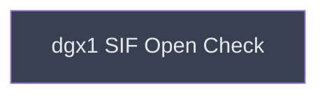

# Cross-Cluster Read-Only Checks

## Context
Cross-cluster verification of a `.sif` that only banyan has produced and trusted. This sits one level below `sif_delivery` because dgx1 cannot open an image that does not exist yet — the ordering is a real artifact dependency, not a preference. Everything at this level is deliberately **read-only**, which is what makes it the one part of the container track an unattended umbod cycle may execute under the Q-006 policy.

## Goal
Establish that the image built under singularity-ce 4.2.2 on banyan is usable on dgx1's singularity 3.5.2, without writing to dgx1 or touching a GPU.

## Pre-conditions
- [ ] `/home/eliott/p53mdm2/gromacs.sif` exists, produced by `convert_verify_cleanup`
- [x] One shared NFS home (`ts2:/export/home`) mounted identically on both clusters — asserted from `df` output in R07 and R10, but never actually proven byte-for-byte

## Success Gates
- ⬜ `[run]` `sha256sum gromacs.sif` computed from banyan and from dgx1 are **equal** — the first genuine test of the "stage once, run anywhere" claim the runbook has relied on since R07
- ⬜ `[run]` `singularity inspect gromacs.sif` exits 0 under singularity 3.5.2 and prints `GromacsVer`
- ⬜ `[run]` `singularity exec gromacs.sif /bin/ls /opt/gromacs/bin` exits 0 and lists `gmx`
- ⬜ `[static]` the SIF-version-skew entry in `examples/p53_mdm2/cluster/README.md`'s risk register is rewritten from open risk to observation

## Gotchas
- **This level is scoped to read-only on purpose.** No `--nv`, no GPU, no `sbatch` on dgx1. The attended dgx1 GPU smoke test is deliberately excluded and belongs here later as a sibling leaf — that reserved slot is why this directory exists for a single leaf today.
- **A bare `gmx --version` without `--nv` may fail on `libcuda.so.1`.** That is the absence of a bind-mounted host driver, not squashfs skew and not a broken image. Record the output either way; do not read it as a conversion failure.
- **squashfs compression is the actual risk being tested.** singularity 3.5.2 is a 2019 release; a newer compression written by 4.2.2 may simply not open. If it fails, capture which compression the `.sif` actually uses — that is the finding, and it points at either a rebuild with older-compatible compression or a per-cluster image.

## Status

## Nodes
| Node | Type | Status |
|:-----|:-----|:-------|
| `dgx1_sif_open_check.md` | 📄 Leaf Task | ⬜ Planned |

## Amendment Log
| ID | Date | Source | Nodes Added | Rationale |
|:---|:-----|:-------|:------------|:----------|

## Progress
| Node | Branch | Commits | Notes |
|:-----|:-------|:--------|:------|
