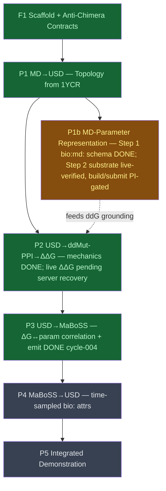

# p53_mdm2

## Context
This campaign builds the runnable, multi-scale **p53–MDM2 demonstration** in which OpenUSD is the shared representation tying molecular dynamics to systems-biology (MaBoSS Boolean-network) modelling, across the four pipelines defined in `__threads__/p53-mdm2/INTENT.md`. New work lands under a fresh `examples/p53_mdm2/`; `foundation_demo_v8/` is inspiration, **not** a copy source. The roadmap is driven by the cycle-000 reuse map and reshaped by the PI's cycle-000 review (answers to Q-001/Q-002): MD trajectories are **not** a hard prerequisite — the MD datum the demo needs is **ΔG**; if the project runs its own MD (dgx1/banyan), the MD **setup parameters** become a greenfield USDBio representation concern; and the ΔG→node "threshold" is replaced by a **ΔG↔MaBoSS-parameter correlation** (ΔG as the inverse of the model's tuned parameters).

## Reference Documents
- [R00 cycle-000 architecture + reuse map](../../__reports__/p53-mdm2/00-architecture_v0.md) — v8 asset classification, external-input decisions (1YCR, MaBoSS 5-node model, ddMut-PPI), anti-chimera invariants
- [R01 MD reproducibility survey](../../__reports__/p53-mdm2/01-md_reproducibility_survey_v0.md) — SOTA for sharing MD setup parameters; recommended `bio:md:` schema (cycle-001)
- [R02 ΔG↔MaBoSS correlation design](../../__reports__/p53-mdm2/02-dg_maboss_correlation_v0.md) — governing MaBoSS parameter, correlation function + inverse, round-trip test design (cycle-001)
- [R03 cycle-001 findings synthesis](../../__reports__/p53-mdm2/03-cycle001_findings_v0.md) — decisions, topic-split rationale, open steering questions (cycle-001)
- [design vision](../../__design__/openusd_for_research_architecture.md) — LIVERPS → research mapping (the parity target; implement, don't rewrite)

## Goal
Run the full end-to-end p53–MDM2 demonstration across all four pipelines (MD/ΔG → USD → ddMut-PPI ΔΔG → binarized MaBoSS model → MaBoSS run → results back onto USD), with committed `.usda` artifacts and passing falsification-resistant read-back tests as the unit of "done", built up over multiple cycles.

## Pre-conditions
- [x] cycle-000 reuse map + external-input decisions filed (R00)
- [x] forOUSD venv available (`/Users/hacker/Documents/src/AOUSD/forOUSD/bin/python3` + `PYTHONPATH`) with both `pxr` and `mdtraj`
- [x] PI decision on the self-run-MD track (Q-003): **YES** — the project runs its own MD on dgx1/banyan via Docker; `p1b_md_parameter_representation` is now **critical-path** (see Q-003 answer, PI 2026-07-12)
- [x] PI decision on topic structure (Q-004): **lead all four pipelines in THIS topic** (no split) — the pipelines are coupled through the single shared USDBio representation (PI 2026-07-12)

## Success Gates
- ✅ `examples/p53_mdm2/` package exists with no `/ABLComplex` literal and no dataset atom-count in library code (anti-chimera invariant, R00)
- ✅ Pipeline 1 emits a committed topology `.usda` for 1YCR with passing read-back tests
- ✅ Pipeline 2 writes ddMut-PPI ΔΔG per p53-peptide variant back onto USD as `bio:` attributes, rate-limited and provenance-tagged (never fabricated)
- ✅ Pipeline 3 emits a `.bnd`/`.cfg` pair whose governing parameter is set by the ΔG↔parameter correlation, round-tripping against the PI-provided reference files
- ✅ Pipeline 4 reads MaBoSS node-state/probability time series back as time-sampled `bio:` attributes in an analysis SubLayer
- ✅ Integrated demonstration runs the full chain with committed artifacts + passing read-back tests

## Status

## Nodes
| Node | Type | Status |
|:-----|:-----|:-------|
| `f1_scaffold.md` | 📄 Leaf Task | ✅ Done (cycle-002) |
| `p1_topology_from_1ycr.md` | 📄 Leaf Task | ✅ Done (cycle-002) |
| `p1b_md_parameter_representation.md` | 📄 Leaf Task | 🔶 In progress — Step 1 `bio:md:` schema done (cycle-003); Step 2 cluster substrate live-verified (cycle-004, report 07), container build/submit PI-gated |
| `p2_ddg_pipeline.md` | 📄 Leaf Task | ✅ Done (cycle-003) — mechanics + tests; live ΔΔG pending ddMut-PPI server recovery |
| `p3_maboss_emit.md` | 📄 Leaf Task | ✅ Done (cycle-004) — correlation + inverse + emit; 28/28 checks; MaBoSS run deferred to P4 |
| `p4_maboss_readback.md` | 📄 Leaf Task | ⬜ Planned |
| `p5_integrated_demo.md` | 📄 Leaf Task | ⬜ Planned |

## Traversal
BFS execution order (dependency-respecting): `f1_scaffold` → `p1_topology_from_1ycr` → { `p2_ddg_pipeline`, `p1b_md_parameter_representation` (Q-003 UNBLOCKED — now in-scope) } → `p3_maboss_emit` → `p4_maboss_readback` → `p5_integrated_demo`. Each leaf's step-level decomposition is elaborated when the leaf is picked up (kept coarse here deliberately — a planning-cycle roadmap, not premature over-specification). p1b's containerized-MD-on-cluster track (Docker + bind-mount, dgx1/banyan) is a substantial parallel workstream that may itself span multiple cycles.

## Amendment Log
| ID | Date | Source | Nodes Added | Rationale |
|:---|:-----|:-------|:------------|:----------|
| — | 2026-07-10 | cycle-001 initial authoring | all | Initial roadmap from R00 reuse map, reshaped by the PI's cycle-000 review (Q-001/Q-002 answers). |
| A1 | 2026-07-13 | cycle-002, PI Q-003/Q-004 answers | (none — status change) | Q-003 = YES: `p1b` unblocked and promoted to critical-path; self-run MD on dgx1/banyan via Docker + bind-mount; ion concentration + protonation state promoted to the `bio:md:` CORE set; cluster is beta/shared → knowledge-report the usage patterns. Q-004: confirmed leading all four pipelines in this single topic (no split). |
| A2 | 2026-07-21 | cycle-004, PI Q-005 answer + live recon (report 07) | (none — status change) | Q-005 resolved: execution model pivots **Docker (local build) → Singularity (on-cluster run)**. Live verification (report 07) confirmed banyan Docker works but dgx1's does not, so Singularity is the only portable, Slurm-integrated path; the PI deferred to these technical findings. `p1b` Step 2 substrate is now live-verified; the container build + first smoke-submit are enumerated PI-gated steps. `p3_maboss_emit` completed. |

## Progress
| Node | Branch | Commits | Notes |
|:-----|:-------|:--------|:------|
| `f1_scaffold` + `p1_topology` | topic/p53-mdm2 | `3f25ad6`…`240570a` (cycle-002) | Package scaffold + committed 1YCR topology `.usda` (`/p53_MDM2_complex`, 818 atoms); 9/9 read-back tests. |
| `p2_ddg_pipeline` | topic/p53-mdm2 | `4e96727`, `0db982c` (cycle-003) | Genotype VariantSet (off ABL T315I) + rate-limited ddMut-PPI client + ΔΔG write-back as `bio:` attrs. Live submit OK, retrieval endpoint 500'd → `unavailable` (no fabricated ΔG); committed artifact uses a self-tagged fixture. Live re-run pending server recovery. |
| `p1b_md_parameter_representation` | topic/p53-mdm2 | `6b1cde6`, `a1ae572` (cycle-003) | Step 1 done: `bio:md:` schema (17 CORE incl. PI-promoted ion-conc + protonation, 7 optional) on a Protocol-layer prim; committed `.usda` + round-trip test. Step 2 (containerized MD): cluster substrate live-verified cycle-004 (report 07) — Singularity pivot confirmed; container build/convert/stage/smoke-submit are PI-gated (need MD-engine choice + PI "yes"). |
| `p3_maboss_emit` | topic/p53-mdm2 | `1f53e38`, `6cf3cb3` (cycle-004) | Done: `dg_correlation.py` (logistic + logit inverse) + `emit_model.py` (byte-identical `.bnd` + `$KMn_pMCD`/`$KMn_pMC`-substituted `.cfg` per mutant) + `bio:maboss:*` write-back; reference matches R02; 28/28 checks; usdchecker exit 0. MaBoSS run (directional test) deferred to P4. |
